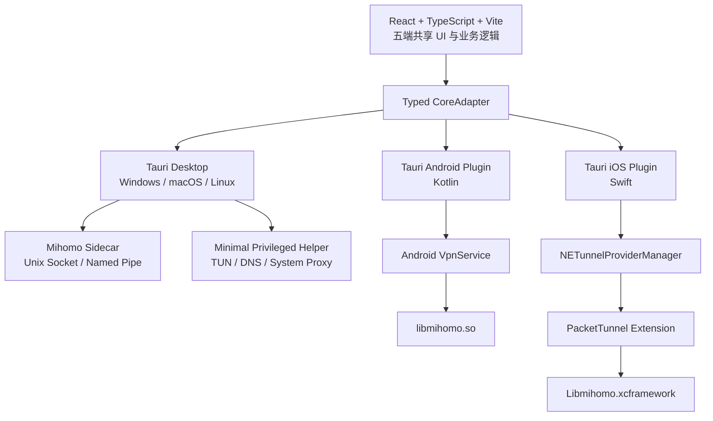

# Mihomo 五端 Web 客户端研发计划

状态：Draft v0.1  
日期：2026-07-14  
项目仓库：`~/repositories/mihomo-web-client`  
目标平台：macOS、Windows、Linux、Android、iOS

## 1. 项目目标

开发一个基于 Mihomo 内核、以 Web 技术栈为主的跨平台代理客户端，产品体验参考 Clash Pro、Clash Mi、Stash 和 Clash Verge Rev。

首要目标不是一次性复制成熟客户端的全部功能，而是以尽可能低的研发与维护成本，建立一套能够长期演进、可独立构建、可审计、可发布的五端基础架构。

核心原则：

- React、TypeScript 和 CSS 承担五端共用的界面与绝大多数业务逻辑。
- Tauri 2 作为首选跨平台应用壳。
- VPN、TUN、后台生命周期、提权和系统扩展保留必要的原生实现。
- 桌面端以 Mihomo 独立进程运行；移动端将 Mihomo 编译成原生库。
- 只跟踪 Mihomo 的真实开发与发布分支，不使用默认 `main` 幌子分支。
- 第一阶段只交付稳定代理能力，不追求功能数量。

## 2. 当前技术决策

### 2.1 推荐技术栈

| 层级 | 选择 | 说明 |
| --- | --- | --- |
| Web UI | React + TypeScript + Vite | 生态成熟，便于参考 Clash Verge Rev，并支持响应式五端界面 |
| 状态管理 | Zustand 或等价轻量方案 | 保存应用状态，避免将高频连接数据放入全局状态 |
| 服务端状态 | TanStack Query | 统一 Mihomo API 查询、缓存、轮询和错误处理 |
| 路由 | React Router | 桌面侧栏与移动底栏共享页面模型 |
| 桌面壳 | Tauri 2 + Rust | 体积和资源占用低，适合管理 Sidecar 与特权服务 |
| Android 原生层 | Kotlin + `VpnService` | 负责 VPN 授权、TUN 文件描述符和后台服务生命周期 |
| iOS 原生层 | Swift + `NEPacketTunnelProvider` | 负责 Packet Tunnel App Extension 和系统 VPN 生命周期 |
| 核心 | Mihomo Go | 桌面构建为独立可执行文件，移动构建为共享库或静态框架 |
| IPC | Typed `CoreAdapter` | Web 层不直接依赖平台实现 |
| 工程组织 | pnpm workspace + Cargo workspace | 管理前端、Tauri、原生插件和共享协议 |

### 2.2 不采用的主方案

- Flutter：不符合产品团队的技术偏好。
- Electron + Capacitor：需要维护桌面和移动两套应用壳，Electron 的资源成本也更高。
- React Native：并非真正的 Web 渲染栈，Linux 和桌面支持分散。
- Wails：适合桌面，但不能覆盖 Android 和 iOS。
- 纯 PWA：无法获得系统 VPN、TUN、后台服务和 Network Extension 能力。

### 2.3 必须接受的原生边界

“基于 Web 技术栈”不代表 VPN 数据面可以运行在 WebView 中：

- Android VPN 必须由 Kotlin `VpnService` 承载。
- iOS VPN 必须由 Swift `NEPacketTunnelProvider` App Extension 承载。
- WebView 被挂起或主应用被系统杀死时，VPN 必须继续运行。
- 桌面 TUN、系统代理和 DNS 修改需要 Rust 后端或最小权限 Helper/Service。

## 3. 总体架构

### 3.1 统一前端接口

前端只依赖统一的 `CoreAdapter`，建议第一版包含：

- `prepare()`：检查权限、资源和核心版本。
- `start(profile)` / `stop()` / `restart()`。
- `getStatus()` / `subscribeStatus()`。
- `getProxies()` / `selectProxy()`。
- `getTraffic()` / `subscribeTraffic()`。
- `getConnections()` / `closeConnection()`。
- `getLogs()` / `subscribeLogs()`。
- `importProfile()` / `updateProfile()` / `deleteProfile()`。
- `validateConfig()`。
- `getPlatformCapabilities()`。

平台差异通过能力声明暴露，避免前端依赖 `if (ios)` 一类分支扩散。

### 3.2 Mihomo 版本策略

- 开发期跟踪官方 `Alpha` 分支以验证新接口。
- 产品版本只固定到官方 `Meta` 分支对应的稳定 tag 或经过审计的明确 commit。
- 禁止从默认 `main` 分支构建产品核心。
- 桌面与移动端必须由同一个 Mihomo commit 构建。
- 每次构建记录 commit、Go 版本、构建参数、SHA-256 和 SBOM。
- 核心升级必须通过自动化协议、配置兼容性和网络生命周期测试。

## 4. 开源项目利用策略

### 4.1 Clash Verge Rev

用途：桌面端架构和实现参考。

优先研究或选择性移植：

- Mihomo Sidecar 生命周期管理。
- Unix Socket / Windows Named Pipe IPC。
- TUN 特权服务与安装流程。
- 配置合并、订阅更新、日志和连接管理。
- 桌面系统代理、托盘、更新和诊断逻辑。

不直接继承：

- 广告和赞助商集成。
- 项目更新源与远程推广内容。
- 订阅服务商控制的身份、设备绑定或原生模块。
- 未经独立审计的默认配置与网络请求。

Clash Verge Rev 使用 GPL-3.0。若复制或修改其代码，发行方案必须按照 GPL-3.0 设计；若产品需要闭源，则只能研究架构并独立实现，不能复制其 GPL 代码。

### 4.2 移动客户端参考

- Clash Meta for Android：参考 `VpnService`、JNI、后台生命周期和 Android 打包。
- Clash Mi：参考 Apple Packet Tunnel 工程结构，但其公开仓库当前缺少部分依赖和预构建 XCFramework，不能直接视为可复现基线。
- FlClash：作为五端 UI 和移动 VPN 行为参考，不采用 Flutter 产品层。
- Stash、Clash Pro：作为产品和交互参考，不作为可复制的源码基线。

### 4.3 Fork 策略

默认不直接将任一现有客户端整体 Fork 为产品仓库。建议新建独立 Monorepo，再按许可证要求选择性移植已审计模块。

原因：

- Clash Verge Rev 的核心架构明显偏桌面。
- 移动端需要完全不同的核心运行和生命周期模型。
- 新仓库更容易建立清晰的平台边界、权限模型和供应链规则。
- 可避免继承历史广告、遥测、更新与治理决策。

## 5. MVP 范围

### 5.1 必须交付

- 本地 YAML 导入。
- 订阅 URL 添加、手动更新和定时更新。
- Rule、Global、Direct 模式。
- 代理组查看、节点选择和延迟测试。
- 系统代理和 TUN/VPN 模式。
- 实时流量、基础日志和活动连接。
- 基础 DNS、LAN、IPv6 和绕过局域网设置。
- 启停状态、错误诊断和核心版本展示。
- 深色/浅色主题。
- 桌面侧栏与移动底栏响应式布局。
- 五端可重复构建和签名流程。

### 5.2 首版明确不做

- MITM 和证书管理。
- JavaScript 脚本运行环境。
- Sub-Store。
- WebDAV 或账户同步。
- 可视化规则编辑器。
- 多内核切换。
- Provider 商业面板和登录体系。
- 设备指纹、不可导出身份或订阅 DRM。
- 小组件、快捷指令和复杂系统集成。
- 连接历史数据库和长期流量统计。

## 6. 阶段计划

### Phase 0：技术可行性门（第 1 周）

目标：在投入产品开发前消除最大的不确定性。

交付物：

- Tauri 2 五端空壳工程。
- 从同一 Mihomo commit 产出桌面二进制、Android `.so` 和 Apple XCFramework。
- Android 真机完成一次 `VpnService` 连接。
- iOS 真机完成一次 Packet Tunnel 连接。
- iOS Archive/TestFlight 构建，确认 Network Extension 和 App Group Entitlements。
- 桌面三端启动 Mihomo 并通过 IPC 调用 `/version`。
- 构建记录、SHA-256 和失败清单。

Go/No-Go 条件：

- Android 和 iOS 均能代理 TCP、UDP 和 DNS。
- 移动端在 WebView 挂起后仍能维持连接。
- iOS 扩展能通过 CI 或可接受的签名流程稳定构建。
- Tauri 重新生成移动工程时不会不可控地破坏扩展配置。

若 iOS Tauri 集成失败，立即切换到降级架构：桌面使用 Tauri，移动端使用薄 Swift/Kotlin WebView 壳，共享同一个 React 构建产物和 TypeScript 业务包。

### Phase 1：工程骨架与桌面 MVP（第 2–6 周）

- 建立 Monorepo、CI、代码质量与发布流水线。
- 实现 `CoreAdapter` 和 Desktop Adapter。
- 完成订阅、配置、代理组、日志、流量和启停状态。
- 完成 Windows、macOS、Linux 的系统代理与基础 TUN。
- 建立配置迁移、崩溃日志和诊断包。
- 完成响应式 Web UI 基础设计系统。

退出条件：桌面三端可供内部日常使用一周，不出现配置损坏、权限残留或无法恢复的断网问题。

### Phase 2：Android MVP（第 5–9 周）

- Kotlin Tauri Plugin。
- `VpnService` 权限与前台服务。
- TUN FD 与 Mihomo Native ABI。
- 应用休眠、进程回收、重启和网络切换。
- 移动端触控布局、返回键和通知状态。

退出条件：通过连续 24 小时运行、Wi-Fi/蜂窝切换、睡眠唤醒、TCP/UDP/DNS 和异常恢复测试。

### Phase 3：iOS MVP（第 5–11 周）

- Swift 主应用插件与 Packet Tunnel Extension。
- App Group 配置、状态共享和日志桥接。
- Mihomo XCFramework 集成。
- 内存、后台生命周期和 Network Extension 限制验证。
- 真机 Archive、TestFlight、签名和隐私声明。

退出条件：通过 TestFlight 安装，并完成持续运行、切网、锁屏、按需连接和异常恢复测试。

### Phase 4：五端统一与公开测试（第 10–16 周）

- 统一配置语义和能力降级提示。
- 完成自动更新、签名、校验和回滚策略。
- 安全审计、许可证清单和 SBOM。
- 完成安装、迁移、卸载与权限清理测试。
- 建立公开 Beta 发布说明和问题模板。

### Phase 5：稳定版准备（第 16–20 周）

- 修复 Beta 阶段高优先级问题。
- 完成多语言、无障碍和性能优化。
- 建立核心升级自动化与五端回归矩阵。
- 完成商店合规、隐私政策和支持流程。

## 7. 安全、隐私与项目治理红线

Clash Verge Rev 的 CVD 争议应转化为项目级约束：

- 默认零遥测；未来如需崩溃统计，必须明确告知、默认关闭并可审计。
- 不建立静默、持久且用户不可导出的设备或订阅身份。
- 所有密钥由用户控制，支持导入、导出、备份和删除。
- 禁止订阅服务商按远程配置加载闭源原生模块。
- 禁止广告、推广或远程内容获得原生执行能力。
- 列出客户端发起的全部非代理业务网络请求及用途。
- 更新清单必须签名，下载后校验哈希。
- Release 必须由受保护 CI 构建，减少个人开发机发布。
- 每个二进制包含版本、源码 commit 和构建信息。
- 对核心、Helper、移动 Native Library 生成 SBOM。
- 重要权限、系统代理、DNS 和 VPN 变化必须可见、可撤销。
- 卸载后不得遗留服务、路由、DNS、证书或自启动项。

## 8. 测试矩阵

### 8.1 网络行为

- TCP、UDP、ICMP 可见性。
- IPv4、IPv6、双栈和无 IPv6 网络。
- DNS Fake-IP、Redir-Host、DoH/DoT 上游。
- Wi-Fi、蜂窝、有线网络和热点。
- 睡眠、锁屏、唤醒、切网和飞行模式。
- Captive Portal。
- 局域网访问与绕过。
- TUN/VPN 与系统代理切换。
- 内核崩溃、配置错误和订阅失效恢复。

### 8.2 平台行为

- Windows Service 安装、升级和卸载。
- macOS Helper、签名、公证和系统扩展权限。
- Linux systemd、桌面环境和 Wayland/X11。
- Android 前台服务、Always-on VPN 和电池优化。
- iOS Packet Tunnel、App Group、On Demand 和内存限制。

### 8.3 供应链

- 构建产物哈希一致性。
- 第三方依赖许可证。
- npm、Cargo、Go Modules 和原生依赖漏洞扫描。
- Mihomo commit 与发布 tag 对应关系。
- 更新服务器和 Release Manifest 防篡改。

## 9. 人员与工期估算

建议最低配置：

- 1 名 React/TypeScript/Tauri/Rust 工程师。
- 1 名 Go/Swift/Kotlin 网络工程师。

两名资深工程师全职投入：

- 技术验证：1 周。
- 内部可用版本：8–12 周。
- 五端公开 Beta：14–20 周。
- 稳定商店版本：视 iOS 审核和 Beta 反馈，预计再增加 4–8 周。

单人开发可以完成，但更现实的公开 Beta 周期是 6–9 个月，并且必须熟悉 Swift、Kotlin、Go、Rust 和 TypeScript 中的大部分技术栈。

## 10. 主要风险

| 风险 | 等级 | 应对 |
| --- | --- | --- |
| Tauri iOS App Extension 集成不稳定 | 高 | 第一周真机与 CI 验证；保留原生 WebView 壳降级方案 |
| iOS Network Extension 内存与生命周期 | 高 | 核心裁剪、流式日志、限制缓存、真机压力测试 |
| 五端 Mihomo Native ABI 分叉 | 高 | 极窄 C ABI、同 commit 构建、自动兼容测试 |
| 桌面 TUN 提权与卸载残留 | 高 | 最小权限 Helper、幂等安装卸载、系统状态恢复测试 |
| GPL 污染闭源商业计划 | 高 | 项目启动前确定许可证；复制代码前进行来源登记 |
| 上游删库或分支伪装 | 中 | 固定 commit、镜像源码、保存 tag 与构建依赖 |
| 广告/赞助影响产品决策 | 中 | 资金披露、功能评审、隐私红线、禁止供应商控制模块 |
| 商店审核与地区合规 | 高 | 海外组织账号、隐私披露、分地区发行策略、提前 TestFlight |

## 11. 首周具体任务

1. 创建 Monorepo 和最小 React/Tauri 2 工程。
2. 确定产品许可证：GPL-3.0 开源或 Clean-room 独立实现。
3. 固定一个 Mihomo `Meta` 稳定 tag 和对应 commit。
4. 定义第一版 C ABI 和 TypeScript `CoreAdapter`。
5. 产出五平台核心构建物及 SBOM。
6. 桌面验证 Sidecar、Socket/Named Pipe 和优雅退出。
7. Android 验证 TUN FD 传递和后台生命周期。
8. iOS 创建 Packet Tunnel Extension 并完成真机签名。
9. 验证 Tauri CI 构建不会丢失 App Extension Entitlements。
10. 输出 Go/No-Go 报告和修订后的工期估算。

## 12. 待决策事项

- 产品是否必须闭源；这将决定能否直接复用 GPL 客户端代码。
- 首发是否包含 iOS App Store，还是先通过 TestFlight 验证。
- 是否允许订阅增强脚本；首版建议不允许。
- 是否支持远程 Dashboard；首版建议只将其作为开发诊断能力。
- 桌面 macOS 是否使用 Network Extension，还是首版沿用 Mihomo TUN + Helper。
- 产品是否面向公共用户发行，还是先服务于受控用户群。
- 最低系统版本和 CPU 架构支持范围。

## 13. 参考资料

- [Mihomo](https://github.com/MetaCubeX/mihomo)
- [Clash Verge Rev](https://github.com/clash-verge-rev/clash-verge-rev)
- [Clash Meta for Android](https://github.com/MetaCubeX/ClashMetaForAndroid)
- [Clash Mi](https://github.com/KaringX/clashmi)
- [Tauri Mobile Plugin Development](https://v2.tauri.app/develop/plugins/develop-mobile/)
- [Android VpnService](https://developer.android.com/reference/android/net/VpnService)
- [Apple NEPacketTunnelProvider](https://developer.apple.com/documentation/networkextension/nepackettunnelprovider)
- [Tauri iOS App Extension Entitlements Issue](https://github.com/tauri-apps/tauri/issues/15663)
- [Clash Verge Rev CVD Discussion](https://github.com/clash-verge-rev/clash-verge-rev/issues/7187)
- [Clash Verge Rev CVD Revert](https://github.com/clash-verge-rev/clash-verge-rev/commit/fa27d3eae57c8444c440f133e95966f01bdd2b7a)
