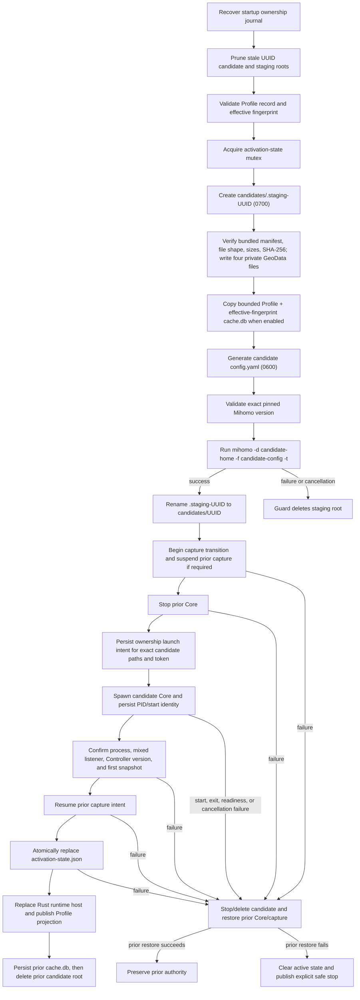

# Candidate home isolation

## RFC status

- **Question:** Does every Profile activation still need a completely fresh
  private Mihomo candidate home?
- **Status:** Proposed no-change decision, pending maintainer acceptance of
  Issue #185.
- **Scope:** Candidate file isolation, preparation cost, validation mutation,
  promotion, rollback, retirement, cancellation, and crash recovery.
- **Non-goals:** GeoData fallback/update design, packaged-runtime fixes,
  activation UX, or a different one-Core ownership model.

## Existing behavior

A **candidate home** is the private filesystem workspace for one attempted
Profile activation. It is not the selected Profile, the persistent Profile
store, or the active-state record. It contains the exact files that the
candidate Mihomo process may read or mutate during validation and, if accepted,
while running.

Every activation currently creates a new UUID-scoped root:

```text
runtime/
├── activation-state.json
├── core-ownership.json
├── profile-selection-cache/
│   └── <profile-id>/<effective-fingerprint>/cache.db
└── candidates/
    ├── <active-uuid>/
    │   ├── config.yaml
    │   └── home/
    │       ├── GeoSite.dat
    │       ├── GeoIP.dat
    │       ├── geoip.metadb
    │       ├── ASN.mmdb
    │       ├── cache.db
    │       └── <Profile-defined provider resources>
    └── .staging-<new-uuid>/
        ├── config.yaml
        └── home/
```

The mechanism is transactional:

1. Rust creates `.staging-<uuid>` with private permissions.
2. Mish verifies the packaged GeoData manifest and source digests, then writes
   private candidate files.
3. Mish restores only the selection cache whose Profile ID and effective
   fingerprint match the attempted activation.
4. Rust generates the candidate-specific configuration and invokes the exact
   pinned Mihomo with `-t`.
5. Successful validation promotes the staging directory by rename. A failed or
   cancelled validation deletes only that staging directory.
6. Mish stops the prior Core only after the replacement is fully prepared,
   records launch ownership for the exact new paths, and starts the candidate.
7. The candidate becomes authoritative only after process, listener,
   Controller version, and first-snapshot readiness succeed and Rust commits
   active state.
8. The prior candidate is then retired: Mish persists its bounded selection
   cache and deletes its entire root.
9. Any failure before commit stops and deletes the new candidate and restores
   the prior Core/capture intent. Startup recovery reconciles the ownership
   journal before deleting stale UUID roots.

This design deliberately permits two candidate roots during replacement but
never two active Cores. The prior root remains rollback authority while the new
root is validated and started.

## Why review it

The packaged GeoData snapshot is about 41 MiB, and the existing implementation
verifies and writes those assets for every attempted activation. This raises a
reasonable performance question: could Mish retain a home per Profile or
effective fingerprint, or use copy-on-write files, while preserving the same
transactional guarantees?

The review must answer two different questions:

1. **Logical isolation:** Which files and guarantees require a fresh root?
2. **Physical copying:** Can private candidate files be created more cheaply
   without changing that logical isolation?

Conflating them would be unsafe. APFS cloning may optimize physical allocation
while retaining independent files; persistent-home reuse changes the logical
isolation and introduces stale mutable state.

## Prior art: other Clash clients

The review inspected source at fixed commits rather than inferring behavior
from UI labels. The comparison is scoped to the filesystem boundary used for
configuration validation and Core execution; it does not claim that these
clients offer the same lifecycle guarantees as Mish.

| Client and inspected revision                                                                                                      | Configuration validation                                                                                                                                                                                                                                                                                                                                                                                                                                                                                                                                                                                                                                                                            | Runtime home scope                                                                                                                                                                                                                                                                                                                                                                                                                                                                                                                                     | Comparison with Mish                                                                                                                                                                                       |
| ---------------------------------------------------------------------------------------------------------------------------------- | --------------------------------------------------------------------------------------------------------------------------------------------------------------------------------------------------------------------------------------------------------------------------------------------------------------------------------------------------------------------------------------------------------------------------------------------------------------------------------------------------------------------------------------------------------------------------------------------------------------------------------------------------------------------------------------------------- | ------------------------------------------------------------------------------------------------------------------------------------------------------------------------------------------------------------------------------------------------------------------------------------------------------------------------------------------------------------------------------------------------------------------------------------------------------------------------------------------------------------------------------------------------------ | ---------------------------------------------------------------------------------------------------------------------------------------------------------------------------------------------------------- |
| [Clash Verge Rev `7ca20fc`](https://github.com/clash-verge-rev/clash-verge-rev/tree/7ca20fc4ede99aa4cc4fb0ff8519b0a2df2d9454)      | Generates a separate check YAML, but invokes the selected Core with `-t -d <app-home> -f <check-yaml>` in the [persistent app home](https://github.com/clash-verge-rev/clash-verge-rev/blob/7ca20fc4ede99aa4cc4fb0ff8519b0a2df2d9454/src-tauri/src/core/validate.rs#L330-L356).                                                                                                                                                                                                                                                                                                                                                                                                                     | The sidecar also starts with the same persistent app home and a generated run YAML ([source](https://github.com/clash-verge-rev/clash-verge-rev/blob/7ca20fc4ede99aa4cc4fb0ff8519b0a2df2d9454/src-tauri/src/core/manager/state.rs#L25-L50)).                                                                                                                                                                                                                                                                                                           | Rejected configuration bytes are discarded, but validation-time home mutations are not candidate-private.                                                                                                  |
| [Clash Nyanpasu `3525ff0`](https://github.com/libnyanpasu/clash-nyanpasu/tree/3525ff032caebe890b645fc574dedd81490585f4)            | Uses a unique, exclusively-created candidate YAML, checks the exact bytes, verifies they did not change, and only then promotes them ([pipeline](https://github.com/libnyanpasu/clash-nyanpasu/blob/3525ff032caebe890b645fc574dedd81490585f4/backend/tauri/src/client/mod.rs#L774-L805), [identity gate](https://github.com/libnyanpasu/clash-nyanpasu/blob/3525ff032caebe890b645fc574dedd81490585f4/backend/tauri/src/client/core_bridge.rs#L77-L99)). The check nevertheless passes the persistent app data directory as the Core workdir ([source](https://github.com/libnyanpasu/clash-nyanpasu/blob/3525ff032caebe890b645fc574dedd81490585f4/backend/tauri/src/core/clash/core.rs#L423-L438)). | Persistent application data.                                                                                                                                                                                                                                                                                                                                                                                                                                                                                                                           | Strong configuration-product transaction, but not a private transaction for the complete Core home. This is the closest example of separating configuration publication from home isolation.               |
| [Mihomo Party `e019290`](https://github.com/mihomo-party-org/mihomo-party/tree/e019290493cdd368452f1238aab4fa248eb76ed0)           | Validates the selected config with `-t`, but always supplies a persistent shared `test` directory as `-d` ([source](https://github.com/mihomo-party-org/mihomo-party/blob/e019290493cdd368452f1238aab4fa248eb76ed0/src/main/core/manager.ts#L928-L947)).                                                                                                                                                                                                                                                                                                                                                                                                                                            | A setting selects either one persistent global workdir or a persistent per-Profile workdir. A per-Profile workdir is reused and refreshed by copying newer GeoData from the global workdir ([preparation](https://github.com/mihomo-party-org/mihomo-party/blob/e019290493cdd368452f1238aab4fa248eb76ed0/src/main/core/factory.ts#L261-L293), [launch selection](https://github.com/mihomo-party-org/mihomo-party/blob/e019290493cdd368452f1238aab4fa248eb76ed0/src/main/core/manager.ts#L497-L527)).                                                  | The closest persistent per-Profile design, but validation does not use that runtime home and neither home is fresh per activation. Reuse therefore permits state to survive between activations by design. |
| [FlClash `7c83185`](https://github.com/chen08209/FlClash/tree/7c831855efedceb1a72bd0b4c18da026593d0853)                            | Writes inline data to a temporary file, but the embedded validation handler only unmarshals the configuration ([caller](https://github.com/chen08209/FlClash/blob/7c831855efedceb1a72bd0b4c18da026593d0853/lib/core/controller.dart#L85-L96), [handler](https://github.com/chen08209/FlClash/blob/7c831855efedceb1a72bd0b4c18da026593d0853/core/hub.go#L90-L97)); it is not equivalent to Mish's pinned `mihomo -t`.                                                                                                                                                                                                                                                                                | One persistent application-support home is initialized once and holds `config.yaml` and GeoData ([paths](https://github.com/chen08209/FlClash/blob/7c831855efedceb1a72bd0b4c18da026593d0853/lib/common/path.dart#L59-L92), [initialization](https://github.com/chen08209/FlClash/blob/7c831855efedceb1a72bd0b4c18da026593d0853/lib/core/controller.dart#L45-L76)).                                                                                                                                                                                     | Temporary configuration bytes do not imply an isolated validation home, and the validation depth differs materially.                                                                                       |
| [Clash Meta for Android `c67ed9c`](https://github.com/MetaCubeX/ClashMetaForAndroid/tree/c67ed9c9445bba3626cdac3249f788d6e49cba6d) | Copies a pending Profile into one shared `processing` directory, downloads and validates there, then copies the result into a persistent imported Profile directory ([source](https://github.com/MetaCubeX/ClashMetaForAndroid/blob/c67ed9c9445bba3626cdac3249f788d6e49cba6d/service/src/main/java/com/github/kr328/clash/service/ProfileProcessor.kt#L30-L88)). Operations are serialized by mutexes.                                                                                                                                                                                                                                                                                              | The embedded Core has one persistent `filesDir/clash` home for shared runtime data ([bridge](https://github.com/MetaCubeX/ClashMetaForAndroid/blob/c67ed9c9445bba3626cdac3249f788d6e49cba6d/core/src/main/java/com/github/kr328/clash/core/bridge/Bridge.kt#L60-L77)); selected Profile bundles persist separately and are loaded by UUID ([source](https://github.com/MetaCubeX/ClashMetaForAndroid/blob/c67ed9c9445bba3626cdac3249f788d6e49cba6d/service/src/main/java/com/github/kr328/clash/service/clash/module/ConfigurationModule.kt#L47-L70)). | This separates reusable Profile artifacts from shared Core data, but the single processing directory and shared Core home are a serialized pipeline, not per-attempt home isolation.                       |

Two source-state caveats apply. The inspected Clash Verge Rev checkout was on a
locally diverged `dev` revision, and the inspected Mihomo Party checkout was on
its `smart_core` branch rather than a verified default branch. Their exact
commits are recorded above so the findings remain reproducible and are not
presented as claims about a later release.

Across these five inspected clients, no implementation created a fresh private
root containing the complete Mihomo workdir for every activation. The common
pattern is a persistent global or per-Profile home plus a temporary/check
configuration artifact. That pattern is useful prior art for a product willing
to accept persistent mutable Core state, but it does not preserve Mish's exact
rejected-Profile isolation, ownership-journal rollback, or whole-root cleanup
contract.

The comparison therefore sharpens, rather than answers, this RFC's decision:
Mish could adopt the more common boundary only by weakening an explicit
guarantee. Issue #185 requires that guarantee to remain intact. The prior art
also provides no evidence that APFS cloning or persistent-home reuse produces
a material launch improvement; the performance decision must still come from
Mish's own measured activation path.

## Decision routes

The design space contains four distinct routes. They are separated by whether
they change the logical isolation boundary or only the physical preparation
Adapter.

| Route                                                       | Design                                                                                                                                                                                                                                                                     | Expected leverage                                                                                                                                                                                                      | New correctness burden                                                                                                                                                                                                                                                                   | RFC disposition                                                                                                                                        |
| ----------------------------------------------------------- | -------------------------------------------------------------------------------------------------------------------------------------------------------------------------------------------------------------------------------------------------------------------------- | ---------------------------------------------------------------------------------------------------------------------------------------------------------------------------------------------------------------------- | ---------------------------------------------------------------------------------------------------------------------------------------------------------------------------------------------------------------------------------------------------------------------------------------- | ------------------------------------------------------------------------------------------------------------------------------------------------------ |
| **A. Fresh private root with verified writes**              | Keep the existing UUID candidate root. Verify packaged assets, write private regular files, validate, promote, and retire the complete root transactionally.                                                                                                               | No speculative gain; measured preparation median is 46.7 ms.                                                                                                                                                           | None beyond the lifecycle already covered by the ownership journal and activation tests.                                                                                                                                                                                                 | **Recommended now.** It is the reference behavior and the only route whose complete proof already exists.                                              |
| **B. Fresh private root with copy-on-write clones**         | Preserve the same UUID root and ownership model, but clone verified immutable seed files into it on filesystems that support independent copy-on-write regular files. Fall back to sequential private copies everywhere else.                                              | Theoretical reduction in physical writes without weakening logical isolation. The measured `/bin/cp -c` prototype was slower at median and p95, and even a zero-cost file stage is below the 10% activation threshold. | A platform capability Adapter, clone verification, partial-clone cleanup, source replacement handling, and deterministic fallback tests.                                                                                                                                                 | **Do not implement for Issue #185.** Reconsider only if native clone measurements show a material end-to-end gain on supported production filesystems. |
| **C. Content-addressed prepared template**                  | Build a read-only template keyed by packaged manifest, Core version, and asset digests. Each activation still creates a fresh private root from that template using clone or portable copies; mutable `cache.db`, config, and provider resources never enter the template. | Could move repeated source discovery or verification out of the activation critical path, while retaining a private runtime root. Current measurements cap the available gain at tens of milliseconds.                 | The template becomes a new durable authority requiring atomic construction, tamper detection, version invalidation, crash cleanup, and proof that no mutable Core-created path can enter it. Without an OS-sealed source, use-time trust cannot simply replace verification.             | **Research only.** It is safer than home reuse but adds an authority and invalidation state machine for an immaterial measured gain.                   |
| **D. Persistent per-Profile or effective-fingerprint home** | Reuse one runtime root across activations, refreshing known assets and resetting candidate-specific state before validation. A snapshot or reset journal would be required for rollback and cancellation.                                                                  | Avoids most root preparation and resembles Mihomo Party's optional runtime layout. The measured upper bound is still below the materiality threshold.                                                                  | Must enumerate every Mihomo- and provider-created mutable path, distinguish reusable state from partial authority, prevent concurrent validation/runtime mutation, snapshot before validation, restore after failure, recover interrupted resets, and retire stale fingerprints exactly. | **Rejected under current guarantees.** The mutable-file set is Profile-dependent and not fully owned by Mish, so the safety proof is incomplete.       |

Route A and Route B preserve the current logical boundary. Route C introduces
a new immutable-source authority but still gives each attempt a private
runtime root. Route D is the only route that actually narrows the isolation
boundary; it is also the route that converts stale filesystem state into part
of activation correctness.

The common industry variant—one shared global home plus a temporary candidate
configuration—is an even narrower form of Route D. It is not a separate Mish
candidate because it directly violates the required rejected-Profile
isolation: `mihomo -t` or provider initialization may mutate authority shared
with the active or next candidate.

## Evaluation criteria

A narrower design is acceptable only if it:

- preserves one active Core and one authoritative ownership record;
- prevents validation, active, updating, and retiring runtimes from mutating
  another candidate's files;
- keeps rejected Profiles, cancellation, rollback, and cleanup exact;
- preserves pinned validation, listener readiness, selection-cache scoping,
  crash recovery, and Rust-authoritative publication;
- has a portable sequential fallback and no mutable symlink or hard-link
  authority; and
- produces a material end-to-end activation improvement, defined here as at
  least 10% of observed cold activation without a meaningful tail regression.

## Conclusion

Mish retains one fresh private Mihomo candidate root for every Profile
activation. The review found no storage proposal that can produce a material
end-to-end launch improvement while preserving the current transactional
Interface. The bundled GeoData snapshot remains the shared immutable source;
each validation and runtime still receives private regular-file copies.

This is a no-change architecture decision. It does not change GeoData update or
fallback behavior, packaged-runtime recovery, or activation UX.

## Module and Seam

`MihomoActivationManager` is the deep Module for candidate preparation, Core
handoff, rollback, and retirement. Its external Interface is activation,
shutdown, recovery, and the committed runtime/state projection. Candidate-root
creation is an internal Seam: callers do not select a storage Adapter.

The current Interface guarantees:

- one active Core and one authoritative Core ownership record;
- validation by the exact pinned Core before launch;
- no state publication before listener and Controller readiness;
- exact rejected-Profile isolation;
- Profile-and-effective-fingerprint selection-cache scoping;
- cancellation and failure rollback without partial authority;
- crash recovery from the ownership journal and removal of stale candidates;
- retirement and exact cleanup of the prior or rejected candidate; and
- Rust-authoritative activation and runtime-host publication.

## Candidate lifecycle DAG



The activation-state mutex serializes the handoff, but serialization alone does
not isolate validation-time or runtime file mutation. The fresh root provides
that locality: every candidate's mutable file set and cleanup target are one
directory.

## File ownership and mutation analysis

| Resource                                               | Source                                                                     | Candidate behavior                                                                                                                                                                      | Required isolation                                     |
| ------------------------------------------------------ | -------------------------------------------------------------------------- | --------------------------------------------------------------------------------------------------------------------------------------------------------------------------------------- | ------------------------------------------------------ |
| `config.yaml`                                          | Generated from the persisted normalized Profile and managed runtime policy | Read by validation and runtime; candidate-specific and contains private controller configuration                                                                                        | Private regular file                                   |
| `GeoSite.dat`, `GeoIP.dat`, `geoip.metadb`, `ASN.mmdb` | Verified packaged snapshot                                                 | Pinned `mihomo -t` reads them. Mihomo retains authority to create or replace missing runtime GeoData inside `-d`; Mish cannot treat the candidate paths as immutable runtime authority. | Shared source is safe; candidate paths remain private  |
| `cache.db`                                             | Profile + effective-fingerprint cache                                      | Mihomo mutates policy selections while running; Mish copies it out only at retirement                                                                                                   | Private and fingerprint-scoped                         |
| Relative provider files                                | Profile configuration, constrained to remain under the managed home        | Provider initialization and update can write candidate-local resources                                                                                                                  | Private; the complete mutable set is Profile-dependent |
| `core-ownership.json`                                  | Rust ownership Module                                                      | Atomically records exact binary, candidate home/config, generation, token, PID, and start identity                                                                                      | One authoritative record outside candidate homes       |
| `activation-state.json`                                | Rust activation Module                                                     | Atomically publishes display-safe active identity only after readiness                                                                                                                  | One authoritative record outside candidate homes       |

Pinned v1.19.29 validation against the four prepared production assets did not
change their hashes for the representative fixture. That observation is not an
immutability guarantee: validation deliberately owns missing-GeoData recovery,
and the running Core can mutate `cache.db` and Profile-defined relative
provider resources. A persistent home would therefore need a complete
Profile-dependent reset or snapshot protocol before every validation. That
protocol recreates the private-candidate problem and adds stale-state and crash
recovery states to the Interface.

No symlink or hard-link proposal is safe. An APFS clone produces independent
copy-on-write files and is not the same as a hard link, but it still needs exact
source verification and a portable sequential Adapter. It changes only the
physical-copy implementation; it does not justify persistent homes or a
narrower isolation Seam.

## Reproducible performance evidence

The repository-owned file harness is:

```sh
pnpm measure:candidate-home -- --iterations 9
node --test scripts/measure-candidate-home.test.ts
```

It verifies the production manifest and 42,881,021 bytes on every sample,
publishes a UUID staging directory through rename, checks the completed files,
and measures injected failure and cancellation cleanup. `current` matches the
Rust implementation: read and hash every asset, then write private files.
`verified-sequential` performs the same verification followed by portable file
copies. `verified-clone` performs the same verification followed by macOS
`cp -c` APFS clones; the production-independent process Adapter makes this a
conservative prototype rather than an implementation benchmark.

Measurements on an Apple Silicon APFS SSD:

| Preparation Adapter             | First sample |  Median |      p95 | Result                 |
| ------------------------------- | -----------: | ------: | -------: | ---------------------- |
| Current verified private writes |      36.5 ms | 46.7 ms |  67.1 ms | Baseline               |
| Verified sequential copies      |      65.6 ms | 69.9 ms | 108.3 ms | Slower                 |
| Verified APFS clone prototype   |      54.1 ms | 79.8 ms | 206.3 ms | Slower and higher tail |

An attempted Node `COPYFILE_FICLONE_FORCE` Adapter returned `ENOSYS` on the same
APFS host, demonstrating why clone availability requires an explicit platform
Adapter and fallback. Native `/bin/cp -c` succeeded. Even a zero-cost native
clone cannot remove the per-activation read and SHA-256 verification; the
observed current preparation cost is already only tens of milliseconds.

The ignored integration harnesses exercise the whole activation Interface with
the production GeoData snapshot:

```sh
cargo test -p mish-bridge --test mihomo_activation \
  measures_fixture_private_candidate_home_activation_paths \
  -- --ignored --nocapture --test-threads=1

MISH_MIHOMO_MEASURE_BIN="$PWD/.scratch/mihomo/v1.19.29/mihomo-darwin-arm64-v1.19.29" \
  cargo test -p mish-bridge --test mihomo_activation \
  measures_pinned_core_private_candidate_home_activation_paths \
  -- --ignored --nocapture --test-threads=1
```

The pinned-Core samples used the binary produced by `pnpm prepare:mihomo` and
reported:

| Path                                     | Observed samples     |
| ---------------------------------------- | -------------------- |
| Cold activation from safe stop           | 3267.9 ms, 3676.8 ms |
| Warm replacement activation              | 3344.9 ms, 5161.7 ms |
| Relaunch after exact shutdown            | 3339.8 ms, 3292.2 ms |
| Validation failure plus rollback cleanup | 2146.3 ms, 2098.7 ms |
| Pre-cancelled preparation plus cleanup   | 2071.4 ms, 2087.7 ms |

“Cold” here means no active candidate or Core, not a privileged
operating-system page-cache purge. The separate first-sample and warm file
results prevent that limitation from being hidden.

The current 46.7 ms median file preparation is about 1.4% of the lower observed
3.27 s pinned cold activation. Eliminating the entire file stage—not merely its
write portion—cannot reach a 10% end-to-end improvement. The clone prototype
also regressed both median and tail. The complexity therefore buys no material
launch improvement.

## Alternatives rejected

### Persistent per-Profile home

Rejected because Profile revision and effective fingerprint are not the full
mutable-file identity. Runtime selection state, GeoData recovery, and
Profile-defined provider resources can outlive or contaminate a later
candidate. Cleaning those paths requires knowledge that is intentionally owned
by Mihomo and the Profile configuration.

### Persistent effective-fingerprint home

Rejected for the same mutable-state reason. The fingerprint scopes generated
Profile meaning and the selection cache, not every file Mihomo or a provider
may create. Reusing a root would also make cancellation and rejected-validation
cleanup distinguish reusable state from partial authority.

### APFS clone with sequential fallback

Rejected as production work for this issue. Copy-on-write regular files can
preserve candidate isolation, but per-activation verification remains required,
the measured prototype is slower, the portable path is slower, and even the
impossible zero-copy upper bound is below the materiality threshold. The
platform Seam and failure states would add Interface complexity without
leverage.

## Regression evidence

The deterministic `mihomo_activation` suite remains the test surface for the
deep activation Module. It covers validation failure, cancellation, shutdown,
relaunch, duplicate/concurrent activation, Core replacement and retirement,
post-promotion state-commit failure, stale ownership recovery, listener
readiness, and rollback. Candidate cleanup unit tests cover stale UUID roots,
partial staging, and a promoted path that fails before guard disarm. The file
harness separately injects partial-copy failure and cancellation and asserts
that no staging or candidate directory survives.

Because the isolation Seam is unchanged, these are characterization and
measurement regressions rather than a new storage implementation.
