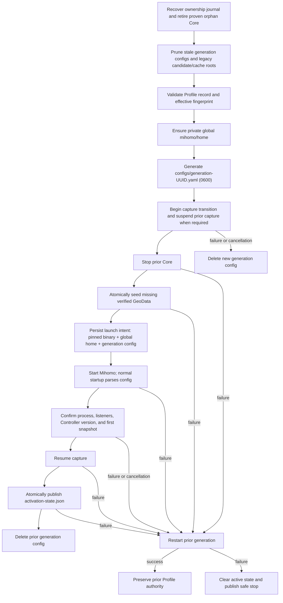

# Mihomo runtime home and activation generations

## RFC status

- **Decision:** Adopt one persistent global Mihomo home and UUID-scoped
  generated configuration files.
- **Issue:** #185.
- **Scope:** Profile activation storage, provider-path isolation, startup
  validation, ownership recovery, rollback, retirement, and cleanup.
- **Non-goals:** GeoData update/fallback policy, packaged-runtime repair,
  activation UX, or the one-Core ownership model.

## Context

Mish previously created a complete private Mihomo home for every activation.
It copied approximately 41 MiB of GeoData, restored a
Profile-and-effective-fingerprint copy of `cache.db`, wrote `config.yaml`, ran
`mihomo -t`, renamed the staging root, and then launched Mihomo from that root.

That boundary was stronger than Mihomo's native state model and the common
Clash-client design. It also created three identities for one activation:
Profile/effective fingerprint, candidate UUID, and a copied cache identity.
The copied home was useful as a transaction boundary, but most of its contents
were intentionally reusable Mihomo state rather than rejected configuration
authority.

The accepted product rule is now:

- a Profile is identified by Mish's stable Profile ID;
- generated configuration is activation-generation state;
- Mihomo-native state is global and remains owned by Mihomo; and
- explicit relative provider paths need Profile isolation, while Mihomo's
  default URL-hashed HTTP provider paths may be shared.

## Decision

Mish uses this layout:

```text
runtime/
├── activation-state.json
├── core-ownership.json
└── mihomo/
    ├── home/
    │   ├── cache.db
    │   ├── GeoSite.dat
    │   ├── GeoIP.dat
    │   ├── geoip.metadb
    │   ├── ASN.mmdb
    │   ├── proxies/<mihomo-url-hash>
    │   ├── rules/<mihomo-url-hash>
    │   └── profile-resources/<profile-id>/<explicit-relative-path>
    └── configs/
        └── <generation-uuid>.yaml
```

The global home contains ordinary private files. Mish does not introduce
symlinks, hard links, APFS clones, a template cache, or a filesystem-specific
fallback state machine.

### Cross-privilege Core handoff

Internal TUN runs the pinned Core as root, while ordinary Capture runs the same
Core as the enrolled desktop user. Both execution backends retain the one
global Mihomo home. After a privileged Core has been reaped, the versioned
Helper recursively returns regular single-link files and directories in that
validated home to the enrolled UID with private modes before it confirms Stop.
Links, special files, excessive depth, or excessive entry counts fail the Stop
closed. This preserves Mihomo-native cache and provider continuity without
letting a root-created `cache.db` or provider artifact block the next ordinary
Core generation.

### Identity rules

| Identity              | Purpose                                                         | Does not control                 |
| --------------------- | --------------------------------------------------------------- | -------------------------------- |
| Profile ID            | Namespace explicit provider paths and identify selected Profile | Global cache lifetime            |
| Effective fingerprint | Describe exact generated Profile meaning and diagnostics        | Home, cache, or generation reuse |
| Generation UUID       | Name one generated config and one ownership launch              | Profile storage or Mihomo cache  |

`cache.db` is a single Mihomo bbolt database. Mihomo uses it for selections,
fake-IP state, HTTP ETags, subscription information, and other native storage.
Mish reads the bounded `selected` bucket for presentation but no longer copies,
restores, or deletes the database per Profile. Mihomo already handles stale
selector values by falling back when a named choice is unavailable.

### Provider paths

Mihomo derives default HTTP provider paths from the provider URL under its
`proxies` and `rules` directories. Mish leaves providers without an explicit
`path` unchanged, so this native content reuse remains global.

An explicit safe relative path is rewritten during record generation:

```text
providers/custom.yaml
  -> profile-resources/<profile-id>/providers/custom.yaml
```

This prevents two Profiles from claiming the same mutable relative file without
adding a home per Profile. Unsafe absolute or parent-traversal paths remain
rejected by managed runtime policy.

### GeoData

The packaged manifest and all packaged source files are verified before any
seed operation. After the prior Core has stopped, missing global GeoData files
are written to same-directory private temporary files, synced, atomically
renamed, and followed by a directory sync on Unix. Stale seed temporaries are
removed on retry. Existing non-empty regular files are preserved because the
independent runtime GeoData updater may own a newer version; zero-byte files
are incomplete and may be replaced from the verified snapshot. Links and
non-file targets are rejected. If a seed write fails, only files created by
that seed operation are removed.

This is initialization, not a new GeoData update policy.

### Startup validation

Mish no longer launches a second `mihomo -t` process for every activation.
Normal Mihomo startup parses the same generation file before becoming ready.
Mish still:

- verifies the exact pinned Mihomo version before process launch;
- records the exact binary, global home, generation config, token, and PID in
  the authoritative ownership journal;
- requires process survival, listener ownership, Controller version, and the
  first valid snapshot before publishing active state.

When all four global GeoData assets are non-empty regular files, readiness uses
the normal short deadline. If an asset remains unavailable after packaged
initialization, startup uses the longer GeoData preparation deadline so
Mihomo's native fallback download is not killed by the short Controller
readiness window.

Invalid startup is therefore a start/early-exit failure rather than a separate
preflight-validation phase. The prior Core is stopped before the new Core can
own the global home. If startup or readiness fails, Mish removes the failed
generation config and restarts the prior generation config against the same
global home.

## Activation lifecycle DAG



The activation mutex and one-Core ownership journal serialize all runtime
mutation. Two generated configs may briefly exist for rollback, but only one
Mihomo process may use the global home.

## Recovery and migration

Startup recovery runs before cleanup:

1. Read and validate the ownership record.
2. Prove and terminate an orphan process, including one launched by the former
   `candidates/<uuid>/home` layout.
3. Remove UUID generation configs.
4. Remove only UUID and `.staging-UUID` legacy candidate directories.
5. Remove the obsolete `profile-selection-cache` tree.
6. Preserve `mihomo/home` and unrelated maintainer files.

New ownership records require `config_directory == runtime/mihomo/home` and a
`runtime/mihomo/configs/<uuid>.yaml` config. The legacy path shape remains
accepted only so upgrades can safely recover an already-launched old Core.
Legacy per-Profile selection databases are not merged: bbolt buckets contain
more Mihomo-native state than Mish can safely reconcile across multiple
fingerprints. The first activation after upgrade therefore starts a new global
cache and Mihomo applies its normal selector fallback once; subsequent
selections persist globally.

## Industry comparison

Source review at fixed revisions found that none of five inspected clients
created a fresh complete Mihomo home for every activation:

| Client                                                                                                                             | Home model                                    | Configuration model                          |
| ---------------------------------------------------------------------------------------------------------------------------------- | --------------------------------------------- | -------------------------------------------- |
| [Clash Verge Rev `7ca20fc`](https://github.com/clash-verge-rev/clash-verge-rev/tree/7ca20fc4ede99aa4cc4fb0ff8519b0a2df2d9454)      | Persistent application home                   | Generated check/run YAML                     |
| [Clash Nyanpasu `3525ff0`](https://github.com/libnyanpasu/clash-nyanpasu/tree/3525ff032caebe890b645fc574dedd81490585f4)            | Persistent application data                   | Exclusive candidate YAML with identity check |
| [Mihomo Party `e019290`](https://github.com/mihomo-party-org/mihomo-party/tree/e019290493cdd368452f1238aab4fa248eb76ed0)           | Global or persistent per-Profile home         | Separate validation config                   |
| [FlClash `7c83185`](https://github.com/chen08209/FlClash/tree/7c831855efedceb1a72bd0b4c18da026593d0853)                            | One application-support home                  | Temporary config for embedded parse          |
| [Clash Meta for Android `c67ed9c`](https://github.com/MetaCubeX/ClashMetaForAndroid/tree/c67ed9c9445bba3626cdac3249f788d6e49cba6d) | One persistent Core home plus Profile bundles | Serialized processing directory              |

The adopted design follows the industry's simpler persistent-home boundary but
keeps Mish-specific generation ownership, exact Rust state publication,
listener readiness, cancellation, and rollback.

## Alternatives

### Fresh private candidate home

This provides exact whole-root rejection but duplicates global Mihomo state,
requires cache export/import semantics that Mihomo does not define, and repeats
GeoData verification/writes. It remains useful only if the product later
requires rejected attempts to leave no mutation in Mihomo-native state.

### Persistent home per Profile or effective fingerprint

This adds multiple cache and GeoData authorities plus invalidation and cleanup
states. A fingerprint is an identity for generated Profile meaning, not for all
files Mihomo may create. Profile ID namespaces the only known collision-prone
input—explicit paths—without multiplying homes.

### APFS clone, hard link, or symlink

Links to mutable authority are unsafe, and APFS clone support requires a
platform Adapter plus sequential fallback. Once the complete home copy is
removed, clone complexity has no meaningful target. Ordinary files are the
portable design.

### Rename staging directory

Directory promotion was necessary when the directory itself was the candidate
transaction. The new transaction is one create-new UUID config file; it is
never discovered by directory name and is passed directly to the owned
process. A staging directory and rename add states without adding publication
atomicity.

## Performance evidence

The earlier reproducible harness established the removable cost:

```sh
pnpm measure:candidate-home -- --iterations 9
node --test scripts/measure-candidate-home.test.ts
```

On the recorded Apple Silicon APFS host, verifying and writing the 42,881,021
byte private home measured 46.7 ms median and 67.1 ms p95. Sequential copy was
69.9 ms median; `/bin/cp -c` clone was 79.8 ms median with a 206.3 ms p95. The
old file-copy stage was only about 1.4% of the lower 3.27 s pinned cold sample.

The file copy alone was not a large end-to-end bottleneck. Removing the second
full Mihomo parse/startup path is material on warm, relaunch, and failure paths.
The same prepared pinned v1.19.29 binary and production GeoData fixture produced:

| Pinned-Core path                  |        Fresh candidate baseline | Global-home implementation |                Change |
| --------------------------------- | ------------------------------: | -------------------------: | --------------------: |
| Cold activation                   |                       3267.9 ms |                  3269.8 ms | effectively unchanged |
| Warm replacement                  | 3344.9 ms lower recorded sample |                  1221.5 ms |          63.5% faster |
| Relaunch                          | 3292.2 ms lower recorded sample |                  1214.2 ms |          63.1% faster |
| Invalid startup and rollback      | 2098.7 ms lower recorded sample |                   394.2 ms |          81.2% faster |
| Pre-cancelled preparation cleanup | 2071.4 ms lower recorded sample |                    24.0 ms |          98.8% faster |

Cold activation still pays first global-home initialization, so the result does
not overclaim a cold-start improvement. Repeated activation paths avoid both
home recreation and the duplicate `mihomo -t` process. This exceeds the RFC's
10% materiality threshold for warm/relaunch/failure paths while also reducing
lifecycle state.

The implementation benefits are:

- no candidate directory construction or promotion;
- no per-Profile/fingerprint cache copy-in/copy-out;
- no duplicate config-parse process;
- no clone/fallback Adapter;
- one persistent Core home and one disposable generation file.

The updated harness compares legacy fresh-home preparation with global-home
initialization, warm reuse, generation creation, and injected seed/config
failure cleanup. It reports file I/O counts and timings without claiming that
filesystem preparation dominates Controller readiness.

A five-sample rerun on the same class of APFS host produced:

| Path                                    | Source bytes read |               Bytes written | Observed preparation |
| --------------------------------------- | ----------------: | --------------------------: | -------------------: |
| Global cold initialization              |        42,881,021 |                  42,885,117 |              32.2 ms |
| Global warm generation (median of four) |                 0 |                       4,096 |              0.15 ms |
| Injected cold seed failure              |        42,881,021 |   22,017,452 before cleanup |              29.7 ms |
| Warm cancellation                       |                 0 | 4,096 before config cleanup |              0.24 ms |

The 4 KiB generated config is a fixed representative harness payload. Runtime
configs vary in size; the important reproducible difference is that warm
activation performs no GeoData source read or write and creates only its
generation file.

## Deterministic regression contract

Repository tests cover:

- global cache reads across different Profiles/fingerprints and Profile delete;
- explicit provider namespace rewriting and unchanged default URL-hash paths;
- verified seed initialization, existing GeoData preservation, and corrupt
  bundle rejection without partial writes;
- generation guard cleanup and startup pruning that preserves global home;
- validation/start failure, cancellation, shutdown, relaunch, duplicate launch,
  capture transition, replacement, rollback, and state-commit failure;
- new global-home ownership, legacy ownership recovery, stale record rejection,
  process termination, and exact ownership clearing; and
- normal activation without a second GeoData validation process.

The bridge activation suite uses fixed managed ports and must run serially:

```sh
cargo test -p mish-bridge --test mihomo_activation -- --test-threads=1
cargo test -p mish-bridge --test managed_core_ownership -- --test-threads=1
```

Whole-path measurements are opt-in:

```sh
cargo test -p mish-bridge --test mihomo_activation \
  measures_fixture_global_home_activation_paths \
  -- --ignored --nocapture --test-threads=1

MISH_MIHOMO_MEASURE_BIN=/absolute/path/to/pinned-mihomo \
  cargo test -p mish-bridge --test mihomo_activation \
  measures_pinned_core_global_home_activation_paths \
  -- --ignored --nocapture --test-threads=1
```
