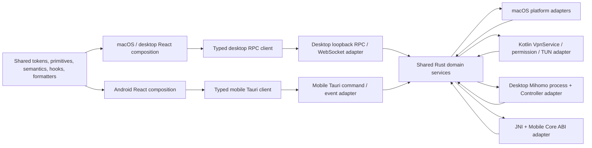
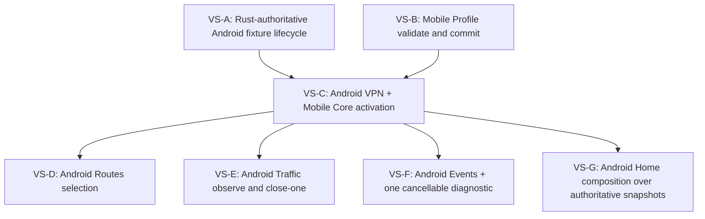

# Cross-platform Product Authority

## Decision and evidence baseline

This contract defines the product-authority boundary required before Mish adds
more Android behavior. It was audited from `origin/main` at
`08b37dea328d68f3c3b83ebf7fa22947e0f7bc08` for
[Issue #261](https://github.com/Asuka109/mish/issues/261). The inventory links
to implementation evidence rather than inferring ownership from a crate,
language, or UI name.

The canonical boundary is:

- **Shared Rust** owns platform-neutral domain services, legal typed state
  transitions, operation identity, revision and sequence ordering,
  cancellation, redaction, persistence and cleanup policy, and semantic events
  when a fact affects product behavior.
- **Platform adapters** own facts and effects that only the operating system can
  provide: macOS System Proxy and helper integration; Android VPN permission,
  foreground service, TUN descriptor, socket protection, lifecycle callbacks,
  and JNI/native calls.
- **React** owns composition and ephemeral interaction or display state. Search,
  filters, focus, sheets, pending affordances, paused display copies, and
  navigation presentation do not move to Rust merely because the product is
  cross-platform.
- Desktop RPC/WebSocket and mobile Tauri/Kotlin/JNI are replaceable projections
  of the same domain commands, snapshots, failures, and semantic events.
  Mobile never starts or embeds the desktop loopback bridge.
- macOS and Android keep intentionally separate view compositions. They may
  reuse design tokens, atomic primitives, accessible semantics, route metadata,
  typed commands and snapshots, hooks, and formatters, but not a universal
  desktop/mobile page.

“Shared Rust” means transport-neutral application code, not one monolithic
crate. Current examples include
[`crates/runtime`](../../crates/runtime),
[`crates/profile`](../../crates/profile),
[`crates/settings`](../../crates/settings),
[`crates/state-authority`](../../crates/state-authority), and
[`crates/updater`](../../crates/updater). A Rust module under
[`crates/desktop-bridge`](../../crates/desktop-bridge) is not automatically
cross-platform: code that depends on Axum, a loopback listener, a desktop
Mihomo process, macOS paths, or desktop bootstrap remains a desktop adapter.

This is an architecture and current-state delivery. It does not move code,
enable a production Android VPN, implement Issues #91 or #94, change desktop
behavior, or promise compatibility for unreleased internal behavior.

## State-scope taxonomy

Every material authority below has exactly one primary reset scope:

| Scope                            | Creation and cleanup boundary                                                                                                               |
| -------------------------------- | ------------------------------------------------------------------------------------------------------------------------------------------- |
| `process-global`                 | Created once for the application process; retired only by ordered application shutdown or process replacement.                              |
| `runtime-scoped`                 | Created for one Core/runtime authority; cancelled and joined before that runtime is replaced, stopped, or declared unrecoverable.           |
| `Profile-scoped`                 | Bound to a validated Profile ID, immutable revision, or fingerprint; replaced by a confirmed Profile transaction or removed by safe policy. |
| `capture/Traffic session-scoped` | Bound to one admitted capture or Traffic session; reset on confirmed stop, rollback, session replacement, or authority loss.                |
| `platform-scoped`                | Bound to an OS object or integration lifetime; the adapter closes or unregisters it on callback, revocation, destruction, or app shutdown.  |
| `durable installation state`     | Stored in private application-owned storage; changed only by an explicit transaction, bounded recovery, or safety-required migration.       |
| `view-local`                     | Bound to a mounted route, component, window, or interaction; reset on navigation, unmount, reload, or explicit view reset.                  |

Scope is not language ownership. Android VPN permission is `platform-scoped`
and stays in Kotlin; a platform-neutral `permission-required -> starting`
product transition is also triggered by that fact and belongs to Shared Rust.

## Evidence-backed ownership matrix

“Required owner and cleanup” is the contract for subsequent slices. “Finding”
records current duplication, a race or terminal-state gap, a desktop-only
assumption, or an intentionally retained boundary. Row IDs are stable review
references and are checked by `pnpm check:docs`.

| ID    | Material state or orchestration                                                                                                        | Current owner and evidence                                                                                                                                                                                                                                                          | Scope                            | Required owner and cleanup                                                                                                                                                             | Finding                                                                                                                                               |
| ----- | -------------------------------------------------------------------------------------------------------------------------------------- | ----------------------------------------------------------------------------------------------------------------------------------------------------------------------------------------------------------------------------------------------------------------------------------- | -------------------------------- | -------------------------------------------------------------------------------------------------------------------------------------------------------------------------------------- | ----------------------------------------------------------------------------------------------------------------------------------------------------- |
| `A01` | Cross-domain mutation admission                                                                                                        | Rust [`StateMutationAuthority`](../../crates/state-authority/src/lib.rs) serializes Profile, Settings, restore, and capture-sensitive work.                                                                                                                                         | `process-global`                 | Shared Rust; shutdown makes the authority unavailable and every permit is dropped or joined.                                                                                           | Retain. Platform code must not add a second mutation lock.                                                                                            |
| `A02` | Application snapshot authority, epoch, and stream order                                                                                | Rust [`ApplicationSnapshotOrder`](../../crates/runtime/src/application_order.rs) defines the DTO, while the issuing [`SnapshotOrderAuthority`](../../crates/desktop-bridge/src/snapshot_order.rs) is desktop-bridge-owned.                                                          | `process-global`                 | Shared Rust publisher; retire all stream tickets on process authority replacement.                                                                                                     | Reusable semantics are currently issued inside a desktop crate and have no mobile projection.                                                         |
| `S01` | Core phase, start, stop, and health                                                                                                    | [`MishRuntime`](../../crates/runtime/src/lib.rs) owns typed lifecycle semantics; [`DesktopMihomoProcess`](../../crates/desktop-bridge/src/managed_process.rs) owns the desktop child process.                                                                                       | `runtime-scoped`                 | Shared Rust owns phase and command completion; the desktop process or Mobile Core adapter owns engine facts and cleanup.                                                               | Desktop executable, PID, signal, and loopback-listener assumptions must not enter the mobile service.                                                 |
| `S02` | Status metrics, routing mode, policy groups, and capabilities                                                                          | [`ControllerStatusSource`](../../crates/desktop-bridge/src/controller_source.rs) maps Mihomo observations into shared [`StatusSnapshot`](../../crates/runtime/src/status.rs).                                                                                                       | `runtime-scoped`                 | Shared Rust owns the bounded snapshot, capabilities, order, and redaction; an engine adapter supplies observations.                                                                    | The DTO is reusable, but its only real source is currently the desktop Controller adapter.                                                            |
| `S03` | Aggregate capture intent, operation, confirmation, drift, rollback, and recovery                                                       | Shared Rust [`CaptureReconciler`](../../crates/runtime/src/capture.rs) owns semantics; [`MacOsSystemProxyPlatform`](../../crates/platform-macos/src/lib.rs) and the TUN helper own effects.                                                                                         | `capture/Traffic session-scoped` | Shared Rust owns operation identity and legal transitions; each platform adapter closes its own capture objects and reports observed facts.                                            | Retain the macOS adapter. Android VPN must not be represented as a desktop System Proxy loopback mutation.                                            |
| `S04` | Recent Status Traffic window, totals, and continuity                                                                                   | Shared Rust [`RecentTraffic`](../../crates/runtime/src/recent_traffic.rs) owns identity, revision, bounds, and reset rules.                                                                                                                                                         | `capture/Traffic session-scoped` | Shared Rust; clear on session replacement, confirmed capture stop, runtime invalidation, or bounded discontinuity.                                                                     | Retain. Mobile engine counters must enter through an adapter observation, not a React sampler.                                                        |
| `P01` | Profile records, immutable revisions, validation, patches, refresh, and deletion                                                       | [`ProfileService`](../../crates/profile/src/service.rs) and repository modules own the domain; desktop supplies private app-data paths and activation composition.                                                                                                                  | `durable installation state`     | Shared Rust service and policy; platform storage adapter owns sandbox path/open/save effects.                                                                                          | Retain the source-first domain. Android must not reimplement validation or policy in Kotlin.                                                          |
| `P02` | Selected Profile and current revision                                                                                                  | Shared Rust [`ProfileSelectionSnapshot`](../../crates/profile/src/selection.rs) is persisted and Web keeps only a revision-bound optimistic projection.                                                                                                                             | `Profile-scoped`                 | Shared Rust; replace atomically, fall back safely after deletion, and retire stale projections by revision.                                                                            | Retain. Do not restore a Kotlin or React “current profile” store.                                                                                     |
| `P03` | Profile activation, replacement, rollback, last-successful resume target, and safe stop                                                | Rust [`ProfileActivationCoordinator`](../../crates/desktop-bridge/src/profile_activation.rs) and activation manager own the transaction.                                                                                                                                            | `runtime-scoped`                 | Shared Rust application service; cancel and join preparation, engine replacement, and capture handoff before terminal publication.                                                     | Product-neutral transaction semantics remain coupled to desktop bridge composition. Android would otherwise duplicate them.                           |
| `R01` | Configured route catalog and configured selections                                                                                     | Shared Rust [`ProfileRouteCatalog`](../../crates/profile/src/routes.rs) derives Profile-owned configuration.                                                                                                                                                                        | `Profile-scoped`                 | Shared Rust; rebuild only from the committed Profile revision and discard on revision replacement.                                                                                     | Retain.                                                                                                                                               |
| `R02` | Live routing mode, group selection, delay tests, and provider state                                                                    | Desktop Controller mapping and [`MishRuntime`](../../crates/runtime/src/lib.rs) expose typed commands and snapshots.                                                                                                                                                                | `runtime-scoped`                 | Shared Rust owns command identity, expected runtime authority, result snapshot, and cancellation; engine adapter performs the closed operation.                                        | Mobile Core ABI already exposes engine operations, but no shared mobile application coordinator prevents platform-specific rule reimplementation.     |
| `T01` | Detailed active connections, rules, source identity, and ordering                                                                      | Shared Rust [`TrafficDataSnapshot`](../../crates/runtime/src/traffic.rs) plus desktop Controller source and runtime host.                                                                                                                                                           | `capture/Traffic session-scoped` | Shared Rust owns session/sequence acceptance, bounds, privacy, and semantic result; engine adapter supplies data.                                                                      | Retain contract; add a native source rather than copying Controller payloads into Kotlin.                                                             |
| `T02` | Close-one, close-all, and close-visible connection commands                                                                            | Shared Rust traffic command authority revalidates current IDs; desktop runtime host rejects replaced-runtime completion.                                                                                                                                                            | `capture/Traffic session-scoped` | Shared Rust owns operation identity, current session/sequence precondition, cancellation, and authoritative result.                                                                    | Mobile Core exposes the primitives, but the product command guard has no mobile projection.                                                           |
| `T03` | Traffic tab, query, filters, sort, selected row, confirmation sheets, pause display, and process-icon cache                            | React [`TrafficProvider`](../../apps/web/src/data/traffic-provider.tsx) and [`TrafficPage`](../../apps/web/src/pages/traffic-page.tsx).                                                                                                                                             | `view-local`                     | React; unmount or explicit reset clears the state, while authoritative snapshots continue behind a paused display.                                                                     | Intentionally remains React-owned.                                                                                                                    |
| `E01` | Events source session, sequence, bounded records, source status, and redaction                                                         | Shared Rust [`EventsSnapshot`](../../crates/runtime/src/events.rs), desktop source mapping, and bridge ordering.                                                                                                                                                                    | `runtime-scoped`                 | Shared Rust owns event semantics, redaction, retention bounds, and sequence; adapters emit typed facts.                                                                                | Retain semantics. Android lifecycle strings and raw JNI errors must not become an independent event taxonomy.                                         |
| `E02` | Rendered event buffer, query, level/source filters, order, pause copy, follow-latest, and local clear                                  | React [`EventsProvider`](../../apps/web/src/data/events-provider.tsx), [`events-model.ts`](../../apps/web/src/pages/events-model.ts), and Events page.                                                                                                                              | `view-local`                     | React bounded cache; reset on runtime session change, unmount, or explicit local clear.                                                                                                | Intentionally remains React-owned; local clear is not authority mutation.                                                                             |
| `G01` | Preferences, onboarding, managed ports, launch policy, appearance, language, and window intent                                         | Shared Rust [`SettingsService`](../../crates/settings/src/lib.rs) owns schema, snapshot, and private atomic persistence.                                                                                                                                                            | `durable installation state`     | Shared Rust; platform adapters confirm OS effects before a durable change is published.                                                                                                | Retain. Mobile fixture settings must not become a second durable store.                                                                               |
| `G02` | Network/DNS observation and startup/window registration facts                                                                          | Settings projects facts from macOS platform traits and Tauri adapters.                                                                                                                                                                                                              | `platform-scoped`                | Platform adapter observes or applies; Shared Rust bounds, redacts, sequences, and projects the result. Adapter cleanup unregisters observers.                                          | Desktop-only interfaces must remain unavailable on Android unless an Android-specific adapter exists.                                                 |
| `N01` | Semantic notification identity, dedupe, severity, revision, retention, read/resolved state, action references, and presentation leases | Shared Rust [`NotificationCenter`](../../crates/runtime/src/notifications.rs).                                                                                                                                                                                                      | `process-global`                 | Shared Rust; bounded retirement and application shutdown clear records, while lease expiry/disconnect requeues delivery eligibility.                                                   | Retain. Mobile must project the same semantic publications and lease contract rather than invent Kotlin product messages.                             |
| `N02` | Localized notification copy, toast geometry/animation, and action-button pending display                                               | TypeScript registry and React notification delivery/adapter modules.                                                                                                                                                                                                                | `view-local`                     | React renders only a Rust-issued lease and reports its explicit completion; unmount/disconnect releases the lease while Shared Rust retains semantic truth.                            | Intentionally remains React-owned. Android foreground-service notification is a separate platform obligation, not this product center.                |
| `U01` | Update check/download/cancel operation, candidate identity, progress, and revision                                                     | Shared Rust [`UpdaterService`](../../crates/updater/src/service.rs).                                                                                                                                                                                                                | `process-global`                 | Shared Rust; one operation key, cancellation token, and terminal snapshot per authority.                                                                                               | Retain. Current support is macOS-only by composition, not by embedding platform APIs in the service.                                                  |
| `U02` | Accepted metadata, resumable partial, verified candidate, and bounded store cleanup                                                    | Updater private candidate store and verification policy in Shared Rust.                                                                                                                                                                                                             | `durable installation state`     | Shared Rust policy with a platform storage adapter; bounded startup recovery removes unsafe managed state only.                                                                        | No install/replacement authority exists. Do not infer an Android updater or generic install command.                                                  |
| `L01` | Sleep/wake/network events, runtime replacement, collector restart, capture reconciliation, and ordered shutdown                        | macOS emits typed lifecycle facts; [`LifecycleCoordinator`](../../crates/desktop-bridge/src/lifecycle.rs) and desktop application composition orchestrate them.                                                                                                                     | `process-global`                 | Shared Rust owns semantic event handling, cancellation, and shutdown order; platform sources own callback registration/unregistration.                                                 | Product-neutral coordination is still composed in the desktop bridge and would otherwise be reauthored in Android service callbacks.                  |
| `L02` | Window show/hide/close, status-bar menu, native navigation, and quit gate                                                              | Tauri/macOS [`status_bar.rs`](../../apps/desktop/src-tauri/src/status_bar.rs), [`native_menu.rs`](../../apps/desktop/src-tauri/src/native_menu.rs), and [`GracefulExitCoordinator`](../../apps/desktop/src-tauri/src/graceful_exit.rs).                                             | `platform-scoped`                | Desktop adapter owns window/menu effects; it invokes Shared Rust commands and waits for ordered shutdown before process exit.                                                          | Retain as desktop-only. React and Android must not emulate the macOS status menu.                                                                     |
| `B01` | Desktop authentication, loopback HTTP/WebSocket, RPC subscriptions, browser pairing, and reconnect                                     | [`desktop-bridge/server.rs`](../../crates/desktop-bridge/src/server.rs), [`protocol.rs`](../../crates/desktop-bridge/src/protocol.rs), and [`@mish/rpc-client`](../../packages/rpc-client/src/index.ts).                                                                            | `platform-scoped`                | Desktop transport adapter; close sockets/subscriptions on disconnect and project Shared Rust command/snapshot semantics.                                                               | Explicitly desktop-only. Mobile must not call `runtime_bootstrap`, bind Axum, or open a loopback WebSocket.                                           |
| `M01` | Android VPN product phase, message, operation, authority/session, revision, and sequence                                               | Shared Rust [`LifecycleMachine`](../../apps/mobile/src-tauri/plugins/mish-vpn/src/lifecycle.rs) owns the typed reducer/effect/finalizer model and projects the canonical snapshot.                                                                                                  | `runtime-scoped`                 | Shared Rust owns product transitions, operation/session identity, revision/sequence, redacted failure, and recovery policy.                                                            | Delivered. Kotlin no longer declares product phases/messages or a complete lifecycle snapshot.                                                        |
| `M02` | VPN consent, notification permission, foreground service, revoke/destroy callbacks, future TUN descriptor, socket protection, and JNI  | Kotlin [`MishVpnPlugin`](../../apps/mobile/src-tauri/plugins/mish-vpn/android/src/main/java/com/asuka109/mish/vpn/MishVpnPlugin.kt), [`MishVpnService`](../../apps/mobile/src-tauri/plugins/mish-vpn/android/src/main/java/com/asuka109/mish/vpn/MishVpnService.kt), and JNI probe. | `platform-scoped`                | Android adapter; close Core/TUN/descriptor on revoke, destruction, failed start, stop, or authority loss, then report typed facts to Shared Rust.                                      | Retain OS ownership. Kotlin may serialize platform effects but must not decide Profile, routing, Traffic, diagnostic, or product-notification policy. |
| `M03` | Embedded engine lifecycle, config validation/load, snapshots, closed commands, event poll, and returned buffers                        | Versioned [`Mobile Core ABI v1`](mobile-core-abi.md) and Go wrapper; JNI now probes identity and executes bounded validate/load/status calls.                                                                                                                                       | `runtime-scoped`                 | Mobile Core adapter executes the ABI; Shared Rust owns load identity/digest preconditions while Kotlin serializes the process/JNI adaptation. Every ABI buffer is freed exactly once.  | Configuration loading is delivered without Core start, TUN, commands, Traffic, or event-poll wiring.                                                  |
| `M04` | Mobile Status/Profile/Traffic/Events/Settings source                                                                                   | TypeScript [`mobile-runtime-bootstrap.ts`](../../apps/web/src/platform/mobile-runtime-bootstrap.ts) subclasses browser fixtures and labels snapshots `native`.                                                                                                                      | `runtime-scoped`                 | Shared Rust services projected through the mobile Tauri adapter before production claims.                                                                                              | Current data is intentionally a fixture. Treating it as a native product backend would duplicate rules and publish false authority.                   |
| `M05` | Mobile VPN client command completion and snapshot acceptance                                                                           | React [`MobileVpnFixtureClient`](../../apps/web/src/platform/mobile-vpn-client.ts) buffers events until a complete Rust baseline, compares authority/session/revision/sequence, and consumes operation-keyed terminal-or-unknown command results.                                   | `view-local`                     | React keeps pending display only; Shared Rust command results carry operation identity and terminal/unknown outcome, and snapshot acceptance compares authority/session plus sequence. | Delivered. Prior-authority and retired-session events cannot replace the accepted baseline.                                                           |
| `M06` | Persisted Android fixture lifecycle recovery record                                                                                    | Kotlin [`MishVpnPlatformStore`](../../apps/mobile/src-tauri/plugins/mish-vpn/android/src/main/java/com/asuka109/mish/vpn/MishVpnStateStore.kt) persists only a versioned foreground-expected/service-instance record and removes the unreleased `snapshot-v1`.                      | `durable installation state`     | Keep only minimum platform safety evidence; Shared Rust decides safe stopped versus recovery-required from fresh facts and rejects ambiguous evidence.                                 | Delivered. No persisted product phase, message, authority/session, revision, or sequence remains in Kotlin.                                           |
| `V01` | Desktop versus mobile shell, navigation, page layout, safe areas, touch, focus, and platform feedback                                  | Separate [`AppShell`](../../apps/web/src/components/app-shell.tsx) and [`MobileShell`](../../apps/web/src/components/mobile-shell.tsx) compose shared routes and product providers.                                                                                                 | `view-local`                     | React keeps separate platform compositions over shared tokens, primitives, accessible semantics, hooks, commands, snapshots, and formatters.                                           | Retain separation. Mobile currently reuses desktop-oriented page bodies; production mobile composition remains not delivered.                         |

## Risk register and migration rules

The matrix produces these concrete risks:

1. **Android authority regression.** Shared Rust now owns lifecycle phases,
   operation/session identity, messages, revision/sequence, recovery, and
   terminal transitions. Adding Profile, Routes, Traffic, Events, Diagnostics,
   or product notification policy directly to Kotlin would recreate a second
   authority and remains forbidden.
2. **Projection drift.** Kotlin publishes typed platform facts only, Shared Rust
   emits the canonical lifecycle snapshot, and TypeScript validates the public
   projection. New fields still require boundary tests across the Rust model,
   emitted event, and TypeScript schema; Kotlin must not gain a parallel product
   snapshot.
3. **Command settlement regression.** Lifecycle commands now carry operation
   identity and settle only with a terminal or explicitly unknown Rust result.
   Returning immediately after enqueuing an Android effect would reintroduce
   optimistic completion and is forbidden.
4. **Mobile ordering regression.** `MobileVpnFixtureClient` subscribes before
   fetching a complete baseline, buffers bounded pre-baseline events, and then
   accepts only the baseline authority with monotonic session/revision/sequence.
   Replacing this with sequence-only event acceptance would allow stale runtime
   snapshots to become current.
5. **Desktop composition leakage.** Snapshot issuing, activation, diagnostics,
   lifecycle coordination, and provider scheduling are Rust but live under the
   desktop bridge. Reusing behavior means extracting bounded application
   services, not starting the bridge on mobile.
6. **Fixture promotion risk.** Mobile currently relabels TypeScript fixtures as
   `native`. This is honest only while the fixture banner and capability
   unavailability remain explicit. Production slices must replace one complete
   domain at a time.
7. **Cleanup gaps at the future JNI/TUN seam.** Configuration response release,
   validation/load serialization, rollback, and process recreation are now
   covered. No code yet proves descriptor closure, socket protection, Core
   stop/join, or post-service-destruction cleanup as one terminal VPN
   transaction.
8. **Universal-view pressure.** Shared route components do not imply identical
   desktop and phone composition. Safe areas, touch targets, Android back,
   compact navigation, sheets, and lifecycle-visible recovery require dedicated
   mobile composition.

All consequential commands therefore follow one rule:

```text
command = operationId + domain + authorityId + expected revision/session
result  = same operationId + terminal/unknown phase + authoritative snapshot
event   = authorityId + session/epoch + monotonic sequence + semantic payload
```

- Duplicate command identity is idempotent; a different in-flight identity is
  rejected or explicitly supersedes according to the domain transition table.
- A transport disconnect never implies success or failure. Reconcile a complete
  baseline, then expose retry when the prior outcome is unknown.
- Runtime replacement cancels and joins old work before a new authority is
  published. Late old-runtime completion cannot mutate the new snapshot.
- Redacted product failure categories cross adapters. Raw platform exception,
  path, endpoint, credential, configuration, JNI pointer, or descriptor values
  do not.
- Platform callbacks publish observed facts. They never directly mutate React
  stores or invent product notifications.

## Canonical dependency graph



The arrows returning to Shared Rust are typed observations, not ownership
inversion. The desktop transport can host Browser Client subscriptions; the
mobile adapter is in-process and event-based. Both project the same semantic
command and snapshot contracts without sharing transport topology.

The bounded delivery dependencies are:



Each node is an independently demoable vertical slice. None is a horizontal
“move everything to Rust” task.

## Exact follow-up Issue draft set

These are drafts only. Issue #261 requires explicit human acceptance of this
contract before they are created.

### VS-A — Make the existing Android fixture lifecycle Rust-authoritative

- Route `request consent -> start fixture -> running/unavailable -> stop`,
  revoke, service destruction, and process recovery through one Shared Rust
  transition service.
- Kotlin reports permission/service facts and performs foreground-service
  effects; it no longer persists or decides product phases/messages.
- Tauri returns operation-keyed results, and React accepts
  authority/session/sequence ordered snapshots.
- Demo: the existing fixture banner survives Activity recreation, rejects a
  stale event, exposes unknown outcome after forced service destruction, and
  stops without creating a TUN or starting Core.

### VS-B — Validate and commit one mobile Profile through Shared Rust

- Compose the existing Profile service with a mobile sandbox/file-selection
  adapter and exact Mobile Core validation.
- Persist one immutable revision and selected Profile using existing redaction,
  patch, and policy rules; do not start VPN or Core.
- Demo: import, preflight, commit, select, restart, and reject one invalid or
  mobile-forbidden configuration from the mobile Profile flow.

### VS-C — Activate one Profile through Android VPN and Mobile Core

- From one explicit user command, reconcile VPN permission, establish the TUN,
  register socket protection, load the committed effective configuration,
  start one Mobile Core session, and publish authoritative Status.
- Shared Rust owns operation/session identity, cancellation, rollback, and safe
  stopped recovery. Kotlin owns permission, foreground notification, TUN,
  descriptor closure, socket protection, and callbacks. JNI owns closed ABI
  calls and buffer release.
- Demo on a device/emulator harness: start, observe running, pass traffic,
  stop, revoke, and failed-start cleanup with no desktop bridge.

### VS-D — Select one live Route through the native adapter

- Project the existing configured route catalog plus one live policy-group
  selection command through Shared Rust and the Mobile Core ABI.
- Require current runtime/Profile/group/child authority and return an
  authoritative Status/Routes snapshot.
- Demo: select one child, observe it after Activity recreation, reject a stale
  prior-runtime command, and preserve the platform-specific mobile Routes view.

### VS-E — Observe Traffic and close one Android connection

- Project bounded active connections with session/sequence authority and one
  close-current-connection command from Shared Rust through the Mobile Core
  adapter.
- Reuse current privacy, route-chain, stable-ID, reconnect, and closed-history
  semantics; keep filtering, pause, sort, and selection in React.
- Demo: observe a connection, pause/resume the view, close that exact
  connection, and prove a stale or replaced-session ID cannot close another.

### VS-F — Publish Android Events and run one cancellable diagnostic

- Map Android lifecycle/Core facts into the shared redacted Events envelope and
  implement one fixed, bounded diagnostic probe through a platform adapter.
- Shared Rust owns run identity, order, history, cancellation, and runtime
  replacement. React owns filters, pause, follow-latest, and presentation.
- Demo: receive ordered lifecycle events, cancel the probe, replace the
  runtime, and prove late old-runtime completion is discarded.

### VS-G — Compose Android Home from authoritative product snapshots

- Build an Android-specific Home composition over the delivered Status,
  Profile, capture/VPN, and command contracts.
- Reuse tokens, primitives, accessible labels, hooks, and formatters while
  keeping safe-area, touch, back, notification-permission, and recovery
  presentation Android-specific.
- Demo: start/stop, current Profile, routing mode, throughput, failure recovery,
  text scaling, and Activity recreation without rendering the desktop sidebar
  or a universal page.

## Rejected alternatives

| Alternative                                                                                   | Rejection                                                                                                                                                                      |
| --------------------------------------------------------------------------------------------- | ------------------------------------------------------------------------------------------------------------------------------------------------------------------------------ |
| Run the desktop loopback bridge inside mobile                                                 | It adds an unnecessary listener, token/bootstrap lifecycle, WebSocket reconnect model, desktop process assumptions, and a second local security boundary.                      |
| Let Kotlin own the Android product state machine                                              | It would duplicate Profile activation, capture/runtime transitions, command identity, ordering, redaction, notification, and recovery rules already required across platforms. |
| Move permission, TUN, service lifetime, System Proxy, windows, or JNI calls into generic Rust | Those are platform facts and effects. Generic code can request and reconcile them but cannot own the OS object or callback lifetime.                                           |
| Move every long-lived React value into Rust                                                   | Filters, focus, sheets, navigation display, pause copies, selected rows, and animation are view-local and gain no cross-client correctness from a process authority.           |
| Build one universal desktop/mobile page with platform flags                                   | It couples incompatible navigation, safe-area, touch, density, lifecycle, and accessibility recipes and makes each platform harder to verify.                                  |
| Perform one repository-wide “move everything to Rust” refactor                                | It is not independently demoable, hides authority regressions, and prevents one-domain rollback. Use the vertical slices above.                                                |
| Add compatibility layers for every internal prototype schema                                  | Mish is a rapidly iterated internal build. Preserve or migrate only data whose loss creates evidenced persistence, security, capture cleanup, or update-safety risk.           |

## Persistence and compatibility policy

No follow-up may claim compatibility merely because a prototype value once
existed. The default for unreleased behavior is a clean cutover with safe
recovery. A migration is required only when repository evidence shows that a
record protects durable user intent or safety across an upgrade:

- Profile records and selected/last-successful activation authority;
- capture recovery journals needed to restore external network state;
- updater accepted-version/candidate evidence needed for rollback and replay
  safety;
- settings inside an explicitly supported upgrade window; and
- installation keys or helper ownership evidence whose reset has a defined,
  conservative operator path.

The current Android fixture `SharedPreferences` snapshot is not a production
compatibility promise. VS-A may replace it and recover to a typed safe stopped
state. Existing
[Settings internal-testing policy](settings-contracts.md#internal-testing-compatibility-boundary)
continues to permit whole-record safe recovery for unsupported internal schemas.

## Contract checks and closure

`scripts/check-cross-platform-authority.ts` ties the matrix to representative
implementation evidence, requires all scope classes and row IDs, checks that
the mobile bootstrap remains separate from desktop `runtime_bootstrap`, and
requires this contract to be indexed from current-state documentation. It is a
drift detector, not proof that future migrations are implemented.

Issue #261 is ready to close only after:

- this evidence matrix, boundary, dependency graph, rejected alternatives, and
  exact vertical slices receive explicit human acceptance;
- documentation links/format, focused architecture inspection,
  `pnpm check:docs`, `pnpm check:pr`, and the required Fast PR gate pass;
- the accepted pull request is merged;
- only the accepted bounded follow-up Issues are created with accurate
  dependencies and the repository AI-assisted notice; and
- Issue #261 is read back with every evidenced criterion checked, its
  `ready-for-agent` label removed, the required notice/evidence posted, and the
  Issue closed.
