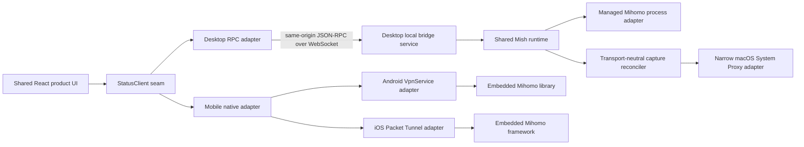

# Frontend and Platform Boundary

## Decision

The product uses a web-first UI without making product logic depend on Tauri.
The same compiled bundle runs in an ordinary browser and inside the desktop
WebView. A desktop local bridge service owns the Mihomo core and exposes a
transport-independent application API; Tauri remains a thin view and
platform-capability shell.



## Ownership

| Layer                              | Owns                                                                                                   | Must not own                                                                             |
| ---------------------------------- | ------------------------------------------------------------------------------------------------------ | ---------------------------------------------------------------------------------------- |
| Shared product UI                  | Views, interaction state, accessible components, DTO consumption                                       | Mihomo core process lifecycle, privilege escalation, direct Tauri imports in domain code |
| Shared domain/application packages | DTOs, commands, invariants, derived view models, capability-neutral use cases                          | WebView APIs or operating-system branching spread through features                       |
| Shared Rust runtime                | Core lifecycle semantics, typed failures, snapshots, application events, platform-neutral coordination | Executable paths, HTTP/WebSocket policy, Android/iOS framework calls                     |
| Typed RPC client                   | Request correlation, subscriptions, reconnect policy, DTO validation                                   | Product-specific rendering                                                               |
| Desktop local bridge service       | Local HTTP/WebSocket origin, authentication and desktop adapter composition                            | Android `VpnService` or iOS Packet Tunnel lifecycle                                      |
| Desktop managed-process adapter    | Mihomo executable paths, child process, PID, signal and cleanup                                        | Cross-platform application semantics                                                     |
| macOS System Proxy adapter         | Structured observation and application of HTTP, HTTPS, and SOCKS settings for one network service      | Capture intent, recovery policy, shell strings, PAC, automatic discovery, or UI state    |
| Android/iOS adapters               | Native VPN permission, TUN/Packet Tunnel lifecycle, native Mihomo integration                          | A spawned desktop executable or persistent WebView lifetime                              |
| Tauri shell                        | Window creation, status-bar menu, native material, deep links, platform permission bridge              | Core business rules or an alternative application state store                            |
| Privileged helper                  | Narrow desktop TUN, DNS, and system-proxy operations requiring elevation                               | General application logic or remote access                                               |

Platform differences are exposed through a capability DTO and adapter rather
than repeated `if (tauri)` or `if (macOS)` branches.

## Desktop local origin and RPC

The desktop local bridge serves the offline web bundle and JSON-RPC endpoint from one
loopback origin. This gives the browser and Tauri clients the same transport and
avoids coupling product features to Tauri commands.

The local origin still requires:

- strict `Host` and `Origin` validation;
- an explicit per-install or per-session authentication secret;
- DNS-rebinding and cross-site request protections;
- bounded message sizes and subscription rates;
- schema validation at the RPC boundary; and
- no network listener beyond loopback unless a separate, explicit feature is
  designed and secured.

This origin is a desktop/browser adapter, not the mobile execution model.
Mobile WebViews use a native Tauri plugin or thin-shell adapter. Android keeps
the VPN alive in a Kotlin `VpnService`; iOS keeps it alive in a Swift
`NEPacketTunnelProvider` extension. Neither depends on the WebView, an Axum
listener, or a spawned CLI process remaining alive.

## Implemented browser client boundary

`packages/rpc-client` implements JSON-RPC 2.0 over an injected WebSocket-like
transport. It has no global singleton and does not choose an endpoint or open a
socket until an owning adapter requests a connection. The boundary owns:

- monotonically increasing request IDs and response correlation;
- method-specific parameter and result validation;
- typed remote, validation, protocol, size, disconnect, cancellation, and
  disposal failures;
- a configurable inbound and outbound message-size limit;
- an authentication-first handshake carrying an explicit token plus client
  name and version metadata;
- validated notification listeners for application subscriptions;
- stale, connecting, connected, reconnecting, disconnected, and disposed
  state; and
- exponential reconnect delays capped by a maximum delay and retry count.

Requests that were in flight when the transport disconnects are rejected and
are not replayed automatically. Replaying a consequential command without
knowing whether the server applied it would be unsafe. Subscription ownership
stays with an adapter, which resubscribes after authentication on a new
connection. Each successful Status subscription response includes its current
validated snapshot, so resubscription restores authoritative state even if no
later notification occurs. The bridge establishes the event cursor before
sampling that snapshot and sends the response before subsequent notifications,
preventing an older queued lifecycle event from overwriting the reconciliation
snapshot. Cancellation removes local correlation state and emits
`rpc.cancel` metadata when the authenticated transport is still available.

`apps/web/src/data/rpc-status-client.ts`, `rpc-traffic-client.ts`,
`rpc-events-client.ts`, and `rpc-diagnostics-client.ts` map this generic
transport to independent Status, Traffic, Events, and Guided Diagnostics view
boundaries. Ordinary
browser startup constructs fixture clients without network or IPC access. The
Tauri WebView obtains a validated private endpoint and in-memory token through
its narrow bootstrap IPC surface, then composes the adapters over one
authenticated RPC client.

## Implemented desktop local bridge slice

`crates/runtime` contains the transport-neutral `MishRuntime` module and the
`CoreRuntime` interface. The interface owns configured/status/start/stop
semantics, stable typed error categories, Status snapshots, and lifecycle
events. It has no Axum, Clap, Nix, executable, signal, or process dependency.
An adapter can publish `native` or `rpc` Status snapshots without changing the
product view contract.

The runtime also defines the closed platform lifecycle event envelope and the
injectable event-source contract. `crates/platform-macos` maps native sleep,
wake, and primary-network-service notifications into that envelope only.
`crates/desktop-bridge` owns the serialized application coordinator that pauses
or invalidates observation authority, restarts collectors, reconciles explicit
capture intent, and rejects stale concurrent event sequences. Neither Tauri nor
the native callback owns those rules.

`crates/desktop-bridge` is the desktop implementation of the platform seam. It
binds only to a loopback address, validates `Host` and WebSocket `Origin`, limits
message size and subscriptions, requires an authentication-first handshake, and
exposes explicit `bridge.getInfo`, `core.getStatus`, `core.start`, and `core.stop`
methods. Authentication secrets come from `MISH_BRIDGE_TOKEN`; they are not CLI
arguments and must never be stored in the repository.

`DesktopMihomoProcess` implements `CoreRuntime` for the managed Mihomo process.
Mihomo executable and configuration paths belong to the
desktop bridge's startup configuration. Browser RPC calls cannot choose an
executable or arbitrary file.
The process manager checks the configured executable's version before launch,
tracks PID and process liveness, sends `SIGTERM` on stop, applies a bounded wait,
and reaps or kills the child before bridge shutdown completes. A background
process monitor also detects termination outside an explicit stop command,
updates `CoreStatus`, and reports the transition through the shared runtime event
sink so RPC and native subscribers cannot retain a false healthy state. It does
not start Mihomo automatically.

`MihomoActivationManager` adds the application transaction above that process
adapter. It generates and privately stages a complete controlled configuration,
uses the exact pinned binary for `-t` validation and launch, composes the
Controller Status source, waits for version/readiness/first snapshot, and only
then commits redacted active state. Failed candidates stop and leave the prior
healthy core active or restore an explicit safe stopped state. Managed binary
resolution is offline: development requires an explicit prepared path and
production looks only in the supplied sidecar resource directory.

`crates/mihomo-controller` implements a transport-neutral client for
the pinned Mihomo Controller surface. The desktop bridge composes its validated,
bounded observations into the Status source, the independent Traffic and Events
sources, and the transactional activation manager. The Tauri shell starts safely stopped
and the authenticated Profile command surface activates only a repository-owned
valid artifact. A successful transaction replaces the shared Status and Traffic
runtime host; default startup still reports Traffic and Events unavailable rather than
discovering private configuration. See
[`mihomo-controller-integration.md`](mihomo-controller-integration.md) for the
process boundaries, data flow, terminology, and remaining mapping gaps.

The Tauri-started Status snapshot remains deliberately sparse, but its macOS
composition now includes a real System Proxy platform adapter. The shared
runtime owns capture intent, serialization, confirmation, rollback, drift, and
recovery semantics; the adapter only observes and applies typed network-service
state. It invokes fixed absolute macOS tools with structured argument vectors,
bounded output and duration, and no shell, `sudo`, or AppleScript. This is a
narrow seam that can be replaced by a privileged helper without changing the
UI or RPC contract.

System Proxy is the only implemented platform-capture mutation. It defaults off and
requires a configured, healthy core plus a reachable managed Mihomo listener
before Mish writes the shared loopback HTTP, HTTPS, and SOCKS endpoint. A
private, size-bounded journal stores only the
minimum prior service state needed for restoration. Every write is observed
again before success is published. Partial application triggers rollback;
unconfirmed rollback, observation loss, or external changes become explicit
drift. Startup, periodic network-service checks, core health changes, and
shutdown audit ownership so a confirmed orphan is restored conservatively.
PAC, automatic discovery, and enabled authenticated proxy settings are observed
but never overwritten.

Commands not backed by real controller or platform reconciliation return a
typed capability error instead of fake success. TUN remains unavailable.
When the Controller source is present, the RPC Status client also discovers
only the reconciled routing-mode and group-selection commands. Missing-core and
lifecycle-only compositions advertise neither Controller command.
Profile import, persistence, refresh, and inactive deletion use the separate
Profile application service. Activation uses its own typed, cancellable command
seam from Profiles and the Status selector. Service and TUN controls remain
unavailable rather than runnable. Active deletion requires
successful replacement activation or an explicit safe stop. Profile activation
never implicitly enables System Proxy.

Protocol version 4 adds Traffic command capabilities and typed results for
closing one stable current connection ID or every connection in the complete
current active snapshot. The Web client sends only profile/session/sequence
authority and connection IDs. It disables duplicate commands while pending,
applies the returned authoritative snapshot on success and failure, and derives
Closed history through the existing same-session snapshot diff. Browser
fixtures advertise these commands as unsupported.

Protocol version 7 adds authenticated, fixed-parameter Guided Diagnostics
history, start, and cancellation methods. The run is owned by the desktop
runtime host so runtime replacement invalidates in-flight work. It defines no
mutation, export, upload, arbitrary endpoint, or persistent history method; see
[`diagnostics-data-contracts.md`](diagnostics-data-contracts.md).

Diagnostics support bundle export is intentionally outside loopback protocol
versioning. The shared UI consumes a typed `SupportBundleClient`: ordinary
browsers receive an explicit unavailable adapter, while the Tauri bootstrap
enables a private preview/save adapter. Preview exposes only metadata for the
exact in-memory JSON; save sends only its opaque preview ID and the native shell
owns destination selection, private atomic writing, cancellation, and cleanup.

Protocol version 8 adds the independent close-window preference and status-bar
and window-lifecycle capability fields. Native menu commands do not create a
second RPC protocol: the Tauri shell calls the same runtime, capture, routing,
and profile-activation application seams composed behind RPC.

Protocol version 9 adds persisted fixed Profile refresh policies plus current
runtime proxy/rule-provider observation and scoped update-one/update-all
results. Scheduling is owned by the desktop application coordinator and stays
active without a WebView. Provider commands carry current profile/fingerprint
authority, preserve partial failures, and never accept a Controller endpoint,
source URL, path, payload, or credential.

Protocol version 10 adds authenticated `profiles.getPatches` and
`profiles.replacePatches`. Both carry only profile/revision/artifact authority
and bounded typed patch DTOs. The desktop serializes patch writes with refresh
and activation, revalidates against repository-owned bytes, and returns only
display-safe catalog and provenance fields. Browser fixtures show one fictional
patch but do not claim validation, persistence, or activation.

The future Android adapter will pair Kotlin `VpnService` with an embedded Go
core library. The future iOS adapter will pair Swift
`NEPacketTunnelProvider` with an embedded core framework. These adapters are
not scaffolded until a native ABI, signing, and lifecycle slice is approved.

`packages/mock-bridge` implements the same shared contracts in TypeScript over a
real loopback WebSocket server. It supports deterministic snapshots,
subscriptions, commands, injected typed failures, and mock core state for test
and adapter development. It is manually started and never selected by default.

## Offline asset policy

The Tauri client ships the complete UI bundle, icons, fonts, charts, and core
screen styles. Core surfaces should not depend on a CDN or appear behind runtime
download placeholders. Code splitting remains acceptable for maintainability,
but it is not required merely to optimize a hosted-web cold start.

`apps/desktop` implements the first shell slice. Tauri embeds `apps/web/dist`,
uses its application-protocol `index.html` fallback for React Router paths, and
starts the existing loopback desktop bridge on an ephemeral port. One permission-scoped
IPC command passes a process-only token and validated endpoint to the main
WebView. Ordinary browser startup remains fixture-backed. The detailed resource
flow and threat model are documented in
[`desktop-bootstrap.md`](desktop-bootstrap.md).

## macOS status-bar behavior

The macOS application normally remains available from the status bar. The
native menu should expose stable, common commands such as proxy start/stop,
capture modes, profile selection, group-scoped proxy selection, opening the
Tauri window, and opening the local browser client. Menu commands call the same
desktop-bridge application API as the React UI.
The implemented ownership, privacy constraints, menu boundary, and close-window
preference are specified in
[`native-status-bar-lifecycle.md`](native-status-bar-lifecycle.md).

## Native sidebar material

Behind-window sidebar translucency is a native-shell capability, not a CSS
effect. The macOS Tauri window applies the semantic Sidebar material backed by
`NSVisualEffectView`, uses a behind-window blending mode, and follows the native
active-window state. The matching WebView sidebar and exposed window-base pixels
are transparent; the foreground workspace remains opaque.

The bootstrap exposes one boolean capability rather than leaking Tauri or
AppKit branches into product components. The browser and unsupported platforms
use the deterministic `surface-soft` fallback. Reduce Transparency paints that
same fallback over the native window. Do not imitate native vibrancy with a
captured wallpaper, decorative gradient, generic glassmorphism, or CSS blur.
Validation covers active and inactive windows, Reduce Transparency, light and
dark appearance, resizing, and energy behavior; see
[`../quality/native-sidebar-validation.md`](../quality/native-sidebar-validation.md).

## Target monorepo shape

The production scaffold should prefer boundaries similar to:

```text
apps/
  web/                 Browser and shared WebView entry
  desktop/             Tauri application
packages/
  domain/              Aggregates, value objects, invariants
  application/         Use cases and derived view models
  contracts/           DTO and JSON-RPC schemas
  rpc-client/          Browser-compatible transport client
  ui/                  Shared accessible components
  design-tokens/       Generated or shared token exports
crates/
  profile/             Profile source, preflight, persistence, and activation seam
  runtime/             Transport-neutral application runtime and core seam
  desktop-bridge/      Desktop bridge and managed-process adapter
  platform-macos/      macOS capability implementation
  privileged-helper/   Narrow elevated operations
```

This is a boundary guide, not a requirement to create empty packages before a
vertical feature needs them. Selected DDD concepts should clarify invariants and
language without adding ceremonial layers.
