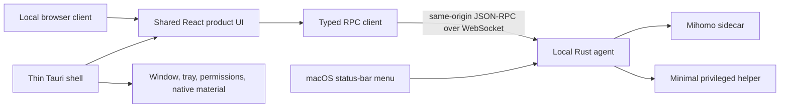

# Frontend and Platform Boundary

## Decision

The product uses a web-first UI without making product logic depend on Tauri.
The same compiled bundle runs in an ordinary browser and inside the desktop
WebView. A local agent owns the Mihomo core and exposes a transport-independent
application API; Tauri remains a thin view and platform-capability shell.



## Ownership

| Layer                              | Owns                                                                                                | Must not own                                                                             |
| ---------------------------------- | --------------------------------------------------------------------------------------------------- | ---------------------------------------------------------------------------------------- |
| Shared product UI                  | Views, interaction state, accessible components, DTO consumption                                    | Mihomo core process lifecycle, privilege escalation, direct Tauri imports in domain code |
| Shared domain/application packages | DTOs, commands, invariants, derived view models, capability-neutral use cases                       | WebView APIs or operating-system branching spread through features                       |
| Typed RPC client                   | Request correlation, subscriptions, reconnect policy, DTO validation                                | Product-specific rendering                                                               |
| Local Rust agent                   | Mihomo core lifecycle, application state, local HTTP/WebSocket origin, persistence, probe execution | Window layout or React component state                                                   |
| Tauri shell                        | Window creation, status-bar menu, native material, deep links, platform permission bridge           | Core business rules or an alternative application state store                            |
| Privileged helper                  | Narrow TUN, DNS, and system-proxy operations requiring elevation                                    | General application logic or remote access                                               |

Platform differences are exposed through a capability DTO and adapter rather
than repeated `if (tauri)` or `if (macOS)` branches.

## Local origin and RPC

The local agent serves the offline web bundle and JSON-RPC endpoint from one
loopback origin. This gives the browser and Tauri clients the same transport and
avoids coupling product features to Tauri commands.

The local origin still requires:

- strict `Host` and `Origin` validation;
- an explicit per-install or per-session authentication secret;
- DNS-rebinding and cross-site request protections;
- bounded message sizes and subscription rates;
- schema validation at the RPC boundary; and
- no network listener beyond loopback unless a separate, explicit feature is
  designed and secured.

## Implemented browser client boundary

`packages/rpc-client` implements JSON-RPC 2.0 over an injected WebSocket-like
transport. It has no global singleton and does not choose an endpoint or open a
socket until an owning adapter requests a connection. The boundary owns:

- monotonically increasing request IDs and response correlation;
- method-specific parameter and result validation;
- typed remote, validation, protocol, size, disconnect, cancellation, and
  disposal failures;
- a configurable inbound and outbound message-size limit;
- an authentication-first handshake carrying an explicit token plus client
  name and version metadata;
- validated notification listeners for application subscriptions;
- stale, connecting, connected, reconnecting, disconnected, and disposed
  state; and
- exponential reconnect delays capped by a maximum delay and retry count.

Requests that were in flight when the transport disconnects are rejected and
are not replayed automatically. Replaying a consequential command without
knowing whether the server applied it would be unsafe. Subscription ownership
stays with an adapter, which resubscribes after authentication on a new
connection. Cancellation removes local correlation state and emits
`rpc.cancel` metadata when the authenticated transport is still available.

`apps/web/src/data/rpc-status-client.ts` maps this generic transport to the
`StatusClient` view boundary. `ProductProvider` does not construct it by
default: the application continues to use `FixtureStatusClient` until a secured
local agent and an explicit endpoint/authentication bootstrap exist.

## Offline asset policy

The Tauri client ships the complete UI bundle, icons, fonts, charts, and core
screen styles. Core surfaces should not depend on a CDN or appear behind runtime
download placeholders. Code splitting remains acceptable for maintainability,
but it is not required merely to optimize a hosted-web cold start.

## macOS status-bar behavior

The macOS application normally remains available from the status bar. The
native menu should expose stable, common commands such as proxy start/stop,
capture modes, profile selection, group-scoped proxy selection, opening the
Tauri window, and opening the local browser client. Menu commands call the same
local-agent application API as the React UI.

## Native sidebar material

Behind-window sidebar translucency is a native-shell capability, not a CSS
effect. The future Tauri window may apply the macOS Sidebar material backed by
`NSVisualEffectView` while leaving the corresponding WebView region transparent.
The foreground workspace remains opaque.

The browser and unsupported platforms use the deterministic `surface-soft`
fallback. Do not imitate native vibrancy with a captured wallpaper, decorative
gradient, or generic glassmorphism. Validate the native implementation against
active and inactive windows, Reduce Transparency, light and dark appearance,
resizing, and energy behavior.

## Target monorepo shape

The production scaffold should prefer boundaries similar to:

```text
apps/
  web/                 Browser and shared WebView entry
  desktop/             Tauri application
packages/
  domain/              Aggregates, value objects, invariants
  application/         Use cases and derived view models
  contracts/           DTO and JSON-RPC schemas
  rpc-client/          Browser-compatible transport client
  ui/                  Shared accessible components
  design-tokens/       Generated or shared token exports
crates/
  agent/               Local service and Mihomo core orchestration
  platform-macos/      macOS capability implementation
  privileged-helper/   Narrow elevated operations
```

This is a boundary guide, not a requirement to create empty packages before a
vertical feature needs them. Selected DDD concepts should clarify invariants and
language without adding ceremonial layers.
