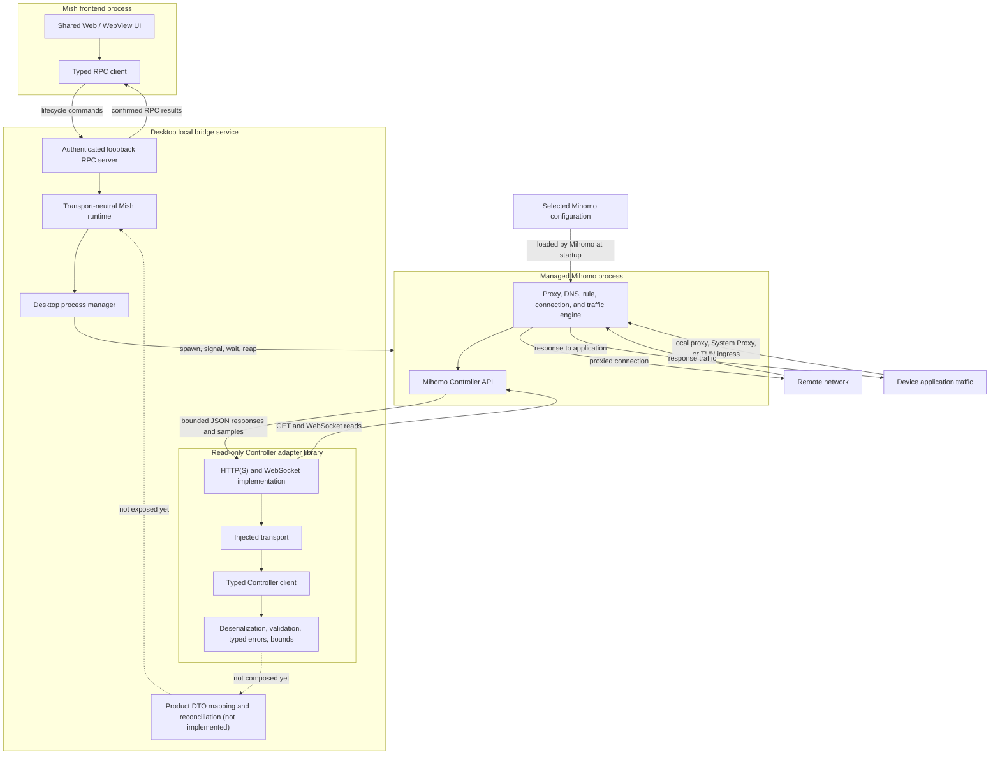

# Mihomo Controller Integration

## Decision

Mish integrates the desktop Mihomo core as a managed operating-system process.
The desktop local bridge service starts and stops that process, while the
read-only Controller adapter observes it over Mihomo's HTTP and WebSocket API.
Mihomo is not linked into the Rust process through a C ABI.

The Controller adapter is a Rust library, not a service and not a proxy engine.
It does not receive or forward device traffic. Its output is a set of validated
Rust DTOs that a future application mapping layer can reconcile into Status,
Routes, and Traffic contracts.

## Terminology

Use these terms in product and architecture prose:

| Term                         | Meaning                                                                                                    |
| ---------------------------- | ---------------------------------------------------------------------------------------------------------- |
| Desktop local bridge service | The loopback Rust process that owns desktop process lifecycle, local RPC, authentication, and composition. |
| Managed Mihomo process       | The independent Mihomo core child process started and stopped by the desktop bridge.                       |
| Controller adapter           | The in-process Rust library that reads and validates Mihomo Controller responses.                          |
| Controller transport         | An injected mechanism for bounded unary and streaming Controller reads.                                    |

Avoid using “agent” as an architecture role because it is easily confused with
an AI agent. The desktop implementation therefore uses `crates/desktop-bridge`,
the `mish-bridge` binary, `MISH_BRIDGE_TOKEN`, and the `bridge.*` RPC namespace.

Reserve “sidecar” for the general deployment pattern in which a companion
process runs beside a main application. In this repository, prefer the precise
terms above: the Rust process is the desktop local bridge service, and Mihomo is
its managed core process.

## Boundaries and data flow

There are three independent paths:

1. **Lifecycle control:** UI RPC calls reach the desktop bridge, which asks the
   process manager to start or stop Mihomo. This path exists today.
2. **Controller observations:** Mihomo emits Controller JSON, the adapter
   validates it, and a future mapper will publish product DTOs over RPC. Only
   the Controller-to-adapter portion exists today.
3. **Device traffic:** application traffic enters Mihomo through a local proxy,
   System Proxy, or TUN path and leaves through Mihomo's selected outbound.
   This traffic never passes through the Controller adapter.

The third path describes Mihomo's role after a platform capture path is
configured. This slice does not enable System Proxy, TUN, or any other device
traffic capture.

## Implemented read-only surface

`crates/mihomo-controller` implements the following v1.19.29 surface:

| Endpoint       | Transport      | Adapter result                                                                  |
| -------------- | -------------- | ------------------------------------------------------------------------------- |
| `/version`     | HTTP GET       | Version metadata and explicit pinned-version verification                       |
| `/configs`     | HTTP GET       | Routing mode and the bounded runtime-configuration subset needed by the product |
| `/proxies`     | HTTP GET       | Proxy metadata, histories, group children, current selection, and fixed choice  |
| `/traffic`     | WebSocket      | Traffic samples and a first-sample snapshot helper                              |
| `/memory`      | WebSocket      | Mihomo memory samples and a first-sample snapshot helper                        |
| `/connections` | HTTP/WebSocket | Active connection snapshot or stream                                            |
| `/rules`       | HTTP GET       | Ordered rules, optional wrapper statistics, disabled state, and effective count |

The generic `ControllerTransport` boundary permits another host implementation
without changing DTO validation. The included transport accepts only HTTP or
HTTPS base URLs, sends an optional Bearer credential in headers, converts the
scheme to WS or WSS for streams, applies connection and unary-request timeouts,
and enforces body, message, string, collection, history, chain, connection, and
rule bounds. Per-stream cancellation and client-wide shutdown drop outstanding
reads without publishing a synthetic success.

The adapter validates the pinned version explicitly through
`verify_version()`. Callers may still read `/version` without claiming that an
unknown version is supported.

## DTO mapping rules

- User-authored proxy and group names are opaque Unicode strings. Preserve
  exact values; do not split emoji, infer geography or protocol from labels, or
  normalize names.
- The presence of Mihomo's `all` field identifies a group. `now` is the current
  effective child when present, and `fixed` is retained separately.
- Mihomo group serializers do not consistently expose an internal UUID. A
  future product identifier must therefore be scoped to a stable profile
  fingerprint rather than treating a label as globally unique.
- Traffic and memory integers are preserved as Controller values. Unit display
  and time-series retention belong to the product mapping layer.
- v1.19.29 deliberately emits zero for the first `/memory` sample. The adapter
  preserves that sample rather than replacing it with a fabricated value.
- Connection IDs are unique within an active snapshot. Chain order, rule type,
  rule payload, process fields, and destination metadata are preserved without
  interpretation.
- `extra.disabled` determines whether a wrapped rule contributes to the
  effective count. A rule without wrapper metadata is treated as enabled.
- Unknown JSON fields are ignored for additive compatibility, while required
  fields, numeric ranges, enum values, and configured size bounds are enforced.

These Controller DTOs are not the shared Status DTOs. The future mapping layer
must add local lifecycle state, uptime, active-profile identity, platform
capabilities, capture intent, traffic-series retention, and profile-scoped
group-usage derivation. See
[`status-data-contracts.md`](status-data-contracts.md) for those semantics.

## Explicit exclusions and remaining gaps

This slice does not:

- compose the adapter into `ProductProvider`, the Rust runtime, or RPC;
- change Status subscription ownership or reconnection behavior;
- mutate profiles, routing mode, group selection, rules, or connections;
- enable System Proxy, TUN, DNS changes, or privileged operations;
- call delay-test endpoints, which initiate real network requests and update
  Mihomo histories;
- retain closed connections or historical traffic;
- read proxy-provider or rule-provider inventories; or
- implement Unix-socket or named-pipe Controller transports.

The synthetic loopback integration test is test infrastructure only. It does
not implement Mihomo routing or proxy traffic and contains no real endpoints,
configuration, credentials, subscription data, or node names.

## Upstream references

- [Mihomo Controller API](https://wiki.metacubex.one/en/api/)
- [v1.19.29 Controller routes](https://github.com/MetaCubeX/mihomo/blob/v1.19.29/hub/route/server.go)
- [v1.19.29 connection endpoint](https://github.com/MetaCubeX/mihomo/blob/v1.19.29/hub/route/connections.go)
- [v1.19.29 proxy endpoint](https://github.com/MetaCubeX/mihomo/blob/v1.19.29/hub/route/proxies.go)
- [v1.19.29 rule endpoint](https://github.com/MetaCubeX/mihomo/blob/v1.19.29/hub/route/rules.go)
