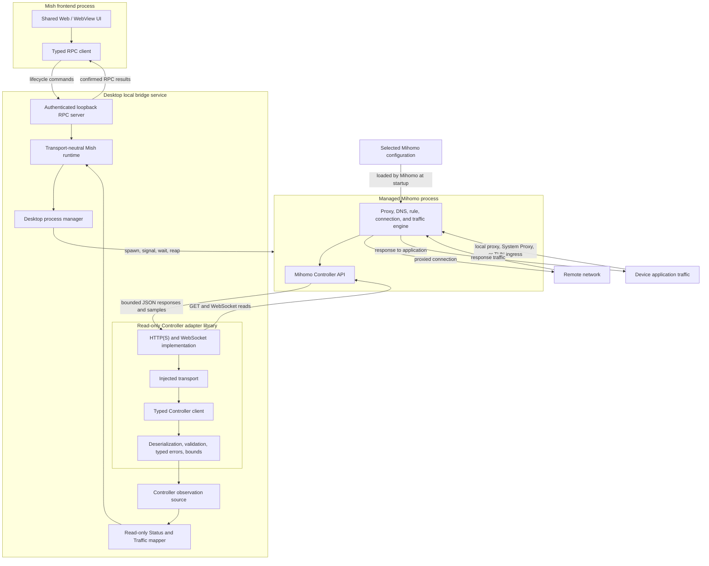

# Mihomo Controller Integration

## Decision

Mish integrates the desktop Mihomo core as a managed operating-system process.
The desktop local bridge service starts and stops that process, while the
read-only Controller adapter observes it over Mihomo's HTTP and WebSocket API.
Mihomo is not linked into the Rust process through a C ABI.

The Controller adapter is a Rust library, not a service and not a proxy engine.
It does not receive or forward device traffic. Its output is a set of validated
Rust DTOs. A read-only application mapper in `crates/desktop-bridge` reconciles
those DTOs into the transport-neutral typed Status state owned by
`crates/runtime`.

## Terminology

Use these terms in product and architecture prose:

| Term                         | Meaning                                                                                                    |
| ---------------------------- | ---------------------------------------------------------------------------------------------------------- |
| Desktop local bridge service | The loopback Rust process that owns desktop process lifecycle, local RPC, authentication, and composition. |
| Managed Mihomo process       | The independent Mihomo core child process started and stopped by the desktop bridge.                       |
| Controller adapter           | The in-process Rust library that reads and validates Mihomo Controller responses.                          |
| Controller transport         | An injected mechanism for bounded unary and streaming Controller reads.                                    |

Avoid using “agent” as an architecture role because it is easily confused with
an AI agent. The desktop implementation therefore uses `crates/desktop-bridge`,
the `mish-bridge` binary, `MISH_BRIDGE_TOKEN`, and the `bridge.*` RPC namespace.

Reserve “sidecar” for the general deployment pattern in which a companion
process runs beside a main application. In this repository, prefer the precise
terms above: the Rust process is the desktop local bridge service, and Mihomo is
its managed core process.

## Boundaries and data flow



There are three independent paths:

1. **Lifecycle control:** UI RPC calls reach the desktop bridge, which asks the
   process manager to start or stop Mihomo. This path exists today.
2. **Controller observations:** when the desktop host supplies an explicit
   loopback Controller configuration, the desktop observation source verifies the
   pinned version, owns unary refreshes and streams, reconciles validated
   observations through the mapper, and publishes changes through the runtime
   to the independent Status and Traffic snapshot/subscription contracts.
3. **Device traffic:** application traffic enters Mihomo through a local proxy,
   System Proxy, or TUN path and leaves through Mihomo's selected outbound.
   This traffic never passes through the Controller adapter.

The third path describes Mihomo's role after a platform capture path is
configured. This slice does not enable System Proxy, TUN, or any other device
traffic capture.

## Implemented read-only surface

`crates/mihomo-controller` implements the following v1.19.29 surface:

| Endpoint       | Transport      | Adapter result                                                                  |
| -------------- | -------------- | ------------------------------------------------------------------------------- |
| `/version`     | HTTP GET       | Version metadata and explicit pinned-version verification                       |
| `/configs`     | HTTP GET       | Routing mode and the bounded runtime-configuration subset needed by the product |
| `/proxies`     | HTTP GET       | Proxy metadata, histories, group children, current selection, and fixed choice  |
| `/traffic`     | WebSocket      | Traffic samples and a first-sample snapshot helper                              |
| `/memory`      | WebSocket      | Mihomo memory samples and a first-sample snapshot helper                        |
| `/connections` | HTTP/WebSocket | Active connection snapshot or stream                                            |
| `/rules`       | HTTP GET       | Ordered rules, optional wrapper statistics, disabled state, and effective count |

The generic `ControllerTransport` boundary permits another host implementation
without changing DTO validation. The included transport accepts only HTTP or
HTTPS base URLs, sends an optional Bearer credential in headers, converts the
scheme to WS or WSS for streams, applies connection and unary-request timeouts,
and enforces body, message, string, collection, history, chain, connection, and
rule bounds. Per-stream cancellation and client-wide shutdown drop outstanding
reads without publishing a synthetic success.

The adapter validates the pinned version explicitly through
`verify_version()`. Callers may still read `/version` without claiming that an
unknown version is supported.

## Desktop observation ownership

`ControllerStatusSource` in `crates/desktop-bridge` is the concrete desktop
owner for Controller observation. Construction requires injected lifecycle
data plus an explicit configuration containing a loopback base URL, optional
Bearer secret, profile ID/fingerprint/label, Controller bounds, transport
timeouts, refresh interval, and reconnect delay. The configuration is held in
process memory. It is not discovered from environment variables, system proxy
settings, profiles, subscriptions, or user directories.

The source starts only after `MishRuntime` attaches its status-event sink. One
observation session proceeds in this order:

1. Read `/version` and require exactly `v1.19.29`.
2. Open the `/traffic` and `/memory` WebSocket streams.
3. Read an initial coalesced batch from `/configs`, `/proxies`, `/rules`,
   `/connections`, and the first traffic and memory stream messages.
4. Apply the complete initial batch transactionally and publish the first valid
   Status change.
5. Continue long-lived traffic and memory reads while a bounded interval
   refreshes configs, proxies, rules, and connections as one batch.

The source uses the existing `ControllerClient` and therefore inherits its
HTTP request timeout, stream connection timeout, response and message bounds,
per-stream cancellation, and client-wide shutdown semantics. It does not add an
unbounded response buffer or bypass DTO validation.

The source exposes a closed initial-observation result for activation
coordination. `Ready` is published only after version verification and the first
complete batch. Unsupported versions and invalid first snapshots are typed
terminal candidate failures; ordinary connection failures may retry only until
the activation readiness deadline.

`compose_desktop_runtime` remains the lifecycle/read-only composition seam.
Passing an explicit Controller configuration installs and starts the source.
Passing `None` constructs the existing lifecycle-only runtime and performs no
Controller access. Tauri begins with that safe stopped runtime and replaces it
through `DesktopRuntimeHost` only after authenticated profile activation commits.
The standalone bridge binary remains lifecycle-only unless its host explicitly
composes an activation coordinator.

## Transactional core activation

`MihomoActivationManager` composes `DesktopMihomoProcess` and
`ControllerStatusSource` for one persisted normalized artifact. The generator
reasserts application policy even if an older or tampered artifact still
contains removed keys: all proxy ingress ports are zero, LAN and listeners are
off, the bind address and Controller are loopback-only, the Controller secret is
application-owned, mode is Rule, logging is warning, sniffer capture and TUN are
off, DNS has no listen socket, and selection/fake-IP persistence is disabled.
Relative provider paths remain source-owned but paths that escape the managed
home are rejected.

Each candidate uses a private `0700` directory and `0600` configuration under
the managed runtime root. Validation runs `mihomo -d <candidate-home> -f
<candidate-config> -t` only after the executable reports the exact pinned
version. The validated candidate then starts without replacing or stopping the
prior core. Commit requires all of the following:

1. the child remains alive;
2. the Controller reports v1.19.29;
3. Controller HTTP and stream readiness succeeds; and
4. the first complete observation batch maps to valid Status and Traffic
   snapshots.

Only then may the manager stop the prior core and atomically replace
`activation-state.json`. The coordinator then atomically replaces the runtime
host and publishes the active-profile projection. A validation error, early exit, readiness timeout,
version mismatch, Controller failure, prior-stop failure, or active-state write
failure stops the candidate and preserves or restarts the prior core. If the
prior core cannot be restored, the in-memory state is cleared and the result is
an explicit safe stopped failure. The state and attempt documents contain no
configuration, URL, Controller secret, node label, or absolute path.

`ManagedMihomoResolver` performs no network access. Development callers must
pass the explicit path produced by `pnpm mihomo:prepare`. Production callers
pass the packaged sidecar/resource directory. Lookup accepts the packaged
runtime name (`mihomo`, or `mihomo.exe`) and the target-specific bundle input
name such as `mihomo-aarch64-apple-darwin`. Missing binaries return a typed
missing state rather than initiating a runtime download.

## Status mapping and reconciliation

`ControllerStatusMapper` accepts a caller-supplied profile ID, profile label,
and stable profile fingerprint. It accepts validated observation batches but
does not fetch, authenticate, persist, or schedule them. `crates/runtime` owns
the transport-neutral Status structs and a generic `StatusDataSource` seam; it
does not depend on the Controller crate or any desktop transport.

| Status value             | Mapper input and behavior                                                                                           |
| ------------------------ | ------------------------------------------------------------------------------------------------------------------- |
| Routing mode             | Latest `/configs` mode; a configuration observation is required before a snapshot can be produced                   |
| Core health              | Caller-supplied transport-neutral `CoreStatus`; an explicit core error becomes the Status message                   |
| Groups and selection     | `/proxies` entries with `all`; `now` must exist, name one of that group's children, and resolve in the same catalog |
| Nodes and latency        | Non-group `/proxies` entries; protocol is the exact Controller `type`, latency is the last supplied history delay   |
| Traffic                  | Latest `/traffic` rates/totals plus a bounded series of observed rates                                              |
| Memory                   | Latest `/memory.inuse`                                                                                              |
| Active connections       | Length of the latest explicit `/connections` snapshot                                                               |
| Effective rules          | `/rules` entries excluding those explicitly marked disabled                                                         |
| Group usage              | Bounded recent connection-ID de-duplication and exact chain intersection with visible group labels                  |
| Capabilities and capture | System Proxy and TUN are unavailable, disabled, and unselected                                                      |

That capability row describes the Controller mapper alone. A desktop host may
compose the independent capture reconciler afterward; the macOS Tauri host does
so for System Proxy while leaving TUN unavailable.

Catalog application is transactional. A missing selection, duplicate child,
unknown child, out-of-group selection, or derived identifier collision rejects
the whole catalog update and preserves the last valid state. This is necessary
because the Status contract requires a selected child and cannot honestly
represent an incomplete group.

The observation source preserves the mapper's transaction boundary. A rejected
traffic, memory, or refresh batch leaves the last valid mapper state intact and
sets a diagnostic runtime error. The failed channel clears that diagnostic only
after it supplies another valid observation. A transport failure, stream end,
HTTP error, decode failure, validation failure, or unsupported version ends the
current observation session, preserves the last valid state, reports the
failure through Status, waits the injected reconnect delay, and starts again at
version verification. A successful complete initial batch clears prior session
diagnostics. No failure is converted into a healthy or zero-valued Controller
sample.

An absent field in an observation batch means that source did not publish a new
value; the mapper retains its last observation. An explicit empty connection
snapshot sets the active count to zero. Before the optional traffic, memory,
connection, or rule streams produce a value, their contract-required numeric
state is zero and traffic series are empty. The mapper does not claim that zero
is a fresh Controller sample.

Traffic series retain at most 512 observations, matching the Status DTO bound;
the policy may lower but not raise that limit. Connection de-duplication retains
the latest 65,536 IDs by default and evicts oldest IDs first. Group counts are
profile-local, saturating counters and are emitted only for currently visible
groups. Replaying an evicted connection ID may increment a count again, so these
values remain heuristic ranking input rather than exact request totals.

## DTO preservation rules

- User-authored proxy and group names are opaque Unicode strings. Preserve
  exact values; do not split emoji, infer geography or protocol from labels, or
  normalize names.
- The presence of Mihomo's `all` field identifies a group. `now` is the current
  effective child when present, and `fixed` is retained separately.
- Mihomo group serializers do not consistently expose an internal UUID. The
  mapper derives `group:` and `proxy:` identifiers by hashing the entity kind,
  caller-supplied profile fingerprint, and Controller ID when present or exact
  label otherwise. Labels are never treated as globally unique.
- Traffic and memory integers are preserved as Controller values. Unit display
  and time-series retention belong to the product mapping layer.
- Mihomo declares traffic totals, traffic rates, and connection byte counters
  as signed 64-bit integers. The adapter preserves that wire type instead of
  imposing an unsigned interpretation. The separate Status mapper performs a
  checked conversion for product traffic values and transactionally rejects
  negative samples; see
  [`status-data-contracts.md`](status-data-contracts.md#mihomo-core-source-mapping).
- v1.19.29 deliberately emits zero for the first `/memory` sample. The adapter
  preserves that sample rather than replacing it with a fabricated value.
- An idle v1.19.29 core serializes the connection list as `null`. The adapter
  normalizes that value to an empty collection for both HTTP snapshots and
  WebSocket samples.
- Connection IDs are unique within an active snapshot. Chain order, rule type,
  rule payload, process fields, and destination metadata are preserved without
  interpretation.
- `extra.disabled` determines whether a wrapped rule contributes to the
  effective count. A rule without wrapper metadata is treated as enabled.
- Unknown JSON fields are ignored for additive compatibility, while required
  fields, numeric ranges, enum values, and configured size bounds are enforced.

Controller DTOs remain distinct from the shared Status structs. The mapper adds
caller-supplied lifecycle, uptime, active-profile identity, honest platform
capabilities, bounded traffic-series retention, and profile-scoped group usage.
See [`status-data-contracts.md`](status-data-contracts.md) for those semantics.
The same validated observation batch also maps detailed connections and ordered
rules into the independent read-only Traffic snapshot documented in
[`traffic-data-contracts.md`](traffic-data-contracts.md). Exact connection byte
counters cross that boundary as decimal strings.

## Shutdown order

Desktop shutdown is ordered and awaitable:

1. `MishRuntime` asks the Status source to close.
2. The source cancels its collector token and the `ControllerClient`, which
   releases outstanding unary reads and WebSocket streams, then awaits the
   collector task.
3. The runtime stops the managed Mihomo lifecycle.
4. The loopback bridge requests graceful RPC server shutdown and awaits the
   server task.

Closing the source is idempotent. Dropping an unclosed source also signals
cancellation, but production ownership uses the awaited shutdown path.

## Explicit exclusions and remaining gaps

The composed managed slice does not:

- discover a Controller configuration or read one from system state;
- accept arbitrary configuration bytes, paths, Controller endpoints, or secrets
  through RPC;
- silently select, import, or restore a profile during Tauri startup;
- download or install Mihomo at runtime; production packaging must still supply
  the pinned resource;
- mutate profiles, routing mode, group selection, rules, or connections;
- enable System Proxy, TUN, DNS changes, or privileged operations;
- call delay-test endpoints, which initiate real network requests and update
  Mihomo histories;
- persist closed connections or historical traffic; the Web client derives only
  a bounded in-memory recently Closed view;
- read proxy-provider or rule-provider inventories; or
- implement Unix-socket or named-pipe Controller transports.

The synthetic loopback and fake-process integration tests are test
infrastructure only. They do not implement Mihomo routing or proxy traffic and
use only fictional endpoints, configuration, credentials, and labels.

## Opt-in pinned-core verification

The real-core integration test is disabled unless `MIHOMO_BIN` is set. Ordinary
tests and CI therefore do not download or execute Mihomo and do not require
network access. On Apple Silicon macOS, prepare and run the pinned core with:

```sh
pnpm mihomo:prepare
MIHOMO_BIN="$PWD/.scratch/mihomo/v1.19.29/mihomo-darwin-arm64-v1.19.29" \
  cargo test -p mish-mihomo-controller --test real_core -- --nocapture
MIHOMO_BIN="$PWD/.scratch/mihomo/v1.19.29/mihomo-darwin-arm64-v1.19.29" \
  cargo test -p mish-bridge --test real_core_activation -- --nocapture
```

The Controller harness writes a synthetic configuration under ignored
`.scratch` storage. The activation harness uses a private operating-system temp
directory. Both bind the Controller only to an ephemeral loopback port, disable
proxy ingress, LAN access, DNS, and TUN, and use no providers or remote proxy
endpoints. They read `/version`, `/configs`, `/proxies`, `/rules`, `/traffic`,
`/memory`, and `/connections`; they do not call delay tests or generate routed
traffic.

## Upstream references

- [Mihomo Controller API](https://wiki.metacubex.one/en/api/)
- [v1.19.29 Controller routes](https://github.com/MetaCubeX/mihomo/blob/v1.19.29/hub/route/server.go)
- [v1.19.29 connection endpoint](https://github.com/MetaCubeX/mihomo/blob/v1.19.29/hub/route/connections.go)
- [v1.19.29 connection snapshot](https://github.com/MetaCubeX/mihomo/blob/v1.19.29/tunnel/statistic/manager.go)
- [v1.19.29 connection tracker](https://github.com/MetaCubeX/mihomo/blob/v1.19.29/tunnel/statistic/tracker.go)
- [v1.19.29 proxy endpoint](https://github.com/MetaCubeX/mihomo/blob/v1.19.29/hub/route/proxies.go)
- [v1.19.29 rule endpoint](https://github.com/MetaCubeX/mihomo/blob/v1.19.29/hub/route/rules.go)
- [Tauri external binary naming](https://v2.tauri.app/develop/sidecar/)
