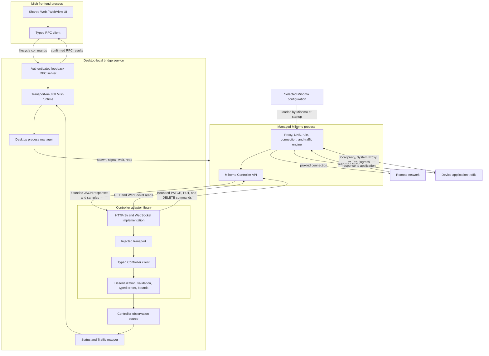

# Mihomo Controller Integration

## Decision

Mish integrates the desktop Mihomo core as a managed operating-system process.
The desktop local bridge service starts and stops that process, while the
Controller adapter observes it and exposes bounded mutation families plus one
group-scoped diagnostic operation over Mihomo's HTTP and WebSocket API.
Mihomo is not linked into the Rust process through a C ABI.

The Controller adapter is a Rust library, not a service and not a proxy engine.
It does not receive or forward device traffic. Its output is a set of validated
Rust DTOs. An application mapper in `crates/desktop-bridge` reconciles
those DTOs into the transport-neutral typed Status state owned by
`crates/runtime`.

## Terminology

Use these terms in product and architecture prose:

| Term                         | Meaning                                                                                                    |
| ---------------------------- | ---------------------------------------------------------------------------------------------------------- |
| Desktop local bridge service | The loopback Rust process that owns desktop process lifecycle, local RPC, authentication, and composition. |
| Managed Mihomo process       | The independent Mihomo core child process started and stopped by the desktop bridge.                       |
| Controller adapter           | The in-process Rust library that validates bounded Mihomo Controller observations and commands.            |
| Controller transport         | An injected mechanism for bounded unary and streaming Controller reads.                                    |

Avoid using “agent” as an architecture role because it is easily confused with
an AI agent. The desktop implementation therefore uses `crates/desktop-bridge`,
the `mish-bridge` binary, `MISH_BRIDGE_TOKEN`, and the `bridge.*` RPC namespace.

Reserve “sidecar” for the general deployment pattern in which a companion
process runs beside a main application. In this repository, prefer the precise
terms above: the Rust process is the desktop local bridge service, and Mihomo is
its managed core process.

## Boundaries and data flow



There are three independent paths:

1. **Lifecycle control:** UI RPC calls reach the desktop bridge, which asks the
   process manager to start or stop Mihomo. This path exists today.
2. **Controller observations:** when the desktop host supplies an explicit
   loopback Controller configuration, the desktop observation source verifies the
   pinned version, owns unary refreshes and streams, reconciles validated
   observations through the mapper, and publishes changes through the runtime
   to the independent Status, Traffic, and Events snapshot/subscription contracts.
3. **Device traffic:** application traffic enters Mihomo through a local proxy,
   System Proxy, or TUN path and leaves through Mihomo's selected outbound.
   This traffic never passes through the Controller adapter.

The third path describes Mihomo's role after a platform capture path is
configured. This slice does not enable System Proxy, TUN, or any other device
traffic capture.

## Implemented observation and command surface

`crates/mihomo-controller` implements the following v1.19.29 surface:

| Endpoint                    | Transport      | Adapter result                                                                  |
| --------------------------- | -------------- | ------------------------------------------------------------------------------- |
| `/version`                  | HTTP GET       | Version metadata and explicit pinned-version verification                       |
| `/configs`                  | HTTP GET       | Routing mode and the bounded runtime-configuration subset needed by the product |
| `/proxies`                  | HTTP GET       | Proxy metadata, histories, group children, current selection, and fixed choice  |
| `/proxies/{name}/delay`     | HTTP GET       | One bounded delay result for a catalog-confirmed direct group child             |
| `/traffic`                  | WebSocket      | Traffic samples and a first-sample snapshot helper                              |
| `/memory`                   | WebSocket      | Mihomo memory samples and a first-sample snapshot helper                        |
| `/logs`                     | WebSocket      | Structured core events, bounded validation, and source redaction                |
| `/connections`              | HTTP/WebSocket | Active connection snapshot or stream                                            |
| `/connections`              | HTTP DELETE    | Close all connections active at Controller command time                         |
| `/connections/{id}`         | HTTP DELETE    | Close one stable active connection ID                                           |
| `/rules`                    | HTTP GET       | Ordered rules, optional wrapper statistics, disabled state, and effective count |
| `/providers/proxies`        | HTTP GET       | Safe proxy-provider identity, source type, update time, count, and health       |
| `/providers/rules`          | HTTP GET       | Safe rule-provider identity, source type, behavior, update time, and count      |
| `/providers/proxies/{name}` | HTTP PUT       | Explicit update of one proxy provider                                           |
| `/providers/rules/{name}`   | HTTP PUT       | Explicit update of one rule provider                                            |

The generic `ControllerTransport` boundary permits another host implementation
without changing DTO validation. The included transport accepts only HTTP or
HTTPS base URLs, sends an optional Bearer credential in headers, converts the
scheme to WS or WSS for streams, applies connection and unary-request timeouts,
and enforces body, message, string, collection, history, chain, connection, and
rule bounds. Per-stream cancellation and client-wide shutdown drop outstanding
reads without publishing a synthetic success.

The adapter validates the pinned version explicitly through
`verify_version()`. Callers may still read `/version` without claiming that an
unknown version is supported.

The command surface is deliberately limited to `PATCH /configs` for the closed
Rule, Global, and Direct mode enum and `PUT /proxies/{group}` for one named
child. The desktop source serializes commands with observation refreshes,
rechecks the pinned version and current proxy catalog before every write, and
accepts group selection only when the target is a Selector and the child is a
current direct member. A successful HTTP response is not product success. The
source polls a fresh bounded Controller observation until it confirms the mode
or group selection, then maps and publishes that observation before returning
the RPC result.

Provider inventory is a separate Profiles-owned runtime surface. The adapter
intentionally deserializes only provider name, kind, vehicle type, update time,
rule behavior/count, and proxy `alive` flags. Controller URL, path, payload,
proxy endpoint, and credential fields never enter the runtime DTO. The desktop
source verifies the pinned version and current profile/fingerprint authority,
resolves a stable provider ID to one current exact Controller label, serializes
provider commands with other Controller mutations, and accepts success only
after a fresh bounded inventory contains that same provider ID. Update All
runs providers serially, retains provider-specific failures, and can return a
typed partial result.

Pinned v1.19.29 executes provider `Update()` synchronously in the HTTP handler
and does not pass request context into that operation. Mish can cancel its local
wait, but cannot claim that an already-started core update was remotely undone.
Runtime replacement therefore invalidates the old command result and publishes
only the replacement runtime's provider authority and inventory. Browser
fixtures advertise this surface as fixture-only and execute no inventory read
or update.

Routes delay testing is a separate, user-initiated diagnostic surface. The
ordinary RPC accepts only a stable group ID to start and a server-issued test ID
to cancel; it never accepts a Controller path, URL, credential, timeout, or
private endpoint. Mish resolves the group against a fresh authoritative catalog,
captures only its direct children, and schedules at most four
`GET /proxies/{name}/delay` requests. Opaque Unicode labels become one encoded
URL path segment. Every Controller result is revalidated against a fresh pinned
version and catalog before publication, so removed children fail with explicit
stale membership instead of leaking a cross-profile result.

Pinned v1.19.29 also exposes `GET /group/{name}/delay`. That handler uses the
request context and returns a child-name-to-delay map when the group operation
succeeds, or 504 on an operation error. For non-Selector selectable groups it
also clears the forced selection before testing. Mish deliberately does not call
that endpoint: its side effect, aggregate error shape, and core-owned concurrent
scheduling cannot provide the required per-child progress and client-held
cancellation boundary. Instead Mish snapshots the same group's current direct
children and invokes the individual endpoint through bounded local scheduling.

The P0 application policy is `mihomo-google-204-v1`: the upstream recommended
`https://www.gstatic.com/generate_204` target, a 5,000 ms timeout, and expected
HTTP status 204. The status RPC exposes the fixed public URL and timeout but does
not allow either value to be overridden. The browser displays only the URL; the
internal policy ID and timeout remain contract and execution metadata. No
background or scheduled probe exists.

Cancellation stops unstarted work and drops client-held HTTP work. Pinned
v1.19.29 creates an individual proxy delay context from
`context.Background()`, so a request disconnect cannot remotely undo a probe
already executing inside Mihomo. Mish therefore preserves confirmed child
results, marks unfinished children cancelled, and never converts a cancelled
test into overall success. Runtime/profile shutdown cancels the old test context
before the replacement snapshot becomes authoritative.

## Desktop observation ownership

`ControllerStatusSource` in `crates/desktop-bridge` is the concrete desktop
owner for Controller observation. Construction requires injected lifecycle
data plus an explicit configuration containing a loopback base URL, optional
Bearer secret, profile ID/fingerprint/label, Controller bounds, transport
timeouts, refresh interval, and reconnect delay. The configuration is held in
process memory. It is not discovered from environment variables, system proxy
settings, profiles, subscriptions, or user directories.

The source starts only after `MishRuntime` attaches its status-event sink. The
Status and Traffic observation session proceeds in this order:

1. Read `/version` and require exactly `v1.19.29`.
2. Open the `/traffic` and `/memory` WebSocket streams.
3. Read an initial coalesced batch from `/configs`, `/proxies`, `/rules`,
   `/connections`, and the first traffic and memory stream messages.
4. Read proxy- and rule-provider inventories as an independently bounded
   runtime observation; failure remains visible without invalidating Status or Traffic.
5. Apply the complete initial batch transactionally and publish the first valid
   Status and Traffic session.
6. Continue long-lived traffic and memory reads while a bounded interval
   refreshes configs, proxies, rules, and connections as one batch.

An independent Events collector verifies the same pinned Controller and opens
the structured `/logs` stream. A successful handshake publishes a ready Events
session without waiting for a log message because an idle healthy core may emit
none. Handshake, transport, stream, decode, and validation failures change only
the Events phase and bounded local boundary events. Its reconnect loop creates
a new Events session without restarting a healthy Status and Traffic session.

The source uses the existing `ControllerClient` and therefore inherits its
HTTP request timeout, stream connection timeout, response and message bounds,
per-stream cancellation, and client-wide shutdown semantics. It does not add an
unbounded response buffer or bypass DTO validation.

The source exposes a closed initial-observation result for activation
coordination. `Ready` is published only after version verification and the first
complete batch. Unsupported versions and invalid first snapshots are typed
terminal candidate failures; ordinary connection failures may retry only until
the activation readiness deadline.

The source also implements the runtime observation-control hook used by desktop
lifecycle coordination. A sleep pause cancels the live Status/Traffic and Events
collector tasks and leaves the last session explicitly stale. A network change,
wake rebuild, or unavailable core increments the observation generation, waits
for in-flight command authority, clears the mapper, connections, event buffer,
event session, and group-delay authority, and rejects late collector work from
older generations. Resume opens new streams and publishes authority only after
the ordinary pinned-version and complete-initial-batch barrier succeeds. It does
not restart Mihomo, probe an arbitrary endpoint, or reuse an old connection
session identifier.

`compose_desktop_runtime` remains the lifecycle/Controller composition seam.
Passing an explicit Controller configuration installs and starts the source.
Passing `None` constructs the existing lifecycle-only runtime and performs no
Controller access. Tauri begins with that safe stopped runtime and replaces it
through `DesktopRuntimeHost` only after authenticated profile activation commits.
The standalone bridge binary remains lifecycle-only unless its host explicitly
composes an activation coordinator.

## Transactional core activation

`MihomoActivationManager` composes `DesktopMihomoProcess` and
`ControllerStatusSource` for one persisted normalized artifact. The generator
reasserts application policy even if an older or tampered artifact still
contains removed keys: the application-owned loopback mixed proxy endpoint is
enabled, every other proxy ingress port is zero, LAN and custom listeners are
off, the bind address and Controller are loopback-only, the Controller secret is
application-owned, mode is Rule, logging is warning, sniffer capture and TUN are
off, DNS has no listen socket, Profile-owned selection persistence is preserved,
and fake-IP persistence is disabled. When selection persistence is enabled, Mish
copies Mihomo's bounded private `cache.db` between the profile-and-effective-
fingerprint cache and each short-lived candidate home.
Relative provider paths remain source-owned but paths that escape the managed
home are rejected.

The Settings-owned managed-port pair defaults to mixed proxy `127.0.0.1:7890`
and Controller `127.0.0.1:9090`. Both values are loopback-only, must be
distinct, and apply only to a later activation; they never come from a Profile.
The same configured mixed endpoint can be used by one browser extension or
application-specific manual proxy without enabling macOS System Proxy. Protocol
version 14 exposes only a bounded readiness test for that listener; it accepts no
target and does not observe or apply operating-system proxy state. See
[`local-proxy-debugging.md`](local-proxy-debugging.md).

Each candidate uses a private `0700` directory and `0600` configuration under
the managed runtime root. Validation runs `mihomo -d <candidate-home> -f
<candidate-config> -t` only after the executable reports the exact pinned
version. Because active and candidate cores cannot own the same managed proxy
port concurrently, switching first restores any confirmed Mish-owned System
Proxy state, stops the prior core, and then starts the validated candidate.
Commit requires all of the following:

1. the child remains alive;
2. the Controller reports v1.19.29;
3. Controller HTTP plus Status and Traffic stream readiness succeeds; and
4. the first complete observation batch maps to valid Status and Traffic
   snapshots.

Production desktop candidates also require the configured mixed-proxy listener to be
owned by the same recorded PID and process identity before commit. Controller
readiness from a candidate that failed to bind either configured managed port is therefore not
activation success, even if another process makes that port connectable.

If a candidate exits or cannot start while either configured Mish-managed
loopback listener cannot be bound, activation reports the bounded
`managed-listener-conflict` failure with only `127.0.0.1:<port>` and the safe
remediation to stop or reconfigure the competing application. The notification
surface also offers one bounded recovery: choose two currently available
loopback ports, persist them, and retry the same activation. It does not inspect
or expose process arguments, paths, configuration, credentials, or unrelated
process metadata. Other early exits remain typed as `early-exit`.

Core lifecycle ownership is durable independently from `activation-state.json`.
The schema-1 ownership record binds the controlled executable, candidate home,
candidate configuration, PID when known, process start identity, random launch
generation/token, and launch phase. It is private, bounded, versioned, and
atomically replaced. The launch-intent phase is persisted before spawn so a
crash between spawn and PID commit can still recover only the token-matched
process. The active-profile record remains display-safe and is not process
termination authority.

Events `/logs` readiness is deliberately excluded from activation commit. An
unavailable or malformed log stream remains visible through the independent
Events contract and cannot delay profile activation or invalidate the committed
Controller command surface.

If System Proxy was already explicitly active, the same shared capture
reconciler confirms the candidate listener and reapplies that prior intent before
the manager atomically replaces `activation-state.json`. An off state remains
off, so activation never selects or enables capture. The coordinator then
atomically replaces the runtime host and publishes the active-profile
projection. The reconciler holds explicit runtime-transition ownership until
that host replacement, so stale health events from the stopped runtime cannot
restore or adopt System Proxy and concurrent capture commands fail visibly.
A validation error, early exit, readiness timeout, version mismatch,
Controller failure, prior-stop failure, capture failure, or active-state write
failure stops the candidate and preserves or restarts the prior core and its
confirmed capture intent. If the prior core cannot be restored, the in-memory
state is cleared and the result is an explicit safe stopped failure. The state
and attempt documents contain no configuration, URL, Controller secret, node
label, or absolute path.

`ManagedMihomoResolver` performs no network access. Development callers must
pass the explicit path produced by `pnpm prepare:mihomo`. Production callers
pass the packaged sidecar/resource directory. Lookup accepts the packaged
runtime name (`mihomo`, or `mihomo.exe`) and the target-specific bundle input
name such as `mihomo-aarch64-apple-darwin`. Missing binaries return a typed
missing state rather than initiating a runtime download.

## Status mapping and reconciliation

`ControllerStatusMapper` accepts a caller-supplied profile ID, profile label,
and stable profile fingerprint. It accepts validated observation batches but
does not fetch, authenticate, persist, or schedule them. `crates/runtime` owns
the transport-neutral Status structs and a generic `StatusDataSource` seam; it
does not depend on the Controller crate or any desktop transport.

| Status value             | Mapper input and behavior                                                                                           |
| ------------------------ | ------------------------------------------------------------------------------------------------------------------- |
| Routing mode             | Latest `/configs` mode; a configuration observation is required before a snapshot can be produced                   |
| Core health              | Caller-supplied transport-neutral `CoreStatus`; an explicit core error becomes the Status message                   |
| Groups and selection     | `/proxies` entries with `all`; `now` must exist, name one of that group's children, and resolve in the same catalog |
| Nodes and latency        | Non-group `/proxies` entries; protocol is the exact Controller `type`, latency is the last supplied history delay   |
| Traffic                  | Latest `/traffic` rates/totals plus a bounded series of observed rates                                              |
| Memory                   | Latest `/memory.inuse`                                                                                              |
| Active connections       | Length of the latest explicit `/connections` snapshot                                                               |
| Effective rules          | `/rules` entries excluding those explicitly marked disabled                                                         |
| Group usage              | Bounded recent connection-ID de-duplication and exact chain intersection with visible group labels                  |
| Capabilities and capture | System Proxy and TUN are unavailable, disabled, and unselected                                                      |

That capability row describes the Controller mapper alone. A desktop host may
compose the independent capture reconciler afterward. The macOS Tauri host does
so for System Proxy and can replace TUN availability only after confirming the
explicit source-development service; packaged TUN remains unavailable.

Catalog application is transactional. A missing selection, duplicate child,
unknown child, out-of-group selection, or derived identifier collision rejects
the whole catalog update and preserves the last valid state. This is necessary
because the Status contract requires a selected child and cannot honestly
represent an incomplete group.

The Status and Traffic observation collector preserves the mapper's transaction boundary. A rejected
traffic, memory, or refresh batch leaves the last valid mapper state intact and
sets a diagnostic runtime error. The failed channel clears that diagnostic only
after it supplies another valid observation. A transport failure, stream end,
HTTP error, decode failure, validation failure, or unsupported version ends the
current observation session, preserves the last valid state, reports the
failure through Status, waits the injected reconnect delay, and starts again at
version verification. A successful complete initial batch clears prior session
diagnostics. No failure is converted into a healthy or zero-valued Controller
sample.

An absent field in an observation batch means that source did not publish a new
value; the mapper retains its last observation. An explicit empty connection
snapshot sets the active count to zero. Before the optional traffic, memory,
connection, or rule streams produce a value, their contract-required numeric
state is zero and traffic series are empty. The mapper does not claim that zero
is a fresh Controller sample.

Traffic series retain at most 512 observations, matching the Status DTO bound;
the policy may lower but not raise that limit. Connection de-duplication retains
the latest 65,536 IDs by default and evicts oldest IDs first. Group counts are
profile-local, saturating counters and are emitted only for currently visible
groups. Replaying an evicted connection ID may increment a count again, so these
values remain heuristic ranking input rather than exact request totals.

## DTO preservation rules

- User-authored proxy and group names are opaque Unicode strings. Preserve
  exact values; do not split emoji, infer geography or protocol from labels, or
  normalize names.
- The presence of Mihomo's `all` field identifies a group. `now` is the current
  effective child when present, and `fixed` is retained separately.
- Mihomo group serializers do not consistently expose an internal UUID. The
  mapper derives `group:` and `proxy:` identifiers by hashing the entity kind,
  caller-supplied profile fingerprint, and Controller ID when present or exact
  label otherwise. Labels are never treated as globally unique.
- Traffic and memory integers are preserved as Controller values. Unit display
  and time-series retention belong to the product mapping layer.
- Mihomo declares traffic totals, traffic rates, and connection byte counters
  as signed 64-bit integers. The adapter preserves that wire type instead of
  imposing an unsigned interpretation. The separate Status mapper performs a
  checked conversion for product traffic values and transactionally rejects
  negative samples; see
  [`status-data-contracts.md`](status-data-contracts.md#mihomo-core-source-mapping).
- v1.19.29 deliberately emits zero for the first `/memory` sample. The adapter
  preserves that sample rather than replacing it with a fabricated value.
- An idle v1.19.29 core serializes the connection list as `null`. The adapter
  normalizes that value to an empty collection for both HTTP snapshots and
  WebSocket samples.
- Connection IDs are unique within an active snapshot. Chain order, rule type,
  rule payload, process fields, and destination metadata are preserved without
  interpretation.
- `extra.disabled` determines whether a wrapped rule contributes to the
  effective count. A rule without wrapper metadata is treated as enabled.
- Unknown JSON fields are ignored for additive compatibility, while required
  fields, numeric ranges, enum values, and configured size bounds are enforced.

Controller DTOs remain distinct from the shared Status structs. The mapper adds
caller-supplied lifecycle, uptime, active-profile identity, honest platform
capabilities, bounded traffic-series retention, and profile-scoped group usage.
See [`status-data-contracts.md`](status-data-contracts.md) for those semantics.
The same validated observation batch also maps detailed connections and ordered
rules into the independent Traffic snapshot and confirmed command surface documented in
[`traffic-data-contracts.md`](traffic-data-contracts.md). Exact connection byte
counters cross that boundary as decimal strings.

Structured `/logs` messages use a separate Events source documented in
[`events-data-contracts.md`](events-data-contracts.md). Their message and field
values are redacted before they enter the bounded runtime DTO. Reconnect creates
a new Events session rather than joining logs across an observation gap.

## Shutdown order

Desktop shutdown is ordered and awaitable:

1. `MishRuntime` asks the Status source to close.
2. The source cancels its collector token and the `ControllerClient`, which
   releases outstanding unary reads and WebSocket streams, then awaits the
   Status/Traffic and Events collectors.
3. The runtime stops the managed Mihomo lifecycle.
4. The loopback bridge requests graceful RPC server shutdown and awaits the
   server task.

Stopping the managed process sends TERM, waits and reaps the child, escalates to
KILL only after the bounded grace period, waits and reaps again, then clears the
matching ownership generation. A process-name match, an occupied proxy port, or
an ownership record whose start identity, arguments, or token no longer match
is never sufficient to signal a process.

Closing the source is idempotent. Dropping an unclosed source also signals
cancellation, but production ownership uses the awaited shutdown path.

## Explicit exclusions and remaining gaps

The composed managed slice does not:

- discover a Controller configuration or read one from system state;
- accept arbitrary configuration bytes, paths, Controller endpoints, or secrets
  through RPC;
- silently select, import, or restore a profile during Tauri startup;
- download or install Mihomo at runtime; production packaging must still supply
  the pinned resource;
- mutate profiles or rules;
- enable System Proxy, TUN, DNS changes, or privileged operations;
- expose arbitrary delay-test URLs, credentials, Controller paths, timeouts, or
  background schedules;
- persist closed connections or historical traffic; the Web client derives only
  a bounded in-memory recently Closed view;
- implement Unix-socket or named-pipe Controller transports.

The synthetic loopback and fake-process integration tests are test
infrastructure only. They do not implement Mihomo routing or proxy traffic and
use only fictional endpoints, configuration, credentials, and labels.

## Opt-in pinned-core verification

The real-core integration test is disabled unless `MIHOMO_BIN` is set. Ordinary
tests and CI therefore do not download or execute Mihomo and do not require
network access. On Apple Silicon macOS, prepare and run the pinned core with:

```sh
pnpm prepare:mihomo
MIHOMO_BIN="$PWD/.scratch/mihomo/v1.19.29/mihomo-darwin-arm64-v1.19.29" \
  cargo test -p mish-mihomo-controller --test real_core -- --nocapture
MIHOMO_BIN="$PWD/.scratch/mihomo/v1.19.29/mihomo-darwin-arm64-v1.19.29" \
  cargo test -p mish-bridge --test real_core_activation -- --nocapture
```

The Controller harness writes a synthetic configuration under ignored
`.scratch` storage. The activation harness uses a private operating-system temp
directory. Both bind the Controller only to an ephemeral loopback port, disable
proxy ingress, LAN access, DNS, and TUN, and use no providers or remote proxy
endpoints. They require no user credential or private profile data. The
Controller harness reads `/version`, `/configs`, `/proxies`, `/rules`,
`/traffic`, `/memory`, and `/connections`, then confirms Rule -> Global ->
Direct -> Rule through `PATCH /configs` while preserving the fictional policy
group choice. The activation harness repeats that transition through the
authenticated desktop `status.setRoutingMode` RPC and compares each result with
the Native Status observation. Neither harness calls delay tests or generates
routed traffic.

## Upstream references

- [Mihomo Controller API](https://wiki.metacubex.one/en/api/)
- [v1.19.29 configuration endpoints](https://github.com/MetaCubeX/mihomo/blob/v1.19.29/hub/route/configs.go)
- [v1.19.29 Controller routes](https://github.com/MetaCubeX/mihomo/blob/v1.19.29/hub/route/server.go)
- [v1.19.29 connection endpoint](https://github.com/MetaCubeX/mihomo/blob/v1.19.29/hub/route/connections.go)
- [v1.19.29 connection snapshot](https://github.com/MetaCubeX/mihomo/blob/v1.19.29/tunnel/statistic/manager.go)
- [v1.19.29 connection tracker](https://github.com/MetaCubeX/mihomo/blob/v1.19.29/tunnel/statistic/tracker.go)
- [v1.19.29 proxy endpoint](https://github.com/MetaCubeX/mihomo/blob/v1.19.29/hub/route/proxies.go)
- [v1.19.29 group endpoint](https://github.com/MetaCubeX/mihomo/blob/v1.19.29/hub/route/groups.go)
- [v1.19.29 rule endpoint](https://github.com/MetaCubeX/mihomo/blob/v1.19.29/hub/route/rules.go)
- [v1.19.29 provider routes and update handlers](https://github.com/MetaCubeX/mihomo/blob/v1.19.29/hub/route/provider.go)
- [v1.19.29 provider interface](https://github.com/MetaCubeX/mihomo/blob/v1.19.29/constant/provider/interface.go)
- [v1.19.29 proxy-provider update implementation](https://github.com/MetaCubeX/mihomo/blob/v1.19.29/adapter/provider/provider.go)
- [v1.19.29 rule-provider update implementation](https://github.com/MetaCubeX/mihomo/blob/v1.19.29/rules/provider/provider.go)
- [Tauri external binary naming](https://v2.tauri.app/develop/sidecar/)
