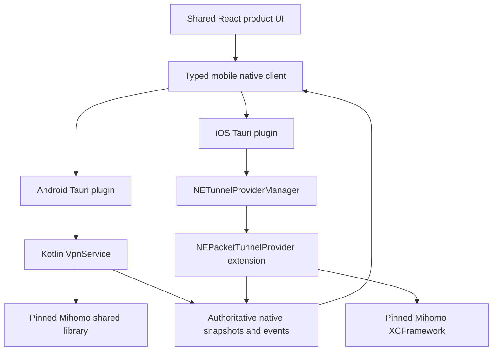

# Mobile Runtime Integration

## Decision

Mish uses one shared React product layer with a dedicated mobile shell and a
native mobile client boundary. Android owns VPN permission, foreground lifetime,
the TUN file descriptor, and the embedded Mihomo Core in a Kotlin `VpnService`.
iOS owns tunnel lifetime and the embedded Core in a Swift
`NEPacketTunnelProvider` extension. Neither platform depends on a live WebView,
a desktop Mihomo executable, or the desktop loopback bridge.

Android is the first runnable device target. iOS shell, bridge, extension, and
Core-framework work proceeds in parallel, but signed Packet Tunnel device and
TestFlight acceptance waits for the required Apple account, capabilities, and
provisioning.

## Goals

- Build Android and Apple native Core artifacts from one pinned Mihomo source
  checkpoint.
- Preserve the existing typed product DTOs and command semantics across desktop
  RPC and mobile native adapters.
- Keep VPN authority alive when the activity or WebView is suspended or
  destroyed.
- Make permission, lifecycle, drift, and recovery states observable and typed.
- Produce reproducible native artifacts with version, checksum, license, and
  SBOM evidence.

## Non-goals

- Running the desktop Mihomo executable on Android or iOS.
- Starting an Axum or WebSocket control service inside the mobile application.
- Giving JavaScript a TUN file descriptor, native path, Controller endpoint, or
  arbitrary Core command.
- Copying Clash Mi, Clash Verge Rev, or another client's product state and
  configuration model.
- Claiming iOS device readiness from an unsigned shell or simulator-only build.

## Runtime topology

## Ownership

| Layer                      | Owns                                                                                                                       | Must not own                                                              |
| -------------------------- | -------------------------------------------------------------------------------------------------------------------------- | ------------------------------------------------------------------------- |
| Shared React product layer | Views, persistent mobile chrome, top-level navigation, product routes/history/back, page/sheet/focus state, DTO validation | VPN permission, TUN descriptors, native Core lifetime, platform lifecycle |
| Mobile native client       | Typed commands, subscriptions, cancellation, adapter state                                                                 | Platform networking policy or a second product state store                |
| Android plugin             | Activity-to-service binding and platform command registration                                                              | VPN lifetime or Core state that disappears with the activity              |
| Android `VpnService`       | Permission result, TUN, socket protection, foreground notification, Core lifecycle                                         | WebView navigation or arbitrary JavaScript execution                      |
| iOS main-app plugin        | Tunnel configuration, manager commands, provider messaging                                                                 | Packet processing or extension-owned Core lifetime                        |
| iOS Packet Tunnel          | Packet flow, network settings, embedded Core, provider messages                                                            | UI navigation or main-app-only storage                                    |
| Native Core wrapper        | Narrow stable ABI over pinned Mihomo source                                                                                | Product persistence, platform permission prompts, remote update policy    |

## Mobile shell and client selection

The Web entry distinguishes `browser`, `desktop`, and `mobile`. Detecting Tauri
alone is insufficient because both desktop and mobile use Tauri. The shell
supplies a validated platform kind before product clients are composed.

The mobile path constructs native implementations of Status, Profile, Traffic,
Events, Diagnostics, and Settings boundaries. It does not call the desktop
`runtime_bootstrap`, request a loopback token, or open a WebSocket. Existing
`native` adapter kinds remain the wire-level evidence that a snapshot came from
the platform adapter.

Android Settings is a dedicated grouped-list and child-route composition, not
the desktop Settings page restyled for a narrow screen. Its local Tauri adapter
allows only `mobile_settings_get_snapshot`, `mobile_settings_set_appearance`,
and `mobile_settings_set_language`. Those commands delegate to the shared Rust
`SettingsService`, persist before returning a complete `native` snapshot, and
do not grant iOS or the WebView any desktop System Proxy, Helper, startup,
window, or updater command. A recreated Android WebView reads that confirmed
snapshot again; React's cache and pending affordances are never preference
authority.

The Android Settings VPN, network, diagnostics, and recovery screens render
the already accepted mobile lifecycle snapshot as read-only facts. They link to
Home for consent, start, stop, and recovery so neither React nor the Settings
adapter duplicates `VpnService` ownership or lifecycle command handling.

React Router and the React `MobileShell` are the sole authorities for persistent
mobile product chrome, top-level destinations, product routes, internal history
and Back, page/sheet state, `canGoBack`, scroll state, and DOM focus. Platform
deep links enter the same Web-owned route hierarchy; Native adapters do not
maintain a parallel selected-tab or product route stack.

The previously delivered production-disabled Shared Rust shell-entry contract
and Android/Apple persistent-shell prototypes were retired after hands-on #373
validation showed that Native tabs/bars plus Web-owned child routes, history,
Back, overlays, and focus create two navigation owners. The durable decision is
recorded in
[`../../.out-of-scope/native-persistent-mobile-shell.md`](../../.out-of-scope/native-persistent-mobile-shell.md).

This does not broaden the WebView's platform authority. Mobile plugins expose
only typed, permission-scoped product capabilities. Web content has no generic
script, message, URL-command, Native UI, or arbitrary capability channel.

## Native Core contract

Mish owns a small versioned C-compatible contract instead of exporting Mihomo's
internal package graph. The first contract covers:

- initialize and report the exact Core version;
- validate and load a repository-owned effective configuration;
- start and stop one TUN runtime idempotently;
- expose bounded Status, Routes, Traffic, and Events snapshots;
- select a current policy-group child and change routing mode;
- close one or all current connections;
- publish lifecycle and observation events; and
- release every returned buffer through an explicit matching function.

The ABI accepts no subscription URL, arbitrary filesystem path, shell command,
Controller endpoint, or unbounded log payload. Platform code resolves all
repository-owned paths and configuration bytes before crossing the boundary.
The frozen v1 signatures, DTOs, limits, errors, event sequence, and buffer
ownership rules are defined in [Mobile Core ABI v1](mobile-core-abi.md).

## Reproducible Core artifacts

One source manifest pins the Mihomo commit, Go toolchain, build tags, wrapper
revision, and expected artifact set. Builds produce:

- Android `arm64-v8a` for the first real-device debug slice;
- Android `x86_64` for emulator and CI coverage;
- additional Android ABIs only after the first slice is stable;
- Apple device and simulator libraries combined into an XCFramework; and
- SHA-256, license notice, source offer material, and an SBOM for every release
  artifact.

No build downloads a Core implicitly during application startup or ordinary
tests. Development preparation is explicit and checksum-verified, following the
same offline principle as desktop packaging.

Android packaging uses an explicit staging command. It accepts only the two
declared ABIs and copies each verified library into the generated, ignored
`jniLibs` directory. Local staging defaults to the committed canonical
checksums. CI explicitly selects evidence from its current dual-pass build:
verification anchors that evidence to the source manifest, current wrapper
digest, current-host Go archive, NDK and build settings, ABI paths, ELF
machines, exported symbols, checksums, and SBOM. This preserves same-host
reproducibility without assuming that Go `c-shared` output is byte-identical
across Darwin and Linux hosts. A small JNI shim loads the exact ABI by soname,
reports bounded version evidence, and carries bounded validation and
configuration-load commands. Loading is admitted only after the exact bytes,
revision, and SHA-256 identity pass the existing validation contract. The JNI
bridge serializes initialization, validation, load, status reconciliation, and
response release; every response is freed exactly once and only closed redacted
results cross JNI. A well-formed failed v1 replacement preserves the prior
loaded identity. Malformed, interrupted, or runtime-replaced outcomes publish
unknown instead of inventing loaded state. This slice never starts Core,
supplies a TUN descriptor, or changes VPN authority.

## Android lifecycle

The Android application requests VPN consent only after an explicit user
command. A protected `VpnService` establishes the interface, records the owned
file descriptor, protects outbound Core sockets from recursive capture, and
starts the embedded Core only after configuration validation.

The service promotes itself to the foreground with an honest persistent
notification. Its state machine covers unavailable, permission-required,
starting, running, stopping, failed, and recovery-required phases. Repeated
start and stop commands are idempotent, and lifecycle transitions are
serialized with profile activation and configuration replacement.
Each admitted Core mutation carries the Shared Rust machine authority, scope
epoch, operation ID, admitted revision, and effect identity through Kotlin,
JNI, and the Mobile Core request. The wrapper rejects stale or foreign
authority before changing the active runtime; cleanup derives an owned effect
from the admitted activation when no later explicit stop exists. A same-operation
cleanup accepts only the coordinator-issued next decimal effect identity; a
suffix, skipped effect, or overflow is stale and cannot mutate Android or Core
resources.

Running is a Shared Rust product state, not a Kotlin shortcut. The same product
session must have observed foreground service, validated non-VPN network, TUN,
routes, DNS, embedded Core, a protected socket, and one successful fixed public
request. Network loss clears the public-request observation and projects
unavailable until the complete barrier is observed again.

Activity recreation, WebView destruction, screen lock, memory pressure, and
network change do not transfer Core ownership back to the UI. The activity
rebinds and receives an authoritative snapshot. Revoked VPN permission,
`onRevoke`, service destruction, failed configuration, or an invalid TUN closes
the Core and descriptor conservatively before publishing a stopped state.

## iOS lifecycle

The main application uses `NETunnelProviderManager` to save and start one
explicit Mish tunnel configuration. The Packet Tunnel extension loads only
bounded data from the configured App Group, applies
`NEPacketTunnelNetworkSettings`, starts the embedded Core, and owns it until the
system asks the provider to stop or the extension fails.

Main-app commands use `NETunnelProviderSession` and a closed provider-message
protocol. Messages carry operation names, authority identifiers, and bounded
DTOs; they do not carry arbitrary paths, scripts, or endpoints. Shared storage
uses atomic writes, versioned schemas, and no displayed credentials.

The tunnel-file-descriptor handoff is a feasibility gate. Reference clients
demonstrate private implementation techniques, but Mish does not treat them as
stable platform API. Device testing must prove the selected method for every
supported iOS release and fail closed when the descriptor cannot be obtained.

## State and event reconciliation

Android service state and the iOS extension state are authoritative while their
VPN is active. On initial bind, reconnect, foreground return, or provider-message
recovery, the native client requests a complete snapshot before accepting later
events. Every event includes a session and sequence authority so stale activity
or extension events cannot overwrite a newer runtime.

Consequential commands are never replayed automatically after an unknown
disconnect. The client reconciles the current snapshot first and then asks the
user to retry when the original outcome cannot be established.

## Profile and configuration ownership

The shared Profile contract remains source-first and transactional. Mobile
platform code owns sandbox paths, secure credentials, platform integration, and
the final TUN policy. Imported capture settings, listeners, Controller settings,
or filesystem paths never silently become mobile runtime authority.

The effective configuration is validated by the exact pinned native Core before
activation. A failed candidate leaves the previous healthy runtime active or
reaches an explicit safe stopped state. Profile switching does not implicitly
start VPN permission flow unless the user requested activation and capture.

## Security and privacy

- Mobile plugins expose a closed permission-scoped command set.
- Native logs, events, support evidence, and errors remain bounded and redacted.
- No LAN listener, loopback WebSocket server, telemetry, or provider-controlled
  native module is enabled by default.
- Signing identities, provisioning data, App Group identifiers, and Android
  keystores stay outside ordinary source and diagnostic output.
- App and extension capabilities are verified from built artifacts rather than
  inferred from project files alone.

## Delivery order

1. Freeze the common mobile DTO and native ABI shape.
2. Scaffold the Web-owned mobile shell with Android and Apple generated hosts.
3. Produce an installable Android shell backed by a native fixture.
4. Build the pinned Android Core and complete the `VpnService` device loop.
5. In parallel, compile the iOS shell, plugin, Packet Tunnel extension, provider
   protocol, and XCFramework without claiming device VPN readiness.
6. Add Android device and CI evidence.
7. Complete signed iOS device, entitlement, archive, and TestFlight gates when
   the required Apple account is available.

## References

- [Android VPN service](../operations/android-vpn-service.md)
- [Mobile runtime reference review](../research/mobile-runtime-reference-review-2026-07-20.md)
- [Frontend and platform boundary](frontend-platform-boundary.md)
- [Mobile navigation and layout](../design/mobile-navigation-and-layout.md)
- [Mobile validation](../quality/mobile-validation.md)
