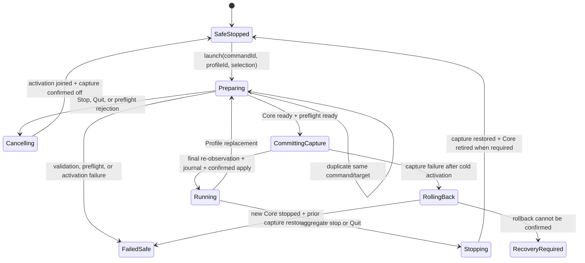
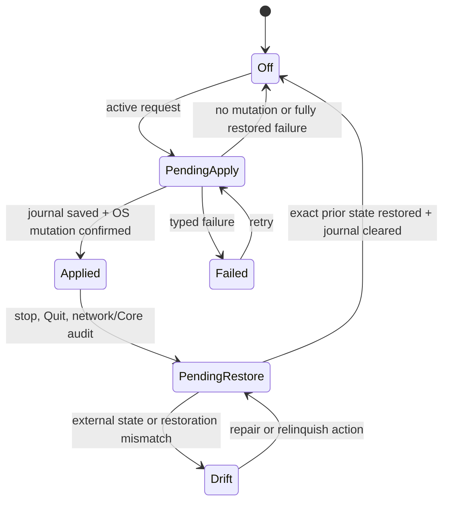
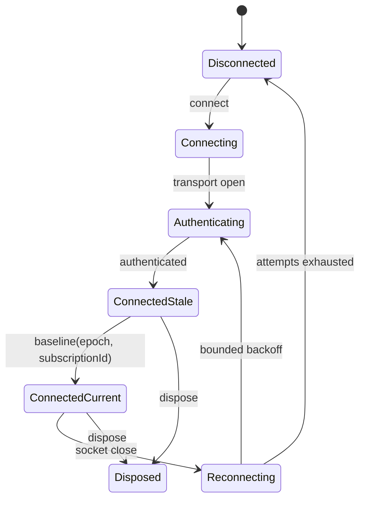
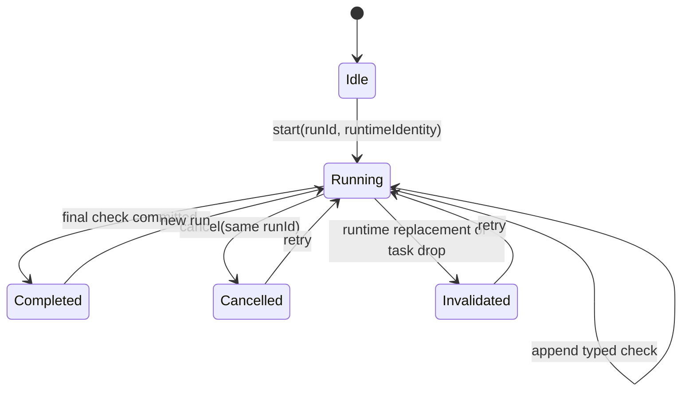
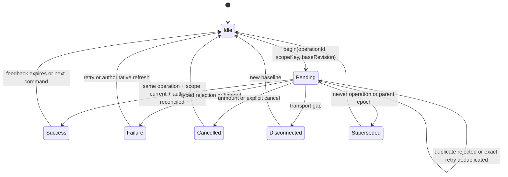

# State lifecycle and race audit

## Decision and scope

This document audits lifecycle and transition correctness at evidence baseline
`28a6e1d` for [Issue #207](https://github.com/Asuka109/mish/issues/207), then
harmonizes the result with the merged ownership contract at `f903b4f`. It covers
Rust runtime modules, the bridge/RPC seam, native projections, React providers
and hooks, command state, cancellation, rollback, stale results, shutdown, and
cleanup.

This is a lifetime and transition taxonomy, not a second ownership taxonomy.
The current authority column below records repository evidence using the
canonical **Authority**, **Derived DTO**, **Bounded cache**,
**Optimistic projection**, and **Presentation-only** classifications from
[Runtime state ownership](runtime-state-ownership.md), delivered by
[Issue #204](https://github.com/Asuka109/mish/issues/204). That contract alone
owns decisions about moving globally visible state to Rust, including recent
Status traffic samples and Current Profile preference. This audit maps those
states to reset scopes, ordering keys, and terminal transitions without
creating a parallel ownership model.

The audit does not introduce a state-machine library or perform a
repository-wide state rewrite. It identifies bounded deepening opportunities
where one Module can provide more **Leverage** through a smaller **Interface**
and better **Locality** for transition tests.

## Evidence method

The audit used three kinds of evidence:

1. Typed contracts and transition implementations at the real seams.
2. Deterministic barrier, cancellation, replacement, reconnect, and
   reordering tests already executable by an agent.
3. Counterexample timelines derived from actual accept/reconcile functions,
   not timing assumptions.

The strongest existing harnesses include:

- aggregate launch overlap, cancellation, rollback, and cleanup in
  [`mihomo_activation.rs`](../../crates/desktop-bridge/tests/mihomo_activation.rs);
- Core crash, platform event ordering, and capture restoration in
  [`lifecycle_coordination.rs`](../../crates/desktop-bridge/tests/lifecycle_coordination.rs);
- runtime replacement for Traffic, routing, providers, and diagnostics in
  [`runtime_host.rs`](../../crates/desktop-bridge/tests/runtime_host.rs);
- multi-client capture single-flight and socket shutdown in
  [`bridge_protocol.rs`](../../crates/desktop-bridge/tests/bridge_protocol.rs);
- RPC cancellation, reconnect bounds, and disposal in
  [`rpc-client.test.ts`](../../packages/rpc-client/src/rpc-client.test.ts);
- Traffic stale-sequence rejection and session replacement in
  [`traffic-provider.test.tsx`](../../apps/web/src/data/traffic-provider.test.tsx);
- notification baseline/update revision handling in
  [`rpc-notification-client.test.ts`](../../apps/web/src/data/rpc-notification-client.test.ts);
- one-shot native quit cleanup in
  [`graceful_exit.rs`](../../apps/desktop/src-tauri/src/graceful_exit.rs).

## Scope taxonomy

Scope answers “when does this state exist and reset?” It does not decide which
language should own the state.

| Scope                                  | Creation and reset rule                                                                                                                    | Examples                                                           |
| -------------------------------------- | ------------------------------------------------------------------------------------------------------------------------------------------ | ------------------------------------------------------------------ |
| Process-global application             | Created once per Mish process; reset only by confirmed shutdown or process restart.                                                        | mutation authority, notification center, graceful-exit gate        |
| Installed-application persisted        | Loaded from private app data; survives process and client restart; reset only by an explicit durable mutation or recovery/migration.       | Settings preferences, Profile repository, capture recovery journal |
| Active Profile/Core                    | Created for one committed Profile fingerprint and runtime instance; reset on replacement, retirement, or safe stop.                        | Controller source, runtime identity, provider authority            |
| Capture/activation session             | Created by an aggregate launch or confirmed capture transition; reset on aggregate stop, failed launch rollback, or a new capture session. | capture pending/applied state, proxy-session uptime                |
| Bridge/RPC connection and subscription | Created by an authenticated socket and remote subscription; reset on disconnect, reconnect, unsubscribe, or disposal.                      | RPC session, subscription IDs, reconnect attempt                   |
| Window/client-local                    | Created per WebView/browser client; reset on client replacement, reload, or provider unmount.                                              | local command feedback, selected tab, notification action pending  |
| Route/page                             | Created when a route is mounted; reset on navigation or an explicit view reset.                                                            | Traffic pause, filters, support-bundle preview                     |
| Command/request/operation              | Created for one invocation; terminal on success, failure, cancellation, timeout, disconnect, or supersession; then cleaned up.             | command ID, diagnostic run ID, request ID, AbortController         |
| Ephemeral presentation                 | Created for one frame or interaction; reset when hidden, unmounted, or reduced-motion policy changes.                                      | animation progress, hover, toast animation                         |

## Inventory and scope matrix

“Order/identity” names the current stale-result mechanism. “Gap” is empty when
the audited transition is sufficiently constrained for its current use.

| State                                           | Scope                                                                              | Current authority and consumers                                                                                                              | Lifetime, persistence, and reset                                                                                                       | Order/identity and allowed transitions                                                                                                          | Cleanup owner                                                                                                       | Gap                                                                                                                                                 |
| ----------------------------------------------- | ---------------------------------------------------------------------------------- | -------------------------------------------------------------------------------------------------------------------------------------------- | -------------------------------------------------------------------------------------------------------------------------------------- | ----------------------------------------------------------------------------------------------------------------------------------------------- | ------------------------------------------------------------------------------------------------------------------- | --------------------------------------------------------------------------------------------------------------------------------------------------- |
| Shared mutation permit                          | Process-global                                                                     | [`StateMutationAuthority`](../../crates/state-authority/src/lib.rs); Profile, Settings, restore, and System Proxy recovery callers           | Process memory; terminal shutdown makes it unavailable until restart                                                                   | exclusive permit bound to authority ID; available → held → available/unavailable                                                                | permit drop; activation coordinator on shutdown                                                                     | Sufficient for the covered mutations; do not broaden it into a general application lock                                                             |
| Settings snapshot                               | Installed-application persisted                                                    | `SettingsService`; Web Settings provider and native projections                                                                              | private `settings.json`; reset by validated mutation, migration, or recovery                                                           | monotonic revision; provider rejects lower revisions                                                                                            | Settings Module and provider unsubscribe                                                                            | Equal revision with different content is not rejected by the Web provider; writer single-authority currently prevents it                            |
| Profile repository                              | Installed-application persisted                                                    | `crates/profile`; activation, Profiles UI, configured Routes                                                                                 | private content-addressed records plus user-facing YAML; reset by explicit mutation or directory reconciliation                        | immutable revision/fingerprint per Profile; repository writes serialized by mutation permit                                                     | Profile Module and scheduler/directory task shutdown                                                                | No aggregate snapshot revision; a delayed complete Profile snapshot can replace a newer one                                                         |
| Current Profile preference while capture is off | Installed-application persisted Rust authority with a client optimistic projection | `ProfileSelectionAuthority`; complete Profile snapshots, toolbar, native launch, and aggregate launch consume it                             | private `selected-profile.json`; upgrade migration and reconciliation survive process, client, and RPC restart                         | parent application order plus nested selection revision; queued launch transaction; rollback compare-and-selects ID plus revision               | Profile service persists/reconciles; Profile provider clears only its matching optimistic operation                 | Delivered in protocol 25. Parent application order composes with, and does not replace, the nested selection revision                               |
| Activation lifecycle                            | Active Profile/Core plus command                                                   | [`ProfileActivationCoordinator`](../../crates/desktop-bridge/src/profile_activation.rs); RPC, startup, status bar, Product/Profile providers | process memory plus manager’s durable last-success evidence; reset by new command or shutdown                                          | internal authority scope plus monotonic command revision, command/target identity, typed transition evidence, and cancellation ownership        | coordinator joins activation indirectly through the mutation permit; shutdown cancels and waits for aggregate guard | Resolved: one data-bearing Rust enum exhaustively projects legal public DTO combinations; parent application order remains the transport order key  |
| Managed Core candidate                          | Active Profile/Core                                                                | `MihomoActivationManager`; runtime host and Controller sources                                                                               | private candidate home; committed on validation/readiness, deleted on failure/cancel, retired after replacement                        | candidate identity, Profile fingerprint, owned process evidence                                                                                 | candidate guard, process stop/reap, manager shutdown                                                                | Strong transaction; retain typed ordinary Rust transitions rather than a library                                                                    |
| Runtime instance                                | Active Profile/Core                                                                | [`DesktopRuntimeHost`](../../crates/desktop-bridge/src/runtime_host.rs); all data and command Modules                                        | process memory; atomically replaced on Profile/Core handoff or safe stop                                                               | `MishRuntime` pointer identity and watch generation                                                                                             | old sources shut down by activation manager; host invalidates diagnostics                                           | Some Status commands do not validate runtime identity on completion                                                                                 |
| Status snapshot                                 | Active Profile/Core projection                                                     | `MishRuntime`/Controller source; Web Product provider, status bar, native menu                                                               | process memory; rebuilt on observation or command; resets on runtime replacement                                                       | no snapshot revision, epoch, or sequence                                                                                                        | source shutdown and client unsubscribe                                                                              | Delayed request/notification completion can regress the whole snapshot                                                                              |
| Recent Status traffic series and session totals | Process-global authority scoped to one capture/activation session                  | Deep Rust `RecentTraffic` Module; lifecycle coordinator; Status RPC and page                                                                 | process memory only; explicit stop/Profile replacement/discontinuity resets; remount and reconnect do not                              | process authority ID + session ID + monotonic revision + paired sample sequence                                                                 | bounded Module retention; runtime host preserves process authority across eligible replacement                      | Implemented per the [ownership contract](runtime-state-ownership.md); a future parent application epoch must compose with the nested revision       |
| Controller observation state                    | Active Profile/Core                                                                | `ControllerStatusSource`; Status, Traffic, Events, Routes, native projections                                                                | process memory; reset on observation generation, pause/resume, Core replacement, or close                                              | observation generation, session IDs, source locks, bounded broadcasts                                                                           | source cancellation and task join/abort                                                                             | Strong internal stale-result guard; externally projected Status still lacks an order key                                                            |
| Traffic snapshot                                | Active Profile/Core observation session                                            | Rust Traffic source; Traffic provider and native summary                                                                                     | process memory; reset on profile/session replacement or unavailable phase                                                              | Profile ID + session ID + sequence                                                                                                              | source shutdown; provider clears pause/history on stale connection                                                  | The provider treats every different session as newer, so an old session can return after a replacement                                              |
| Events snapshot and local event buffer          | Active Profile/Core observation session plus window/client-local buffer            | Rust Events source; Events provider and page                                                                                                 | Rust bounded history plus client buffer; reset on session/profile replacement                                                          | Profile ID + session ID + sequence + event IDs                                                                                                  | source shutdown; provider unsubscribe; local clear affects only the buffer                                          | Buffer rejects same-session regression, but any different old session replaces the new one; top-level snapshot metadata is accepted unconditionally |
| Notification center                             | Process-global                                                                     | deep Rust Notification Module; Web center/toast and native producers                                                                         | process memory, 128 records; preserved across runtime replacement                                                                      | monotonic snapshot and record revisions, stable IDs, dedupe keys                                                                                | producer retirement, bounded retention, client unsubscribe                                                          | Sufficient; action-pending correctly remains client-local                                                                                           |
| Capture selection and System Proxy/TUN state    | Capture/activation session                                                         | `CaptureReconciler` and aggregate coordinator; all control surfaces                                                                          | selection retained in process; System Proxy journal persists only restoration evidence; reset by confirmed stop/relinquish             | typed phase/observed/failure state, aggregate single-flight, final re-observation, public scope epoch and monotonic operation ID                | reconciler rollback/drop guards; shutdown confirms restoration                                                      | Strong typed state delivered through protocol 26; Web feedback composes with, and never replaces, the aggregate operation identity                  |
| Proxy-session uptime                            | Capture/activation session                                                         | `MishRuntime::ProxySessionUptime`; Status consumers                                                                                          | process memory; resets when neither capture mode is authoritatively applied                                                            | derived from confirmed capture projection                                                                                                       | MishRuntime replacement/drop                                                                                        | Sufficient after stop/relaunch regression coverage                                                                                                  |
| Routing-mode command                            | Command/request/operation                                                          | Controller source through runtime host; Product provider                                                                                     | one request; no persistence                                                                                                            | Controller command lock plus runtime identity comparison; success/failure                                                                       | request completion or RPC disconnect                                                                                | Sufficient for runtime replacement                                                                                                                  |
| Policy-group selection command                  | Command/request/operation                                                          | Controller source through runtime host; Product provider                                                                                     | one request; Controller state persists in Core                                                                                         | command lock, Controller re-observation, membership check; no host runtime completion check                                                     | request completion/source close                                                                                     | A replacement can complete the old call without the same typed `runtime-replaced` rule used by routing                                              |
| Group delay test                                | Active Profile/Core plus command                                                   | Controller source; Routes/Product                                                                                                            | process memory; reset on cancellation, completion, source close, or runtime replacement                                                | test ID, Profile ID, child phases, cancellation token, observation generation                                                                   | source owns token and task; replacement tests prove retirement                                                      | Start/cancel RPC result has no uniform host runtime completion rule, although background results are generation-scoped                              |
| Provider update                                 | Active Profile/Core plus command                                                   | Controller source/runtime host; Profiles UI                                                                                                  | one runtime session; update observation retained until replacement                                                                     | Profile ID + runtime fingerprint authority, command lock, runtime identity                                                                      | source close; host converts late completion to `runtime-replaced`                                                   | Sufficient; remotely uncancellable behavior is explicit                                                                                             |
| Traffic close commands                          | Active Profile/Core observation session plus command                               | Traffic source/runtime host; Traffic provider                                                                                                | one request; no persistence                                                                                                            | Profile/session/sequence authority, target IDs, runtime identity, typed partial/failure result, Web operation ID                                | request completion; exact-operation reducer cleanup                                                                 | Strong Rust contract; client feedback is keyed by target domain and accepted application/Profile/session scope                                      |
| RPC connection                                  | Bridge/RPC connection                                                              | `RpcClient`; every RPC adapter/provider                                                                                                      | client memory; reset on disconnect/reconnect/dispose                                                                                   | transport object identity, request IDs, bounded reconnect attempt; disconnected → connecting → authenticating → connected/reconnecting/disposed | reject pending requests, clear timers/listeners on dispose                                                          | Strong transport lifecycle                                                                                                                          |
| Remote subscriptions                            | Bridge/RPC connection and subscription                                             | individual RPC adapters; providers                                                                                                           | socket-local; new baseline after reconnect; reset by unsubscribe/disconnect/dispose                                                    | subscription ID rejects notifications from retired subscriptions                                                                                | adapter unsubscribe and socket teardown                                                                             | Baseline/request results outside the subscription ID can still race newer subscription updates                                                      |
| Product command feedback                        | Window/client-local command                                                        | shared `command-feedback` reducer; Product provider; sidebar, Status and Routes controls                                                     | provider memory; terminal on success, failure, cancellation, disconnect, or supersession; reset by exact cleanup/client replacement    | operation ID + deduplication domain + accepted application/Capture scope and revision                                                           | provider aborts matching controllers; reducer rejects stale terminal and cleanup actions                            | Sufficient after operation-keyed cutover; domain errors/results remain outside the generic reducer                                                  |
| Profile command feedback                        | Window/client-local command plus Rust activation projection                        | shared `command-feedback` reducer; Profile provider and Profiles UI                                                                          | provider memory; terminal on success, failure, cancellation, disconnect, or supersession; activation waiters remain Rust-command keyed | operation ID + Profile domain + accepted application scope/order; nested selection revision reconciles optimism                                 | unmount rejects waiters and aborts matching local commands; reducer owns exact cleanup                              | Sufficient after operation-keyed cutover; parent application order and nested selection revision remain authoritative                               |
| Traffic pause/filter/history                    | Route/page                                                                         | Traffic provider/page                                                                                                                        | client memory; pause reset on connection/session/Profile change; filters reset by page behavior                                        | pause captures Profile/session/sequence but is never command authority                                                                          | provider unmount and explicit clear                                                                                 | Correctly local; old-session acceptance remains the upstream gap                                                                                    |
| Support-bundle preview/save                     | Route/page plus command                                                            | Events provider/native save Adapter and shared `command-feedback` reducer                                                                    | client preview plus native temporary file                                                                                              | preview ID plus Web operation ID and accepted application scope                                                                                 | temporary file guard; matching abort and exact-operation Web cleanup                                                | Sufficient; duplicate domain submissions are rejected and retired completions cannot replace a newer preview                                        |
| Native status/menu projection                   | Process-global native presentation                                                 | Tauri native Modules; status/activation/settings streams                                                                                     | process lifetime; rebuilt/updated in place                                                                                             | settings language revision, authoritative snapshots, shared coordinator calls                                                                   | retained task handles and bridge shutdown                                                                           | Status/capture projections inherit missing general revision; language projection is protected                                                       |
| Graceful exit                                   | Process-global terminal operation                                                  | one-shot exit coordinator; menu, status bar, window close, OS exit                                                                           | process lifetime; retryable after failed cleanup, terminal after confirmation                                                          | atomic claim plus cleanup result                                                                                                                | coordinator performs ordered bridge shutdown and final exit                                                         | Sufficient; deterministic racing-source tests exist                                                                                                 |
| Animation/hover/toast motion                    | Ephemeral presentation                                                             | React/UI adapters                                                                                                                            | frame or mounted presentation only; never persisted                                                                                    | animation frame/timer identity and reduced-motion policy                                                                                        | effect cleanup                                                                                                      | Correctly local and outside application truth                                                                                                       |

## Required transition contract

Every stateful Interface that crosses an asynchronous seam must define:

1. **Scope key** — process, runtime, Profile fingerprint, capture session,
   connection epoch, subscription, operation, or client.
2. **Order key** — monotonic revision/sequence within that scope.
3. **Initiator** — the only Module allowed to request the transition.
4. **Guard** — the state and identity that must still match at commit.
5. **Pending projection** — what consumers may show without treating it as
   committed truth.
6. **Terminal result** — success, typed rejection, timeout, disconnect,
   cancellation, invalidation, or supersession.
7. **Rollback/reconciliation** — how authority is re-observed and how an
   optimistic projection is removed.
8. **Cleanup owner** — the Module that cancels and joins tasks, clears pending
   identity, retires subscriptions, and removes temporary resources.

A receiver accepts an update only when:

```text
same scope key AND greater order key
OR
explicitly newer parent epoch with its own monotonic order
```

“Different session” is not sufficient evidence that a message is newer. The
parent epoch must order session replacement.

## High-risk lifecycle diagrams

### Aggregate launch and Profile/Core activation



Invariants:

- one `proxy_operation` guard spans the complete aggregate transition;
- only the same command ID may observe its activation terminal result;
- preliminary System Proxy observation is never mutation authority;
- Stop and Quit cancel and join preparation before confirming capture-off;
- failed cold launch cannot leave a newly started Core as successful authority;
- rollback failure is explicit and never projected as idle.

### Capture and System Proxy



The typed phase is sufficient; adding a library would not improve the
platform transaction. The missing leverage is an operation/revision envelope
at the projection seam, not more states.

### Bridge reconnect and subscription replacement



Invariants:

- a retired transport and subscription ID cannot publish;
- disconnect rejects all pending RPC requests;
- a reconnect remains stale until its new baseline is accepted;
- a baseline/update must carry a connection/runtime epoch plus an order key
  before it can replace current application state.

### Diagnostics run



The existing Rust enum, run ID, cancellation token, and drop finalizer form a
deep Module. No library is justified.

### Generic command result



This should be a typed reducer/ordinary enum. A general state-machine library
would add a second execution model without improving the required identity and
revision checks.

## Concrete race catalogue

Protocol version 25 resolves the four snapshot-replacement rows below through
one parent application-order contract. The Rust host reserves
`authorityId + epoch + order` before asynchronous publication, retires an epoch
on runtime replacement, and stamps Status, complete Profile, Events, and
detailed Traffic snapshots. RPC baselines are authority-replacement barriers;
all other deliveries may advance only within the accepted authority. Product,
Profile, Events, and Traffic providers use the same deep acceptance Module,
including explicit duplicate, stale, and equal-order conflict outcomes.
Recent Traffic keeps its independent nested authority/session/revision.

| Priority | Timeline                                                                                                                 | Current safeguard                                                                               | Gap and required invariant                                                                                                          |
| -------- | ------------------------------------------------------------------------------------------------------------------------ | ----------------------------------------------------------------------------------------------- | ----------------------------------------------------------------------------------------------------------------------------------- |
| P0       | Status subscription publishes S2; an earlier `status.getSnapshot` resolves S1; Product provider accepts S1               | Protocol 25 parent epoch/order acceptance                                                       | Resolved: request, command, baseline, and notification results pass one acceptance Module                                           |
| P0       | Traffic runtime changes A→B; delayed A snapshot arrives after B; `sessionId !==` is treated as newer                     | Protocol 25 parent epoch plus nested session sequence                                           | Resolved: an older epoch can never reopen A                                                                                         |
| P0       | Events runtime changes A→B; delayed A snapshot replaces the local buffer and top-level metadata                          | Protocol 25 parent epoch plus event sequence                                                    | Resolved: the same acceptance result gates both top-level snapshot and buffer                                                       |
| P1       | Profile subscription publishes terminal activation; earlier complete Profile request resolves with pending/old inventory | Protocol 25 parent epoch/order acceptance                                                       | Resolved: stale complete Profile snapshots cannot replace terminal activation                                                       |
| P1       | Group-selection command starts on runtime A; Profile replacement installs B; A confirms and host returns success         | Controller command lock and membership re-observation                                           | Every runtime-scoped command captures runtime identity and returns typed `runtime-replaced` with B’s current snapshot/result        |
| P1       | Browser and status bar issue aggregate Launch concurrently                                                               | Rust `proxy_operation` single-flight                                                            | Preserve this guard; client-local loaders must only project Rust pending for other surfaces                                         |
| P1       | Stop or Quit arrives during parallel activation/preflight                                                                | cancellation token, aggregate lock, activation join, zero-apply barrier tests                   | Preserve join-before-off invariant and expose operation identity in the public pending projection                                   |
| P1       | System Proxy changes externally between preflight and commit                                                             | final full re-observation and fingerprint comparison                                            | Preserve repeated observation; never optimize it away as duplicate I/O                                                              |
| P1       | Capture apply fails after a cold Core starts                                                                             | rollback stops candidate, replaces safe runtime, restores prior projection                      | Rollback failure remains a distinct recovery-required terminal state                                                                |
| P1       | Diagnostic probe is pending while Profile/Core is replaced                                                               | runtime watch identity, invalidation token, drop finalizer, operation-keyed Web reducer         | Delivered: matching application scope plus local operation ID prevents an old completion or `finally` from clearing a new request   |
| P2       | Command request disconnects, reconnect baseline arrives, old provider `finally` runs                                     | RPC rejection plus operation-keyed provider reducer                                             | Delivered: disconnect/supersession is terminal only for the matching operation and stale cleanup is rejected                        |
| P2       | Two clients select different Current Profiles while capture is off, then either launches                                 | Rust queues both commands; launch holds the shared permit through activation/capture completion | Preserve both parent application order and nested selection revision; clients and capture commands never supply competing authority |
| P2       | Failed A→B switch attempts rollback after another client confirms C                                                      | Rust compare-and-select requires B and its revision before restoring A                          | A stale rollback returns current C unchanged and cannot manufacture a later revision for A                                          |
| P2       | Native language update revisions 8 then 7                                                                                | native projection rejects non-newer revision                                                    | Preserve and generalize the acceptance pattern to other native projections only after their source contracts expose revisions       |
| P2       | Two quit sources race; first cleanup fails; later retry succeeds                                                         | graceful-exit atomic claim and retryable failure evidence                                       | Preserve one cleanup owner and never exit before confirmed cleanup                                                                  |

## Optimistic-state rules

Optimism is allowed only for reversible, client-local presentation. It must not
create a second application authority.

Every optimistic flow must specify:

| Rule                       | Required behavior                                                                                                                                       |
| -------------------------- | ------------------------------------------------------------------------------------------------------------------------------------------------------- |
| Predicted authority        | Name the exact Rust snapshot field and transition being predicted                                                                                       |
| Identity                   | Allocate an operation ID and capture the parent runtime/Profile/session/connection scope                                                                |
| Pending                    | Render pending separately from committed state; other clients use the authoritative pending projection when one exists                                  |
| Success                    | Accept only a result matching the operation and a current parent epoch, then reconcile through the shared snapshot acceptance function                  |
| Failure/timeout/disconnect | Remove the prediction and retain or refresh the last confirmed snapshot; show a typed terminal result                                                   |
| Authoritative disagreement | Authority wins immediately; mark the operation superseded rather than reapplying the prediction                                                         |
| Cleanup                    | Abort or retire the operation on unmount, client replacement, Profile/runtime switch, or a newer operation; a stale `finally` may clear only its own ID |

Application of the rule:

- Settings does not optimistically mutate the snapshot and is safe; retain its
  revision check.
- Traffic close actions show pending without removing rows and reconcile a
  typed Rust result; retain this pattern.
- aggregate Capture correctly exposes Rust pending; client-local command
  feedback must follow that projection rather than predict Applied.
- Current Profile selection is a client-local **Optimistic projection** of
  `ProfileSnapshot.selection`. Parent application order rejects stale complete
  snapshots; the nested selection revision rejects stale selection results.
  Rollback is a conditional Rust mutation bound to the failed command's
  confirmed Profile ID and revision, so it cannot overwrite a concurrent
  selection. Normal Profile activation still completes before capture changes.
- notification action pending, view pause, filters, hover, and animation are
  presentation-only and correctly client-local.

## State-machine adoption decisions

| Lifecycle                       | Current representation                                                           | Decision                                                                                        | Evidence                                                                                                                        |
| ------------------------------- | -------------------------------------------------------------------------------- | ----------------------------------------------------------------------------------------------- | ------------------------------------------------------------------------------------------------------------------------------- |
| Application launch              | ordered bootstrap plus one-shot exit coordinator                                 | Keep ordinary typed stages and explicit cleanup; no library                                     | launch has platform I/O and failure evidence that a library cannot commit or roll back                                          |
| Profile/Core activation         | data-bearing Rust enum plus one exhaustive DTO Adapter and transactional manager | Keep the typed state and existing public DTO; no library                                        | command scope/revision, cancellation ownership, terminal evidence, rollback, retry, and shutdown are structurally constrained   |
| Capture/System Proxy/TUN        | typed phase enums plus reconcilers and journal                                   | Keep; add operation/revision envelope, not a library                                            | schema refinements and transaction tests already reject most impossible states                                                  |
| Bridge connectivity/reconnect   | TypeScript discriminated union plus transport identity                           | Keep; add connection epoch to application snapshot envelopes                                    | transport lifecycle is deterministic and bounded                                                                                |
| Diagnostics                     | Rust run/status enums, run ID, token, finalizer                                  | Keep unchanged; no library                                                                      | cancellation and runtime replacement are terminal in tests                                                                      |
| Command pending/success/failure | one shared operation-keyed reducer plus domain payloads outside it               | Keep the reducer Module at Product, Profile, Traffic, Events, and current-Profile command seams | operation/scope identity, legal terminal phases, duplicate rejection, and exact cleanup have one property-tested implementation |
| Graceful shutdown               | atomic claim plus typed cleanup report                                           | Keep unchanged; no library                                                                      | racing quit sources and failed-cleanup retry are deterministic                                                                  |

No lifecycle justifies XState or another state-machine dependency. Typed Rust
enums, TypeScript discriminated unions, reducers, operation IDs, and explicit
epoch/revision acceptance provide the needed correctness with less Interface
surface.

## Deepening opportunities and implementation backlog

These are independent vertical slices, not a repository-wide migration. The
merged [runtime ownership contract](runtime-state-ownership.md) is the
terminology and authority-placement dependency. Its recent capture-session
Traffic and selected Profile migration slices remain canonical and are not
duplicated here.

### 1. Ordered application snapshot envelopes (delivered)

- **Files/Modules:** contracts; Rust Status/Profile/Events/Traffic publishers;
  RPC adapters; Product/Profile/Events/Traffic providers.
- **Problem:** subscription IDs order connection-local notifications, but
  complete snapshots do not share a comparable parent epoch and revision.
- **Solution:** add one runtime epoch plus per-stream monotonic revision/sequence
  to the existing snapshot Interfaces, and route request, command, baseline,
  and update delivery through one acceptance Module.
- **Benefits:** one stale-result rule provides Leverage across four consumers
  and Locality for delayed/reordered tests.
- **Cutover:** additive protocol version; dual fields only during one bounded
  compatibility window, then require the envelope. Do not create a second
  snapshot format.
- **Verification:** deterministic S2-before-S1 request/notification reorder,
  A→B→late-A runtime replacement, reconnect baseline, duplicate revision,
  simultaneous clients, and unmount cleanup.
- **Acceptance:** confirmation-only; no residual hands-on step.
- **Dependency:** reuse the ownership contract's `authorityId`, `sessionId`,
  and `revision` meanings for recent capture-session Traffic. A parent runtime
  epoch may order replacement of whole Status/Profile/Events/Traffic
  authorities, but it must compose with rather than replace the nested
  `RecentTrafficSnapshot.revision`.

### 2. Uniform runtime-scoped command completion (delivered)

- **Files/Modules:** `DesktopRuntimeHost`, Controller Status source, Status
  command results, runtime-host tests.
- **Problem:** Traffic, routing, provider, and diagnostics results are protected
  against runtime replacement, while group selection and group-delay entry
  points do not all cross the same host Interface.
- **Solution:** capture runtime identity once for every runtime-scoped command,
  then return a typed stale/replaced terminal result and the current authority
  after any replacement.
- **Benefits:** callers learn one rule; deterministic barrier tests live at the
  host seam.
- **Cutover:** preserve method names and successful payloads; add/standardize
  typed failure only.
- **Verification:** replacement before mutation, during confirmation, after
  mutation before response, duplicate command, cancellation, and old-source
  cleanup.
- **Acceptance:** confirmation-only.

### 3. Operation-keyed Web command reducer (delivered)

- **Files/Modules:** Product, Profile, Traffic, Events providers and their
  command hooks.
- **Prior problem:** booleans, refs, maps, and unions implemented similar
  lifecycle rules but could not uniformly prevent a stale `finally` or
  completion from clearing/writing a newer operation.
- **Delivery:** `apps/web/src/data/command-feedback.ts` provides one reducer
  Interface with operation ID, domain key, scope key,
  pending/success/failure/cancelled/disconnected/superseded phases, and exact-ID
  cleanup. Product, Profile, Traffic, Events, and the composed current-Profile
  command consume it without retaining their replaced lifecycle writers.
  Domain-specific result and error payloads remain outside the reducer and are
  publishable only while their operation identity still matches.
- **Benefits:** deeper command-state Module, less caller knowledge, and one
  property-test surface.
- **Cutover:** complete with no dual feedback state. Application
  `authorityId/epoch/order`, nested Profile selection revision, detailed
  Traffic Profile/session identity, and aggregate Capture
  `scopeEpoch/operationId` compose with local operation identity rather than
  being replaced by a second authority token.
- **Verification:** delayed completion, newer operation, disconnect/reconnect,
  Profile/runtime switch, unmount/remount, duplicate submission, authoritative
  correction, exact cleanup, reducer transition tables/properties, and affected
  provider integrations.
- **Acceptance:** confirmation-only; visible timing and control feedback remain
  covered by deterministic provider tests.

### 4. Typed Profile activation state

- **Delivery:** completed by Issue #236 without a protocol bump. One internal
  data-bearing Rust enum owns idle, pending, success, failure, cancellation,
  rollback, retry, and shutdown boundaries. Every command carries its target,
  authority scope, and monotonic revision; exact command scope guards terminal
  completion. One exhaustive Adapter retains the public DTO fields, and shared
  refinements reject invalid optional-field combinations.

- **Files/Modules:** Profile activation coordinator, contracts, native/Web
  projections, activation tests.
- **Problem:** one DTO with optional fields represents states that should be
  impossible, such as Success with a failure or Pending without command/target
  identity.
- **Solution:** use an internal Rust enum with data-bearing variants and one
  exhaustive DTO projection. Strengthen contract refinements while retaining
  the public field shape unless a protocol bump is justified.
- **Benefits:** transition Locality in the coordinator and an exhaustive
  Interface test surface.
- **Cutover:** internal first; serialize golden snapshots before changing any
  transport shape.
- **Verification:** legal-transition table, invalid-combination contract tests,
  duplicate command, cancellation, rollback success/failure, retry, shutdown,
  and stale terminal completion.
- **Acceptance:** confirmation-only.

### 5. Capture operation identity at every projection (delivered)

- **Files/Modules:** aggregate launch coordinator, capture runtime status,
  Status contract, native status/menu and Product/Capture hooks.
- **Problem:** global Pending exists, but consumers cannot prove which aggregate
  operation produced a delayed Pending/Applied/Failed projection.
- **Solution:** expose a bounded operation ID and capture-session/runtime epoch
  with the existing typed phases. Retire the ID only on a terminal projection.
- **Benefits:** multi-surface consumers share one operation truth without
  adding another authority.
- **Cutover:** additive fields, native and Web readers updated together.
- **Verification:** browser/status-bar simultaneous commands, Stop/Quit during
  preflight, delayed pending after terminal, rollback failure, reconnect, and
  second client.
- **Acceptance:** confirmation-only; native projection parity and transition
  correctness are covered by deterministic Adapter and contract tests.

## Closure criteria

Issue #207 may close only when:

- this inventory remains linked to executable evidence and covers every scope
  required by the issue;
- the five slices above exist as bounded implementation Issues after accepted
  delivery, with dependencies, cutover, tests, and acceptance style;
- the ownership taxonomy and cross-links remain aligned with
  `runtime-state-ownership.md`;
- documentation checks, `pnpm check:pr`, and the Fast PR gate pass;
- the pull request is explicitly accepted and merged.

If any item is missing, #207 must remain open with the exact remaining
criterion. A merged audit document alone is not automatic evidence of complete
tracker closure.
