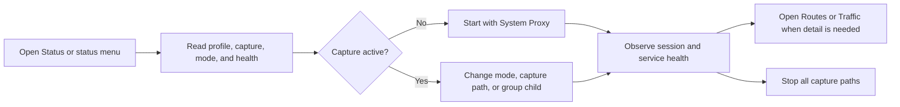

# PRD 01: Everyday Control

## Metadata

- Status: Draft for product review
- Implementation status: Not authoritative; see [PRD suite](README.md)
- Version: 0.1
- Date: 2026-07-18
- Destination: Status and macOS status-bar menu
- Related contract: [`status-experience.md`](../status-experience.md)

## Product bet

For a user who opens the client to answer “is my traffic captured and is it
working?”, provide one compact workbench that makes the current outcome clear
and exposes the next frequent action. Success means the user can start, stop,
change routing mode, switch a frequent group, and open detailed traffic without
searching across multiple pages.

## Scope

This PRD makes the existing Status contract testable at release level. It does
not replace the detailed information hierarchy and data semantics already
specified in `status-experience.md` and `status-data-contracts.md`.

### In scope

- Aggregate capture control and state machine.
- Rule, Global, and Direct routing modes.
- Independent System Proxy and TUN capture paths.
- Active profile menu.
- Session traffic and runtime metrics.
- Most-used policy groups with a group-scoped selector.
- User-managed service probes.
- Compact status-bar mirrors for common commands.

### Out of scope

- Full group tree, profile editing, connection inspection, raw logs, rule
  editing, and long-term traffic history.
- A global “current node” claim in Rule mode.
- A user-customizable card dashboard or duplicated system-information page.

## Primary journey

## Requirements

| ID          | Priority | Requirement                                                                                                         | Acceptance criteria                                                                                                                                                                                                                                                                                                                 |
| ----------- | -------- | ------------------------------------------------------------------------------------------------------------------- | ----------------------------------------------------------------------------------------------------------------------------------------------------------------------------------------------------------------------------------------------------------------------------------------------------------------------------------- |
| CTRL-F-001  | P0       | `ProxyControlButton` shall represent inactive, connecting, healthy, stopping, and error states.                     | Given capture is inactive, when the user starts it, then the button prevents duplicate starts, shows progress, and resolves to healthy or an actionable typed error.                                                                                                                                                                |
| CTRL-F-002  | P0       | The aggregate control shall resume the remembered capture-mode selection.                                           | Given one or both capture paths are selected but stopped, when the user activates the aggregate control, then every selected path is requested and the selection remains unchanged. When no path is selected, System Proxy is selected and requested as the compatibility default.                                                  |
| CTRL-F-003  | P0       | Stopping through the aggregate control shall disable every active capture path without clearing its selection.      | Given one or both capture paths are active, when the user chooses Stop, then all are reconciled to off or the remaining drift is shown with a recovery action, while the selected combination remains available for the next start.                                                                                                 |
| CTRL-F-004  | P0       | Each capture-mode control shall distinguish selection intent from confirmed runtime state.                          | Selected controls use the same pressed treatment as Routing mode. A selected but stopped control remains muted, while a selected and running control uses a restrained green icon. Selecting an unselected mode while stopped starts Core with the currently selected profile, waits for listener readiness, and then starts the complete selected combination; deselecting a stopped selected mode does not start capture. |
| CTRL-F-005  | P0       | Routing mode shall be an exclusive choice of Rule, Global, or Direct.                                               | Given a healthy core, when a different mode is selected, then pending state is shown, the core confirms the mode, and exactly one mode remains selected.                                                                                                                                                                            |
| CTRL-F-006  | P0       | System Proxy and TUN shall remain independent capability controls.                                                  | Given the platform supports both, when either control changes, then the other selection does not change except when selecting a new mode while stopped resumes the complete remembered combination.                                                                                                                                 |
| CTRL-F-007  | P0       | Status shall display the user's currently selected profile as a quiet, switchable context.                          | The selected profile remains visible while Core and capture are stopped and is used by the next start. The selector remains enabled without Core, marks the selected item, and changing it updates preference only; it does not activate or restart the proxy.                                                                                                                                     |
| CTRL-F-008  | P0       | Session shall show current rates, cumulative bytes, active connections, effective rules, Mihomo memory, and uptime. | Given live streams are connected, when values change, then text values update without stealing focus; when streams disconnect, stale values are marked instead of silently appearing current.                                                                                                                                       |
| CTRL-F-009  | P0       | Status shall show up to five most-used visible policy groups for the active profile.                                | Given usage observations exist, when Status renders, then groups follow the documented profile-scoped ranking and counts are not displayed as traffic truth.                                                                                                                                                                        |
| CTRL-F-010  | P0       | A group row shall open a selector scoped to that group.                                                             | Given group G contains child C, when C is selected, then the command names both G and C, validates membership, and updates only G.                                                                                                                                                                                                  |
| CTRL-F-011  | P0       | Status shall expose a direct action to open detailed live Traffic.                                                  | Given Status is visible, when the user activates “Open live traffic,” then Traffic opens without losing the active profile context.                                                                                                                                                                                                 |
| CTRL-F-012  | P1       | Service monitors shall support add, edit, delete, restore defaults, and typed results.                              | Given a valid monitor, when a probe runs, then its method, route target, timestamp, latency or typed failure, and stale state are available.                                                                                                                                                                                        |
| CTRL-F-013  | P1       | The native status menu shall mirror stable common commands without presenting a second state model.                 | Given the main window and status menu are both open, when a command succeeds in either surface, then both reconcile from the same application state.                                                                                                                                                                                |
| CTRL-F-014  | P1       | TUN installation and permission requirements shall be explained in context.                                         | Given TUN is unavailable because its helper or permission is missing, when the user inspects the disabled control, then the required setup and its effect are stated and an explicit setup action is offered.                                                                                                                       |
| CTRL-NF-001 | P0       | Live updates shall remain readable and low-noise.                                                                   | Traffic values may update frequently, but labels, focus, row order, and layout remain stable; decorative charts never replace text.                                                                                                                                                                                                 |
| CTRL-NF-002 | P0       | Status shall adapt to compact desktop widths without hiding critical state.                                         | Session and Groups stack in reading order, sparklines disappear before text, and no horizontal scrolling is required at the supported minimum window size.                                                                                                                                                                          |
| CTRL-NF-003 | P0       | Animated health material shall have static, reduced-motion, WebGL-failure, and low-power fallbacks.                 | Given any fallback condition, the aggregate control remains legible and fully operable with equivalent state wording.                                                                                                                                                                                                               |

## Empty, loading, and failure behavior

- **No valid selected profile:** keep capture disabled, explain the missing prerequisite,
  and offer Import profile. Do not show an empty “current node” card.
- **Core starting:** preserve the last confirmed configuration as stale, show one
  progress state, and prevent commands that cannot be queued safely.
- **Core crash:** show the affected capture state as unknown until platform state
  is reconciled; retain one specific semantic notification with a valid retry
  action when retry is safe.
- **RPC reconnecting:** keep navigation usable, mark live values stale, and
  resume streams without resetting cumulative UI state unnecessarily.
- **System Proxy drift:** distinguish “client requested off/on” from observed OS
  state and provide Reconcile or Restore action.
- **Probe failure:** display timeout, DNS, TLS, HTTP status, or policy rejection;
  never convert every failure to a fake latency.

## Metrics and validation

- Users identify capture state and mode within ten seconds in a five-person
  usability test.
- Start and stop complete within the agreed platform timeout in at least 95% of
  deterministic integration runs; slower operations show continuing progress.
- Every tested failure has a visible next action and leaves OS proxy state
  reconcilable.
- Keyboard-only tests cover mode selection, capture controls, group picker,
  profile menu, service management, and Traffic navigation.

## Dependencies

- Runtime, traffic, metrics, profile, policy-group, usage, service-monitor, and
  platform-capability DTOs.
- Authenticated local RPC subscriptions and commands.
- System Proxy adapter for P0; privileged TUN helper for P1.
- Native status-bar integration for P1.

## Open questions

1. Should a user be able to pin groups as an override to most-used ranking in
   P1, or should pinning wait until usage ranking has been dogfooded?
2. What default service-monitor set is appropriate for a global open-source
   release without implying endorsement or guaranteed accessibility?
3. Which exact timeouts separate a slow transition from a failed transition on
   each platform?
